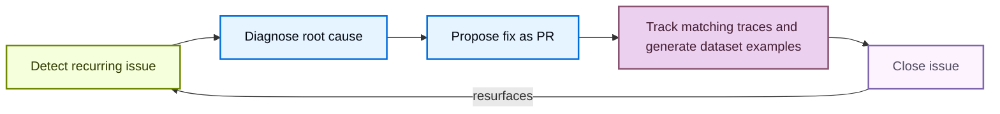

<!-- langchain-docs: Find and fix your agent's issues with LangSmith Engine | https://docs.langchain.com/langsmith/engine -->

# Find and fix your agent's issues with LangSmith Engine

LangSmith Engine helps you ship more reliable agents without manually searching through traces. It is the LangSmith agent for agent engineering: working from your production traces, it surfaces recurring issues, diagnoses their root cause, and drives the fix across every stage of the development lifecycle. For a product overview, see [Engine](/langsmith/engine-overview).

## How Engine works

### The issue lifecycle

Each issue moves through a closed loop in which Engine:

1. Detects a recurring issue in your traces.
2. Diagnoses the root cause against your traces and connected source code.
3. Proposes a fix as a pull request.
4. Tracks the issue over time, automatically adding new traces that match the same pattern, and generates ground truth [dataset examples](/langsmith/manage-datasets) so you can verify a fix.
5. Reopens the issue automatically if it resurfaces after being closed.



### How Engine selects traces

Engine analyzes both trace content and run feedback when selecting and ranking traces for each scan. It treats feedback—including online evaluator scores, annotation queue scores, and user feedback submitted via the SDK—as a high-priority signal, not supplementary data.

To apply this signal, Engine:

- Reads the feedback keys present in your project and performs a dedicated pull of low-scoring traces for each key, so the sample includes traces with poor evaluator scores rather than leaving them to recency.
- Prioritizes traces with non-empty feedback scores ahead of other traces when screening the sample.
- Preserves feedback scores on every trace in the analysis context, even when trace payloads are compacted to fit within context limits.

Any source that writes feedback to a run contributes to this prioritization automatically. Engine requires no setup beyond evaluators or annotation queues.

## Set up Engine

Setting up Engine is a two-step process: an [Organization Admin](/langsmith/rbac#organization-admin) first enables Engine for the [workspace](/langsmith/administration-overview#workspaces), then any user can turn on Engine for each tracing project.

<Note>
On Self-hosted LangSmith, an operator must enable Engine in the LangSmith Helm chart before either step is available. Refer to [Engine on Self-hosted](/langsmith/engine-self-hosted).
</Note>

### Enable Engine for your organization

<Note>You must be an [**Organization Admin**](/langsmith/rbac#organization-admin) to enable Engine. To find your admins, open **Settings**, select **Members** under **Access and Security**, and look for members with the **Organization Admin** role.</Note>

<Steps>
  <Step title="Open Engine enablement">
    In the [LangSmith console](https://smith.langchain.com?utm_source=docs&utm_medium=cta&utm_campaign=langsmith-signup&utm_content=langsmith-engine), click **Settings** in the bottom-left corner, then select **Engine enablement** under **Engine**.
  </Step>
  <Step title="Toggle Enable Engine">
    Toggle **Enable Engine** on and acknowledge the AI features terms of use. The dialog displays the following in-product notice verbatim:

    > LangSmith AI features, powered by LangChain-managed inference, bring intelligence to your observability workflow. With LangSmith AI enabled, your team can surface issues faster, run smarter evaluations, and build more reliable LLM applications. By enabling this feature, your organization's trace data will be processed using LangChain-managed LLM keys. Subject to our Terms of Service.

  </Step>
</Steps>

Once Engine is enabled, any team member in your organization can set it up for their tracing projects.

<Tip>
  If you want to turn off Engine, toggle the same setting to off. This will stop all automatic runs of Engine and discontinue future billing in your account.
</Tip>

### Turn on Engine for a tracing project

<Steps>
  <Step title="Open Engine and select a project">
    In the [LangSmith console](https://smith.langchain.com?utm_source=docs&utm_medium=cta&utm_campaign=langsmith-signup&utm_content=langsmith-engine), select **Engine** in the UI sidebar. The project selector lists projects that are already configured. To set up a project that is not listed, click **+ Set up another project**, then choose it under **Choose a project to analyze**. The **Engine** tab in a tracing project is also available.
  </Step>
  <Step title="Connect a code repository (optional)">
    Although optional, connecting a code repository is recommended. Engine reads your source code to locate the code path behind a failing trace, ground its proposed fixes in the actual implementation, and open pull requests directly from issues. Under **Connect your agent's code repository**, select a repository in the **GitHub Repository** field. Only repositories the GitHub app can access are shown. Click **Manage app access →** to update permissions. For GitHub App setup and organization approval, see [Connect Engine to GitHub](/langsmith/engine-github). To give Engine additional project context, select a repository in the **Context Hub repository** field.
  </Step>
  <Step title="Select preference categories (optional)">
    Under **What matters most to you?**, select categories to prioritize for your review (for example, **Tool Call Failures** or **Latency**). Click **+ Add something specific** to describe a custom concern. See [Tell Engine what kinds of issues to focus on](#tell-engine-what-kinds-of-issues-to-focus-on).
  </Step>
  <Step title="Choose an analysis level">
    Under **Analysis level**, choose **Reduced**, **Standard** (the default), or **Expanded**. Higher levels analyze more traces and cost more. See [Set the analysis level](#set-the-analysis-level).
  </Step>
  <Step title="Focus on specific traces (optional)">
    Under **Focus on specific traces**, narrow Engine's attention to a subset of runs by run name or metadata. Leave it empty to analyze all traces. See [Tell Engine which traces to focus on](#tell-engine-which-traces-to-focus-on).
  </Step>
  <Step title="Start analyzing">
    Click **Start Analyzing**. The dialog may show an estimated monthly cost range based on your project's usage. Engine can take up to 20 minutes to analyze your project’s traces and begin making suggestions. While you wait, you can [set up notifications](/langsmith/engine-notifications) to be alerted in Slack or via webhook when issues of different priority levels are found.
  </Step>
  <Step title="Review the agent overview document">
    Before surfacing issues, Engine generates an agent overview document describing your project's purpose, architecture, and key metrics based on your traces. Review and edit the document, then click **Accept & Continue** to proceed. If the overview is inaccurate, edit it before continuing, since Engine uses it as context for all analysis, so accuracy here affects the quality of detected issues.
  </Step>
</Steps>

<Frame caption="Setup dialog">
  
  
</Frame>

You can change any of these choices later in [Configure Engine](#configure-engine). To connect GitHub, see [Connect Engine to GitHub](/langsmith/engine-github). To get alerted in Slack or through a webhook when Engine finds issues, see [Engine notifications](/langsmith/engine-notifications).

### Pause Engine or delete its issues

Engine scans your traces on a dynamic schedule tuned to balance cost and performance. To stop scanning a project without deleting its existing issues, click **Pause** in the [**Engine Settings**](#configure-engine) panel. Click **Resume** to start scanning again.

Click **Delete all issues** in the same panel to permanently remove the project's issues and Engine settings. This cannot be undone.

To turn off Engine for the whole organization, see [Enable Engine for your organization](#enable-engine-for-your-organization).

## Configure Engine

On the **Engine** page, click the **Configure Engine** <Icon icon="settings"/> (gear) icon at the top of the issue list to open the **Engine settings** panel. Use it to give Engine context on your agent, tell it what to focus on, and connect Linear. The panel also holds settings covered elsewhere:

- **Code repository** and **Context repository**: Connect or update the GitHub repository Engine reads when diagnosing issues, optionally with a **Subfolder** and a **Branch** (defaults to the repository default). A Context Hub repository lets Engine propose fixes to instructions, docs, and linked skills. See [Connect Engine to GitHub](/langsmith/engine-github).
- **Notifications**: See [Engine notifications](/langsmith/engine-notifications).
- **Preview deployments**: Set the baseline deployment Engine replays issue traces against, and turn on fix verification with preview deployments. See [Validate fixes by running your agent](#beta-validate-fixes-by-running-your-agent).
- **Analysis level**: See [Set the analysis level](#set-the-analysis-level).
- **Engine spend**: See [Set spend limits and monitor usage](#set-spend-limits-and-monitor-usage).
- **Pause** and **Delete all issues**: See [Pause Engine or delete its issues](#pause-engine-or-delete-its-issues).

### Give context on your agent

During setup, Engine generates an agent overview document describing your project's purpose, architecture, and key metrics. Engine uses it as context for all analysis, so its accuracy affects the quality of detected issues. Under **Agent overview**, edit the document to add any relevant context Engine can't infer from your traces and to make sure it is accurate. The document's **User Preferences** section also collects what Engine has [learned from your actions on issues](#investigate-and-fix-an-issue), so you can review and correct those calibrations here.

### Tell Engine what kinds of issues to focus on

Under **Preferences**, list the areas Engine should focus on, prioritize, or ignore. Select category chips such as **Cost & Tokens**, **Latency**, or **Tool Call Failures**, or click **+ Add something specific** to describe a custom concern. Engine treats preferences as authoritative and folds them into the agent overview document. Changes take effect on the next scan.

### Tell Engine which traces to focus on

Focus Engine on the traces that matter to keep analysis precise and reduce wasted LCU spend. Use trace scope (the **Focus on specific traces** control) when a project mixes several agents or workloads and you want Engine to analyze only some of them. For example, if a project runs both a production chatbot and a nightly batch job, scope to `Run Name is chatbot` so Engine ignores the batch runs. By default, Engine analyzes all of a project's traces.

Set the scope in either of two places, using the same control:

- **Engine setup**: In the **Find and fix your agent's issues** panel, under **Focus on specific traces**.
- **Engine Settings**: In the **Focus on specific traces** section of the [**Engine Settings**](#configure-engine) panel. Edits here save automatically.

Add scope conditions with the filter editor. You can add one condition of each kind, **up to two**:

- **Run Name**: Pick a run or agent name. The value field autocompletes from the run names in your project's recent traces.
- **Metadata**: Pick a metadata key, then a value. Both autocomplete from the metadata present on your project's recent runs.

To add a condition, choose its kind from the field selector, fill in the values, then click **Add**. Each condition appears as a chip, for example `Run Name is chatbot` or `env is prod`. Click the **×** on a chip to remove that condition.

<Note>
**Scope limitation:** The scope filter only accepts run name and metadata conditions. You cannot scope Engine's scan by feedback key, evaluator name, or score threshold. To focus Engine on traces with a specific evaluator's low scores, describe that in your [preferences](#tell-engine-what-kinds-of-issues-to-focus-on) or [agent overview](#give-context-on-your-agent). Engine already factors in all feedback signals automatically. See [How Engine selects traces](#how-engine-selects-traces).
</Note>

Scope determines which traces Engine analyzes to detect issues and build the agent overview document. Scope set during initial setup applies to Engine's first scan. Scope changed later in the [**Engine Settings**](#configure-engine) panel does not re-run Engine immediately; it applies on the next scan.

### Connect to Linear

Under **Linear**, click **Connect**, select a team, optionally select a project for new issues, then click **Save changes**. Engine retains durable links to the issues it creates, but does not synchronize later edits from Linear. Deleting all Engine issues does not delete existing Linear tickets. See [Create a Linear issue](#create-a-linear-issue).

## Manage Engine costs

### Understand LCU costs

<Note>
Engine uses **LangChain-managed inference** exclusively. Bring Your Own Key (BYOK) is not supported; you cannot supply your own provider API keys for Engine.
</Note>

Engine charges in **LangChain Compute Units (LCUs)**, a normalized unit of work combining compute, storage, memory, and LLM spend. LCU consumption scales with the number of traces analyzed, the number and complexity of the LLM calls Engine makes to diagnose and fix issues, and the size of any connected repository. LCUs cost **$1.50 USD each**. For an estimate of your expected LCU usage, see the [LangSmith Usage Calculator](https://www.langchain.com/pricing#pricing-calc).

Engine runs in two phases:

| Phase | Trigger | Typical LCU usage |
|---|---|---|
| **Initialization** | First time you enable Engine on a project | 30-40 LCUs |
| **Recurring scans** | Automatically, on a dynamic schedule | 10-15 LCUs |

On initialization, Engine audits past traces, clusters and prioritizes issues by severity, and proposes fixes to your prompts or code (if a repository is connected). Recurring scans run on a dynamic schedule tuned to balance cost and performance, whether or not new issues are found, and surface new issues not previously detected.

### Set the analysis level

The analysis level controls how many of your project's traces Engine analyzes, and so how many LCUs it uses. Choose it when you [turn on Engine for a project](#turn-on-engine-for-a-tracing-project), and change it later under **Analysis level** in the [**Engine Settings**](#configure-engine) panel:

- **Reduced**: Monitors fewer traces at a lower cost.
- **Standard** (default): Analyzes more of your eligible traces for fuller coverage.
- **Expanded**: Maximum coverage for high-volume projects. Available only for projects with enough tracing volume.

The setup dialog shows an estimated monthly cost range that updates with the level you choose.

### Set spend limits and monitor usage

Organization Admins can set spend limits at two levels:

- **Org-wide limit**: Open **Settings**, select **Engine enablement** under **Engine**, then enter a value under **Monthly LCU spend limit**.
- **Per-project limit**: Open the **Engine** tab in a tracing project, click the **Engine Settings** <Icon icon="settings"/> icon, and set a limit under **Monthly LCU spend limit**.

You can enter limits in LCU or USD (1 LCU = $1.50). When a limit is reached, LangSmith pauses new Engine runs until the limit is raised or the next monthly billing period begins.

The two levels default differently:

- **Org-wide limit**: Choose **Default**, **No limit**, or a custom cap. Until an admin chooses, the default applies (500 LCU per month, about $750), so Engine spend is capped even though no one has set a limit. The **Engine enablement** page names the enforced limit and its source.
- **Per-project limit**: Leave the field blank for no limit. Use **Remove limit** to clear a cap you set earlier.

To stop Engine entirely, use the **Enable Engine** toggle in **Settings > Engine enablement**.

To monitor usage, you can view your organization's monthly LCU spend on the **Engine enablement** page in **Settings**, or view per-project spend in the [**Engine Settings**](#configure-engine) panel for each tracing project.

## Investigate and fix an issue

Once setup is complete, the **Engine** page lists the issues Engine has detected. Click any issue to open its detail panel. At the top, a diagnosis describes the problem and its impact. Each issue has a toolbar for setting its priority, closing or reopening it, opening a pull request, creating a Linear issue, and watching it.

Engine learns from how you handle issues. On each scheduled scan, it reviews the actions you took since the last scan, such as closing an issue, marking it as incorrectly flagged, changing its priority, or opening a pull request, and folds them into the **User Preferences** section of the [agent overview](#give-context-on-your-agent). Reasons you give when changing priority or closing an issue are part of that feedback. For example, if you repeatedly mark issues in one category as incorrectly flagged, Engine rates that category as lower priority on later scans. Changes that come from automation, such as a pull request merging, and actions taken through [LangSmith Chat](/langsmith/chat#engine) do not count as feedback.

### Review evidence

The **Evidence** section contains traces that support a diagnosis, including a snippet from each trace. From this section, you can:

- **View a trace**: Click **View trace** to open an evidence trace. When Engine identifies the child run that caused the issue, it opens that exact run. The trace view includes a **View issue** link back to the Engine issue.
- **Create offline examples**: Click [**Add offline examples**](#add-offline-examples) to generate custom ground truth [dataset examples](/langsmith/manage-datasets) from the production trace inputs for offline evaluation.
- **View project evidence**: Click **View all in project** to view the evidence in the tracing project.

For more information, see [Manage a trace](/langsmith/manage-trace).

Engine keeps tracking an issue after it is filed. On later scans, any new trace that matches the issue's failure pattern is added to **Evidence** automatically, so the issue reflects how often the failure is still happening without you re-running anything.

The **Proposed Fix** section describes the issue and suggests how to address it, which may include specific code or prompt changes if a repository is connected.

### Change priority and status

Select **Low**, **Medium**, or **High** from the priority dropdown to update an issue's priority. You can optionally provide a reason, which Engine [learns from](#investigate-and-fix-an-issue) on later scans.

Closing records the outcome of your review. Click:

- **Close** to mark the issue as resolved.
- **Incorrectly Flagged** to dismiss the issue as not real or not worth fixing.

For either outcome, you can optionally provide a reason, which Engine [learns from](#investigate-and-fix-an-issue) on later scans.

You can reopen a closed issue at any time. Click **Reopen** to clear any fix in progress and stop watching the issue if it was being watched. Engine also reopens an issue automatically when it detects the same problem recurring in a later trace.

### Open a pull request

Click **Open PR** to open a GitHub pull request with the proposed code change in your connected repository. Connect a repository first if you haven't. Once a pull request exists, Engine replaces **Open PR** with **View PR #\<number\>**. Click **View PR #\<number\>** to open the pull request in GitHub. Engine reflects the PR's status (open, merged, or closed) throughout the issue. You can also copy the issue's fix context to your clipboard for use with an LLM or coding assistant. Engine can propose code changes to any connected repository, including agents built with [Deep Agents](/oss/python/deepagents/overview), [LangChain](/oss/python/langchain/overview), and [LangGraph](/oss/python/langgraph/overview).

### Create a Linear issue

To create an issue, first [connect Linear](#configure-engine), then click **Create in Linear** on an Engine issue. Engine shows **Linear creation pending** while it creates the issue. When creation completes, Engine displays the linked Linear issue identifier in the Engine issue and issue list.

The Linear issue includes the Engine issue title and description, severity, category, tags, a **View issue in LangSmith** link, and evidence trace IDs. Engine retains the link to the Linear issue. If you close the Linear ticket, Engine closes the corresponding issue. If you cancel the Linear ticket, Engine marks the corresponding issue as incorrectly flagged. Engine also tracks a pull request linked to the Linear ticket on the corresponding Engine issue.

### Add offline examples

This step captures the traces that surfaced the issue as ground-truth [dataset examples](/langsmith/manage-datasets), so you can evaluate the fix offline before it reaches production.

1. Click **Add offline examples** at the top right of the **Evidence** list to open the **Add as offline example** dialog.
2. Review each trace. The dialog shows the input, the wrong output the agent produced, and the proposed expected output as a custom ground truth example.
3. Click **Add to Dataset** to add them directly, or click **Edit in annotation queue** to review them first.
4. In the annotation queue, each example shows the run inputs alongside reference outputs proposed by Engine, structured as named [assertions](/langsmith/assertions) generated from trace analysis. Each assertion is a short claim describing what a correct answer should or shouldn't include. Edit the assertions as needed, add new ones with **+ Add assertion**, then click **Add to Dataset & Continue** to work through each example.

For more information, refer to [Manage datasets](/langsmith/manage-datasets), [Use annotation queues](/langsmith/annotation-queues), and [Use assertions](/langsmith/assertions).

### Watch an issue

Watching keeps an issue open for monitoring without resolving it or marking it as incorrectly flagged. Click **Watch** when you are not ready to fix an issue but still want to know if it keeps happening.

To be alerted when a watched issue recurs, click **Alert me via Slack**, which opens the **Notifications** section of the [Engine Settings](#configure-engine) panel. See [Engine notifications](/langsmith/engine-notifications).

When new traces link to a watched issue, Engine moves it to the top of your list and shows how many new traces arrived, so you can pick up the fix or keep watching.

<Note>
Watching is only available for open issues without a pull request in flight: discard the fix to watch an issue again. Resolving a watched issue, or marking it as incorrectly flagged, automatically stops watching it.
</Note>

## Filter and sort issues

### In the UI

The **Engine** page lists detected issues in the left panel. Each entry shows a title, a short description, the number of contributing traces, and how recently the issue was observed. Each issue is tagged with a failure category, such as **Silent tool error** or **Hallucination**.

At the top of the list, you can click:

- **Filter issues** icon to filter by **Priority**, **Status** and **Tags**.
- **Sort issues** icon to sort by **Severity**, **Last Updated**, and **Created**.
- **Configure Engine** <Icon icon="settings"/> (gear) icon to [configure Engine](#configure-engine).

Open [LangSmith Chat](/langsmith/chat#engine) to ask questions across your issues, for example, which issues need the most attention or how many new issues are open.

If no issues appear after setup completes, Engine found no recurring patterns in the analyzed traces. Try checking back after more traces have been collected.

### With the CLI

Use `langsmith project issues list` in the [LangSmith CLI](/langsmith/cli) to list a project's issues. Filter with `--status` (`open`, `fixing`, `watching`, `completed`, or `ignored`) and `--priority` (`urgent`, `high`, `medium`, or `low`), and page with `--limit` and `--offset`.

```bash
# List open, high-priority issues for a project
langsmith project issues list --project <project-name> --status open --priority high
```

## Beta: Validate fixes by running your agent

<Note>
Fix validation is in private [beta](/langsmith/release-stages#beta). It is available only on LangSmith Cloud, for organizations where it has been enabled. It supports agents running on [LangSmith Cloud deployments](/langsmith/deploy-to-cloud) only; externally hosted agents are not supported. To request access, [join the waitlist](https://www.langchain.com/langsmith-engine-v2-new-feature-access).
</Note>

Engine validates fixes by running your agent. It replays the traces linked to an [issue](#investigate-and-fix-an-issue) against a deployment of your agent to confirm that the issue reproduces. It then replays the same traces against a preview deployment of Engine's fix to confirm that the fix resolves it. Engine records each validation as an [experiment](/langsmith/evaluation-concepts#experiment) on a dataset built from the issue's traces, so you can compare the baseline and the fix trace by trace.

### Set up validation

Validation requires a baseline deployment: a ready, non-preview [LangSmith Cloud deployment](/langsmith/deploy-to-cloud) of your agent in the same workspace. Selecting it requires `deployments:update` on that deployment.

To set up validation:

1. On the **Engine** page, click **Configure Engine**.
2. (Optional) [Connect the GitHub repository](/langsmith/engine-github) Engine should modify. In the repository settings, select the base branch for Engine's fixes, or leave it blank to use the repository's default branch.
3. In the **Preview deployments** section, find the **Baseline deployment** field. Search for a deployment, or paste its LangSmith URL or deployment ID. Preview deployments and deployments that are not ready cannot be selected from the list. The baseline can be a production or staging deployment, but use staging when possible so validation does not exercise production credentials and services.
4. Select **Verify fixes with preview deployments**.
5. Click **Save**.

Fix verification also requires:

- **A connected repository**: Engine opens its fix as a pull request in the repository connected in [Connect Engine to GitHub](/langsmith/engine-github).
- **Label-triggered preview builds**: [Enable preview builds](/langsmith/preview-builds#enable-preview-builds) on the baseline deployment. Use the following starting configuration:
  - Set **Preview base branch** to the same branch configured for Engine.
  - Select **Label only** and set **Trigger label** to `preview`. Engine applies this label to its fix pull request.
  - Set **Idle TTL** to 6 hours.
  - Set **Max concurrent previews** to 20.

With this setup, Engine applies the preview label, waits for LangSmith to build a temporary deployment from the proposed fix, replays the validation against it, and shows the verdict and replay traces on the issue.

<Warning>
Validation sends the inputs from an issue's traces to the baseline deployment, and to the preview deployment when it verifies a fix. Each replay creates a thread and a run on that deployment, and your agent can call its tools while it responds.

[Preview deployments inherit the baseline deployment's secrets](/langsmith/preview-builds#manage-secrets) when LangSmith creates them. Confirm that every inherited secret is appropriate for temporary deployments before enabling fix verification. Changes to the baseline's secrets do not propagate to previews that already exist.
</Warning>

#### Authenticate with your deployment

By default, Engine calls your deployment with a LangSmith credential, and the deployment sees the caller as a Studio user. Deployments that accept LangSmith platform authentication need no further setup.

If your deployment authenticates callers itself, give Engine the headers it expects:

1. In the **Preview deployments** section, under **Deployment authentication**, click **Add custom headers**.
2. Enter every header your deployment requires, then click **Save**.
3. In your deployment's authentication handler, map those headers to an identity with the least access validation needs.

Header values are encrypted and write-only: LangSmith shows only their names, so replacing them means entering every value again. Headers that LangSmith manages itself cannot be overridden. To go back to the default, click **Use platform authentication**.

<Note>
Custom headers only decide whether your deployment accepts the request. They do not tell your agent that a run is a validation replay, which is a separate signal described in [Make replayed runs side-effect free](#make-replayed-runs-side-effect-free).
</Note>

### Prepare a deployment to test against

Engine confirms an issue by running your agent, so the deployment you select needs to be one you can exercise repeatedly without consequences.

#### Use a deployment you can safely exercise

Choose a deployment that mirrors the configuration of the agent you want to test, but that is not the one serving your users. Point it at test credentials, test accounts, and non-production data stores for any service your agent writes to.

#### Make replayed runs side-effect free

Engine sets `config.configurable.__engine_validation_replay__ = true` on every replay, so your agent can recognize one and respond more conservatively. At the HTTP boundary, validation requests also include `X-LangSmith-Source: engine`. Use the configurable marker in graph code and the header in request middleware.

Use the marker to skip or block tools whose effects leave your agent, such as sending email or messages, charging customers, filing tickets, writing to production data stores, scheduling work, and calling partner APIs.

<Accordion title="Copy-paste allowlist middleware">
Add the following middleware to your agent project:

```python
from __future__ import annotations

from collections.abc import Awaitable, Callable, Collection, Mapping
from typing import Any, cast

from langchain.agents.middleware import AgentMiddleware
from langchain.messages import ToolMessage
from langchain.tools.tool_node import ToolCallRequest
from langchain_core.runnables import RunnableConfig
from langgraph.types import Command

ENGINE_VALIDATION_CONFIG_KEY = "__engine_validation_replay__"
LANGGRAPH_AUTH_USER_ID_CONFIG_KEY = "langgraph_auth_user_id"


def _configurable(config: RunnableConfig | None) -> Mapping[str, object]:
    configurable = (config or {}).get("configurable")
    return configurable if isinstance(configurable, Mapping) else {}


def is_engine_validation(config: RunnableConfig | None) -> bool:
    """Return whether the caller requested reduced-privilege validation mode."""
    return _configurable(config).get(ENGINE_VALIDATION_CONFIG_KEY) is True


def is_trusted_engine_validation(
    config: RunnableConfig | None,
    *,
    expected_user_id: str,
) -> bool:
    """Verify the validation marker and authenticated Engine identity."""
    configurable = _configurable(config)
    return (
        bool(expected_user_id)
        and configurable.get(ENGINE_VALIDATION_CONFIG_KEY) is True
        and configurable.get(LANGGRAPH_AUTH_USER_ID_CONFIG_KEY) == expected_user_id
    )


def _request_config(request: ToolCallRequest) -> RunnableConfig | None:
    runtime = getattr(request, "runtime", None)
    config = getattr(runtime, "config", None)
    return cast(RunnableConfig, config) if isinstance(config, dict) else None


class EngineValidationSafetyMiddleware(AgentMiddleware):
    """Allow only explicitly safe tools during Engine validation."""

    def __init__(self, *, safe_tools: Collection[str]) -> None:
        self._safe_tools = frozenset(safe_tools)

    def _rejection(self, request: ToolCallRequest) -> ToolMessage | None:
        if not is_engine_validation(_request_config(request)):
            return None
        call = request.tool_call
        name = call.get("name") or "tool"
        if name in self._safe_tools:
            return None
        return ToolMessage(
            content=f"{name} is blocked during Engine validation.",
            tool_call_id=call["id"],
            name=name,
            status="error",
        )

    def wrap_tool_call(
        self,
        request: ToolCallRequest,
        handler: Callable[[ToolCallRequest], ToolMessage | Command[Any]],
    ) -> ToolMessage | Command[Any]:
        rejection = self._rejection(request)
        return rejection if rejection is not None else handler(request)

    async def awrap_tool_call(
        self,
        request: ToolCallRequest,
        handler: Callable[
            [ToolCallRequest],
            Awaitable[ToolMessage | Command[Any]],
        ],
    ) -> ToolMessage | Command[Any]:
        rejection = self._rejection(request)
        return rejection if rejection is not None else await handler(request)
```

Register it on every run and allow only tools that are read-only and isolated:

```python
from langchain.agents import create_agent

from engine_validation import EngineValidationSafetyMiddleware

agent = create_agent(
    model=model,
    tools=[search_catalog, lookup_order, send_message],
    middleware=[
        EngineValidationSafetyMiddleware(
            safe_tools={"search_catalog", "lookup_order"},
        )
    ],
)
```

Without the replay marker, the middleware passes tool calls through unchanged. During validation, it invokes only tools in `safe_tools` and returns an error `ToolMessage` for every other tool. An empty allowlist blocks all tools.
</Accordion>

Only allow tools that are read-only and isolated. Do not allow tools that send messages, deliver notifications, schedule or queue work, persist data, or write to external systems.

<Warning>
Treat the marker and source header as untrusted hints that can only reduce what a run may do. Anything that can reach your deployment can set them, so never use them to grant access, skip authentication, or widen permissions.
</Warning>

##### Verify trusted Engine context

The replay marker is not proof of identity because any caller can set configurable values. If your deployment reconstructs user context or accesses protected data during validation, verify the authenticated Engine identity first:

```python
if is_trusted_engine_validation(
    config,
    expected_user_id=settings.engine_user_id,
):
    context = load_context_from_checkpoint()
```

Read identity and application context from authenticated runtime configuration and the copied checkpoint. Do not read them from replay input or metadata.

For deployments with [custom authentication](/langsmith/custom-auth), map the authenticated Engine service principal to `langgraph_auth_user_id` in your authentication handler before applying the same check. Authentication headers establish caller identity, while the replay marker activates the reduced-privilege tool policy.

#### Expect a burst of traffic

Engine replays an issue's traces at the same time, so a validation can start up to five runs at once and each one runs to completion. Fix verification repeats the same set against the preview deployment. Confirm that the deployment's rate limits, quotas, and any downstream service it calls tolerate that burst.

#### Keep the deployment available

Engine can only replay against a ready, non-preview deployment, and it records the deployment and revision that produced each result. Keep the deployment running while validation is in progress, and expect a result to describe the revision that was active when Engine tested it.

### Test an issue

When a baseline deployment is set, Engine validates each new issue automatically when it creates the issue. To validate an issue again, open it and click **Test issue**.

**Test issue** is unavailable when no baseline deployment is set, when the issue has no linked traces, or when the monthly LCU spend limit is reached.

For each validation, Engine:

1. Selects up to five distinct traces linked to the issue, in the order they were linked.
2. Replays each trace's input against the baseline deployment. For a trace from a multi-turn thread, Engine includes the earlier turns of the conversation, so a follow-up failure is judged in the same context.
3. Judges whether each replay shows the issue's reported behavior again. Each trace is **Reproduced**, **Not reproduced**, or **Inconclusive**.

The issue as a whole is reproduced when at least one trace reproduces. It is not reproduced only when every replay completed without the reported behavior. Otherwise, the result is inconclusive. When validation does not reproduce an open issue, Engine closes the issue.

### Verify a fix

When **Verify fixes with preview deployments** is selected, Engine verifies each fix it generates:

1. When a fix run completes, Engine opens a pull request for the fix if one is not already open, then adds the preview build label to it.
2. LangSmith builds a preview deployment from the pull request.
3. When the preview revision is live, Engine replays the traces from the issue's validation against the preview deployment.
4. If the issue still occurs on the preview, Engine revises the fix on the same pull request and verifies it again, for up to three attempts in total.

### Read a validation result

Each issue reports a baseline result and, once a fix exists, a verification result.

The baseline result answers whether the issue still happens on your deployment:

| Status | Meaning |
| --- | --- |
| **Awaiting test** | Engine has not recorded a baseline result yet. |
| **Reproduced** | At least one replay showed the reported behavior again. |
| **Not reproduced** | Every replay finished without the reported behavior, so Engine closes an open issue. |
| **Inconclusive** | Engine could not judge the replays confidently. |
| **Error** | Validation could not complete. |

The verification result answers whether Engine's fix resolved it:

| Status | Meaning |
| --- | --- |
| **Not run** | The issue did not reproduce, so there is nothing to verify. |
| **Generating fix** or **Awaiting fix** | Engine is still producing a fix to verify. |
| **Awaiting preview** or **Running** | A preview deployment is building, or replays are in progress. |
| **Verified** | The issue no longer occurred on the fix's preview deployment. |
| **Not fixed** | The issue still occurred, so Engine revises the fix and tries again. |
| **Inconclusive**, **Timed out**, or **Error** | Engine could not establish a verdict for this attempt. |

<Warning>
**Inconclusive** means Engine could not gather trustworthy evidence, not that the issue is absent or fixed. Treat it as a signal to re-test rather than as a passing result.
</Warning>

### Review validation experiments

Engine stores each issue's validation evidence in your workspace:

- **Dataset**: One per issue, described as `Engine validation evidence`, with one example per replayed trace.
- **Baseline experiment**: The replays against the baseline deployment.
- **Fix experiment**: The replays against a fix's preview deployment, one experiment per verification attempt.

Engine records its verdict on each conclusive replay as feedback with the key `engine_issue_validation`. The value is `reproduced` or `not_reproduced`, and the feedback comment explains the verdict.

When Engine verifies a fix against a preview deployment, the issue's **Evidence** section shows the overall verdict and one row per trace:

- **Flagged traces**: What Engine saw in the original trace. Click **Original trace** to open it.
- **Reproduced on prod**: The baseline result, **Reproduced**, **Not reproduced**, or **Inconclusive**. Click **Repro trace** to open the replay.
- **After PR #\<number\>**: The result on the fix's preview, **Fix verified**, **Recurred**, or **Inconclusive**. Click the trace link to open the replay.

Each column header counts how many traces reproduced on the baseline or were resolved by the fix. Click **View Experiment** to open the baseline and fix experiments side by side in the dataset's comparison view. For more information, see [Compare experiment results](/langsmith/compare-experiment-results).

Until fix verification runs, the issue shows a validation summary instead: the baseline result, the fix's verification status, and links to each replayed example.

### Troubleshoot validation

If an issue stays on **Awaiting test**, or a result comes back inconclusive, check the following before testing it again:

- **The baseline deployment**: Confirm it is still ready, is not a preview, and is in the same workspace as the tracing project.
- **Authentication**: If your deployment authenticates callers itself, confirm the saved headers are current. Replacing a credential requires re-entering every header value.
- **The replays themselves**: Open the replayed runs from the issue's **Evidence** section or validation summary and read what your agent returned.
- **Deployment limits**: Look for rate limiting, quota exhaustion, or timeouts caused by the concurrent replays, and for very large responses, which Engine may not be able to judge.
- **Restricted tools**: If your agent blocks tools during a replay, confirm the stubbed tools still return a usable result rather than an error that ends the run.

After correcting the deployment or its settings, open the issue and click **Test issue** to run validation again.

## Beta: Proactively detect issues with Red Teaming

<Note>
Red Teaming is in private [beta](/langsmith/release-stages#beta). It is available only on LangSmith Cloud, for organizations where it has been enabled. It supports agents running on [LangSmith Cloud deployments](/langsmith/deploy-to-cloud) only; externally hosted agents are not supported. To request access, [join the waitlist](https://www.langchain.com/langsmith-engine-v2-new-feature-access).
</Note>

Red Teaming tests a deployed agent by sending it new, synthetic requests and judging how it responds. The issues described earlier on this page come from failures that already happened in your production traces. Red Teaming looks for failures that have not happened yet, such as a prompt injection that succeeds, a consequential tool call made without the confirmation your agent requires, or hidden context that leaks into an answer.

Each run produces a report of hypotheses, the probes that tested each one, and a verdict for each hypothesis.

### How Red Teaming works

Red Teaming probes the deployment set as the tracing project's [baseline deployment](#set-the-baseline-deployment). Each run:

1. **Maps the application.** Engine reviews up to 25 recent traces from the tracing project and, if one is connected, your code repository. From them, it learns the agent's prompts, tools, guardrails, and request format. If Engine has already scanned the project, the run starts from the project's agent overview and runs a shorter confirmation scan.
2. **Forms hypotheses.** Each hypothesis describes one specific way the agent could fail. Engine assigns it an [issue class](#red-teaming-issue-classes) and a scenario type, which records whether an ordinary user could trigger the failure or whether it takes a deliberate attack.
3. **Probes the deployment.** Engine sends up to two synthetic requests per hypothesis to the deployment. A probe reuses the request format of a real trace, but replaces its content with new, synthetic input.
4. **Judges the results.** Engine reviews each probe's response and trace, then assigns the hypothesis a status and a severity. For an ambiguous result, Engine can send one follow-up probe.

Past traces only help Engine understand the application. Every confirmed finding comes from a probe sent during the run, not from an error in an earlier trace.

Red-team findings stay in the red-team report. A run does not create Engine issues, and it does not write datasets, evaluators, or feedback to your workspace.

### Red Teaming prerequisites

To run Red Teaming, you need:

- **Engine on the tracing project**: [Set up Engine](#set-up-engine) for the project that receives your agent's traces.
- **A baseline deployment**: A ready, non-preview [LangSmith Cloud deployment](/langsmith/deploy-to-cloud) in the same workspace, set as the project's baseline. See [Set the baseline deployment](#set-the-baseline-deployment).
- **Permissions**: `runs:read` on the tracing project to view red-team reports. To start a run, you also need `runs:create` on the project and `deployments:update` on the baseline deployment.
- **A connected repository (recommended)**: With a [connected GitHub repository](/langsmith/engine-github), Engine reads your agent's prompts, tools, and guardrails from source. Without one, findings rely on traces alone, and the report shows **Repository context was not available**.

<Warning>
Probes are real requests. Each probe creates a thread and a run on the baseline deployment, and your agent can call its tools while it responds. Choose a deployment where synthetic test traffic and tool side effects are acceptable, such as a staging deployment.
</Warning>

### Set the baseline deployment

The baseline deployment is the deployment that Red Teaming sends probes to.

To set the baseline deployment:

1. On the **Engine** page, select the tracing project, then click **Configure Engine**.
2. In the **Preview deployments** section, find the **Baseline deployment** field.
3. Search for a deployment, or paste its LangSmith URL or deployment ID. Preview deployments and deployments that are not ready cannot be selected from the list.
4. Click **Save**.

### Start a Red Teaming run

To start a run:

1. In the [LangSmith UI](https://smith.langchain.com?utm_source=docs&utm_medium=cta&utm_campaign=langsmith-signup&utm_content=langsmith-engine), select **Engine** in the sidebar, then select the tracing project.
2. At the top of the left panel, select **Red Teaming**.
3. Click **Run red team**.

The run appears in the report picker with the status **Running**. When it completes, its report opens in the same view. **Run red team** is unavailable while a run is in progress.

If a run does not complete, the report picker shows its final status: **Failed**, **Timed Out**, **Interrupted**, **Cancelled**, or **Failed to Start**. No report is available for that run.

### Read a red-team report

Use the report picker at the top of the left panel to choose a run by date. Select **Load older reports** to page back through earlier runs.

#### Review the overview

When no hypothesis is selected, the right panel shows an overview of the report:

- **Confirmed findings**: The number of confirmed findings, broken down by severity.
- **Hypotheses tested**: The number of hypotheses the run tested.
- **Issue classes tested**: How many of the 10 [issue classes](#red-teaming-issue-classes) the run tested.
- **Findings by Issue Class**: Confirmed findings per issue class.
- **Hypothesis Outcomes**: Hypotheses by status. Click a status to filter the hypothesis list to it.
- **Findings Over Runs**: Confirmed findings for each run, stacked by severity. Click a run to open its report.

#### Browse hypotheses

The left panel groups the report's hypotheses:

- **Product-Facing Findings**: Confirmed findings that an ordinary user could trigger, with a normal request or a realistic, messy one.
- **Technical Hardening Observations**: Confirmed findings that take a deliberate attack or a technical boundary check to trigger.
- **Legacy Confirmed Findings**: Confirmed findings from older reports, recorded before Engine assigned scenario types.
- **Other Tested Hypotheses**: Every hypothesis that was not confirmed.

Click the filter icon to show a single status, or the sort icon to sort by **Default**, **Severity**, or **Title (A-Z)**. The default order lists confirmed hypotheses first, by severity, then hypotheses that need review.

Each hypothesis has one of these statuses:

| Status | Meaning |
|---|---|
| **Confirmed** | A probe reproduced the failure, and Engine judged it a real finding. |
| **Needs Review** | The evidence was ambiguous or incomplete. Review the probes before acting on the hypothesis. |
| **No Issue Found** | Probes ran, and the agent behaved correctly. |
| **Not Tested** | No probe exercised the hypothesis. This is missing coverage, not evidence of safe behavior. |

A confirmed finding also has a severity: **Critical**, **High**, **Medium**, **Low**, or **Info**.

#### Inspect a hypothesis

Click a hypothesis to open its detail. The detail shows Engine's conclusion, followed by one card per probe, labeled **Prompt 1** and **Prompt 2**. Each probe has an outcome of **Attack Worked**, **Attack Blocked**, or **Needs Review**.

Expand a probe card to see:

- **The synthetic prompt**: The exact prompt Engine sent to the deployment.
- **Observed**: An excerpt quoted from your agent's response, with a summary of the probe's trace, such as its tool calls, tool errors, and token count.
- **Expected**: What a correct application would have returned.
- **View proof trace**: Opens the probe's trace in the side panel.

Below the probes, **Why the Judge Decided This** explains how Engine reached the status and severity, and **What to Do Next** recommends a fix. A hypothesis marked **Unexpected** is a finding that Engine discovered while testing a different hypothesis.

### Red Teaming issue classes

Every hypothesis belongs to one issue class, chosen by the failure's root cause and the fix it needs. Each report accounts for all 10 classes, and marks each one as tested, untested, or not applicable to the agent.

| Issue class | What Red Teaming tests |
|---|---|
| **Content Policy** | Violations of explicit product, legal, safety, or business policies, such as a prohibited competitor comparison. |
| **Instruction Hierarchy** | Direct overrides of the agent's instructions, and conflicting or confusing prompt instructions. |
| **Indirect Injection** | Retrieved content, tool output, or other untrusted data that tries to control the agent. |
| **Data Exposure** | Hidden context, such as synthetic canary values planted by a probe, escaping into a response. |
| **Auth Isolation** | Access or actions beyond the caller's identity or permission boundary. |
| **Tool Safety** | Unsafe tool selection, arguments, or approvals, and unsafe consequential workflows. |
| **Workflow Integrity** | Required steps, such as retrieval, clarification, or truthful completion, that the agent skips or fabricates. |
| **Session Integrity** | Multi-turn state problems, such as memory poisoning, delayed activation, or role confusion. |
| **Input Robustness** | Confusion caused by structured output, parsing, delimiters, encodings, or message boundaries. |
| **Reliability Safety** | Behavior around failures, retries, resource limits, loops, duplicate work, and irreversible side effects. |

Two classes have extra requirements:

- **Auth Isolation**: Red Teaming does not confirm findings in this class. Its hypotheses report as **Needs Review** or **Not Tested**.
- **Session Integrity**: A hypothesis needs a two-turn probe in a single conversation. When no such probe runs, the hypothesis reports as **Needs Review** or **Not Tested**.

### Run Red Teaming again

Red Teaming carries verdicts forward between runs of the same deployment revision. A new run receives the verdicts from up to five earlier successful runs against the same baseline deployment and active revision. Engine skips hypotheses that earlier runs already confirmed or found safe, unless the new run shows that the behavior changed, and prioritizes hypotheses that needed review.

After you deploy a new revision to the baseline deployment, the next run starts without prior verdicts. Use **Findings Over Runs** to compare confirmed findings across runs.

### Red Teaming limits

Each red-team run is bounded:

| Limit | Value per run |
|---|---|
| Traces reviewed | 25, selected from up to 100 recent trace summaries |
| Hypotheses | 50 |
| Probes per hypothesis | 2 |
| Requests to the baseline deployment | 100 |
| Recommendations | 20 |

### How Red Teaming handles your data

- **Synthetic probes**: Probe content is synthetic. Engine does not copy customer trace content or repository text into probes; a trace supplies only the request format.
- **Read-only access**: Red Teaming reads your traces with a read-only LangSmith credential and clones your repository with a read-only GitHub token.
- **Screened reports**: Engine screens model-written report text for secrets before storing it, and bounds the length of response excerpts.

For how Engine handles your data more broadly, see [Engine security](/langsmith/engine-security).

## See also

- [Engine](/langsmith/engine-overview): Product overview and where Engine fits in the development lifecycle.
- [Connect Engine to GitHub](/langsmith/engine-github): Connect repositories in LangSmith Cloud, or create and configure your own GitHub App for a self-hosted deployment.
- [Engine notifications](/langsmith/engine-notifications): Slack and webhook destinations, event payload reference, and signing-secret verification.
- [Engine security](/langsmith/engine-security): Review how Engine accesses your traces, deployments, and repositories.
- [Preview builds](/langsmith/preview-builds): Create the preview deployments Engine verifies fixes against.
- [Compare experiment results](/langsmith/compare-experiment-results): Compare the baseline and fix experiments side by side.
- [Engine on self-hosted](/langsmith/engine-self-hosted): Self-hosted architecture and data handling.
- [Manage datasets](/langsmith/manage-datasets), [Use annotation queues](/langsmith/annotation-queues), and [Use assertions](/langsmith/assertions): Work with the offline examples Engine generates.
- [LangSmith CLI](/langsmith/cli): List and manage issues programmatically.

---

<div className="source-links">
<Callout icon="terminal-2">
    [Connect these docs](/use-these-docs) to your agent of choice via MCP for real-time answers.
</Callout>
<Callout icon="edit">
    [Edit this page on GitHub](https://github.com/langchain-ai/docs/edit/main/src/langsmith/engine.mdx) or [file an issue](https://github.com/langchain-ai/docs/issues/new/choose).
</Callout>
</div>