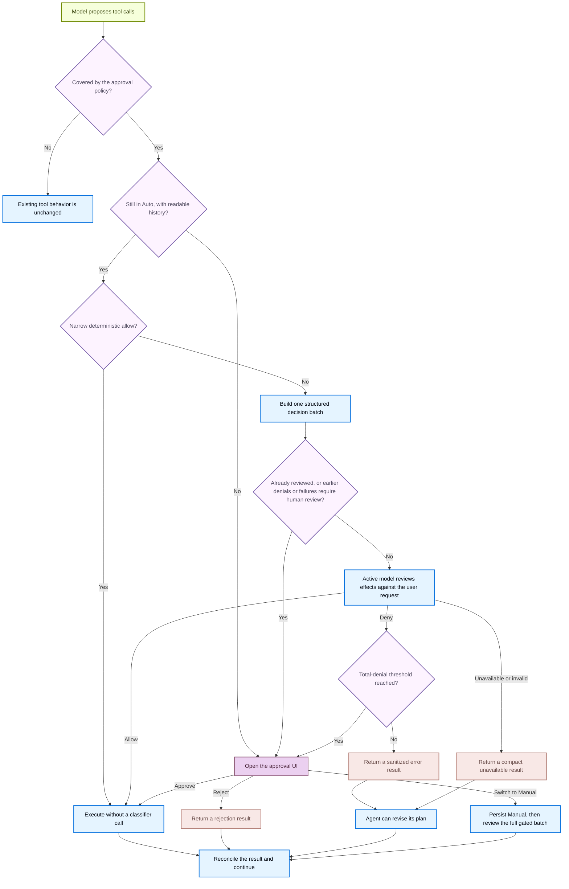

<!-- langchain-docs: Approval modes | https://docs.langchain.com/oss/deepagents/code/approval-modes -->

# Approval modes

By default, Deep Agents Code asks for your approval before running potentially consequential actions. These are called **gated actions** and include things like:

- Editing or deleting files (`write_file`, `edit_file`, `delete`)
- Running shell commands (`execute`)
- Making web requests (`web_search`, `fetch_url`)
- Delegating work to subagents (`task`)

Read-only tools such as `ls`, `read_file`, `glob`, and `grep` always run without prompting. Approval modes let you choose how much oversight each session requires for the gated actions.

## Choose a mode

| Mode | What it does |
|---|---|
| **Manual** (default) | Asks for approval before every gated action |
| **Auto** | Approves routine actions automatically; asks the model to review anything uncertain; falls back to you after repeated denials or failures |
| **YOLO** | Runs gated actions with no review at all |

<Warning>
    Auto is an authorization heuristic for a local coding agent. It is **not** sandbox containment, an operating-system boundary, or a guarantee that model-generated actions are safe.
</Warning>

## Enable Auto

Auto is eligible only in interactive, unsandboxed sessions.

<Steps>

    <Step title="Launch with Auto" icon="terminal">
        ```bash
        dcode -y
        ```

        Or set it as your default in `~/.deepagents/config.toml`:

        ```toml
        [startup]
        mode = "auto"
        ```

        You can also cycle to Auto mid-session with `Shift+Tab`.
    </Step>
</Steps>

## Enable YOLO

YOLO runs gated actions without any review. Use it only when you accept that the agent can take any action without asking.

<Steps>

    <Step title="Launch with YOLO" icon="terminal">
        ```bash
        dcode --yolo
        ```

        Accept the one-time risk acknowledgement when prompted. The acknowledgement is stored locally so you do not see it again on later launches.

        Or set it as your default in `~/.deepagents/config.toml`:

        ```toml
        [startup]
        mode = "yolo"
        ```
    </Step>
</Steps>

Press `Shift+Tab` to cycle YOLO → Manual → Auto → YOLO. Set [`startup.yolo_switcher = false`](/oss/deepagents/code/config-file#startup-approval-mode) to omit YOLO from the cycle.

## How Auto works

Auto keeps the same gated-action rules as Manual but changes how those actions are reviewed. It uses two stages:

1. **Routine actions run automatically.** A write to a source file like `src/parser.py` or a read-only Git command like `git status` proceeds without a prompt. Sensitive targets like `.github/workflows/ci.yml` or mutating commands like `git commit` go to the next stage.
2. **The model reviews the rest.** For anything not clearly routine, the active model checks whether the action matches your requested outcome. Ordinary steps reasonably necessary for that outcome can proceed even when you did not name each implementation detail. High-risk effects, such as sending local content to an unconfigured destination, still require explicit authorization. If the model denies a call, the agent gets an error result and can revise its plan.

After repeated denials or classifier failures, Auto stops and shows you the normal approval prompt for the next batch, then continues in Auto mode.

<Accordion title="Auto decision flow" icon="flow">


</Accordion>

### Select a classifier model

When you do not configure an Auto classifier, Deep Agents Code selects a lower-latency default based on the main model's provider:

| Main model provider | Default classifier |
|---|---|
| Anthropic | `anthropic:claude-sonnet-5` |
| Google AI | `google_genai:gemini-3.8-flash` |
| Google Vertex AI | `google_vertexai:gemini-3.8-flash` |
| OpenAI | `openai:gpt-5.6-luna` |
| OpenAI Codex | `openai_codex:gpt-5.6-luna` |

For other providers, the classifier uses the main agent model. You can select a different model to control cost and latency during Auto review.

Set the classifier model through any of these sources:

<Tabs>
    <Tab title="TUI command">
        Run `/auto model` to open the interactive model picker and select a classifier model for the current session. To specify a model directly, pass it as an argument:

        ```txt
        /auto model openai:gpt-5.6-luna
        /auto model clear
        ```

        Use `/auto model clear` to go back to inheriting the main model.
    </Tab>
    <Tab title="CLI flag">
        ```bash
        dcode -y --auto-classifier-model openai:gpt-5.6-luna
        ```

        `--auto-classifier-model` is only accepted in interactive TUI sessions.
    </Tab>
    <Tab title="Environment variable">
        ```bash
        export DEEPAGENTS_CODE_AUTO_CLASSIFIER_MODEL="openai:gpt-5.6-luna"
        ```

        <Warning>
            A **project `.env`** cannot set `DEEPAGENTS_CODE_AUTO_CLASSIFIER_MODEL`. Only shell exports, `~/.deepagents/.env`, the CLI flag, and `/auto model` work.
        </Warning>
    </Tab>
    <Tab title="config.toml">
        ```toml title="~/.deepagents/config.toml"
        [models]
        auto_classifier = "openai:gpt-5.6-luna"
        ```
    </Tab>
</Tabs>
<br />
<Accordion title="Precedence order">
    1. **`/auto model` TUI command**: takes effect immediately for the current session.
    2. **`--auto-classifier-model` flag**: sets the classifier on launch (interactive TUI sessions only).
    3. **`DEEPAGENTS_CODE_AUTO_CLASSIFIER_MODEL` environment variable**: applies at startup.
    4. **`[models].auto_classifier` in `config.toml`**: your persistent default.
    5. **Provider default**: uses the lower-latency model listed above when the main model uses a supported provider.
    6. **Inherit**: uses the main agent model for providers without a built-in default.

    An unset value falls through to the next source. Explicitly clearing the classifier with `/auto model clear` or an empty CLI flag selects the main agent model instead of the provider default.
</Accordion>

The TUI displays which model is reviewing when Auto turns on and inside `/auto model` output.

### Revalidate before side effects

The decision plan is bound to the thread, mode, batch, and exact gated calls. Missing or invalid state, a mode race, or a replay falls back to human review. For example, if you switch to Manual while classifier review is in progress, an earlier Auto decision cannot execute silently; the normal approval UI opens instead.

### Understand scope and limitations

- The Manual approval menu can enable Auto for the current thread. Threshold fallback can switch permanently to Manual or perform a one-off review while leaving Auto enabled.
- The active model is not an independent security authority. [MCP read-only annotations](/oss/deepagents/code/mcp-tools#read-only-tool-annotations-in-auto-mode) are trusted as a deliberate beta tradeoff.
- Parent-level Auto review does not cover actions performed inside delegated subagents or broader explicitly configured `js_eval` fan-out. Model providers and tracing backends may still observe classifier inputs and outputs even though the TUI hides them.

## Where Auto and YOLO are available

Auto and YOLO are interactive-mode features. Auto is eligible only in an interactive, unsandboxed session; a remote `--sandbox` forces it to Manual. YOLO is interactive-only as well and requires the risk acknowledgement regardless of sandbox. Headless runs use fail-closed MCP routing and `--shell-allow-list` for shell access.

In non-interactive mode (`-n` or piped stdin), `-y`/`--auto-approve` and `--yolo` are ignored. Headless runs use fail-closed MCP routing and `--shell-allow-list` for shell access.

### Remember the last mode across sessions

When no flag or configured mode applies, Deep Agents Code restores the last selected Manual or Auto mode. YOLO must be explicitly selected. See [Startup approval mode](/oss/deepagents/code/config-file#startup-approval-mode).

For flag and configuration precedence, see [Startup approval mode](/oss/deepagents/code/config-file#startup-approval-mode).

## See also

- [CLI reference](/oss/deepagents/code/cli-reference)
- [Configuration](/oss/deepagents/code/configuration)
- [Remote sandboxes](/oss/deepagents/code/remote-sandboxes)

---

<div className="source-links">
<Callout icon="terminal-2">
    [Connect these docs](/use-these-docs) to Claude, VSCode, and more via MCP for real-time answers.
</Callout>
<Callout icon="edit">
    [Edit this page on GitHub](https://github.com/langchain-ai/docs/edit/main/src/oss/deepagents/code/approval-modes.mdx) or [file an issue](https://github.com/langchain-ai/docs/issues/new/choose).
</Callout>
</div>