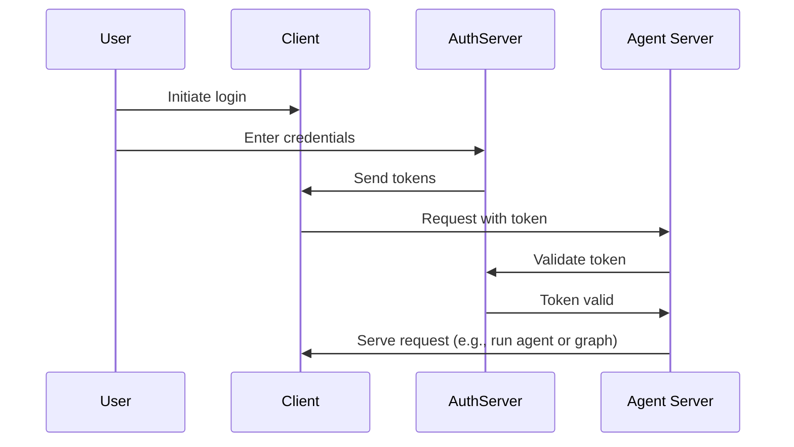

<!-- langchain-docs: machine-translated zh-CN from English source -->

<!-- langchain-docs: Connect an authentication provider | https://docs.langchain.com/langsmith/add-auth-server -->

# 连接身份验证提供者

在[the last tutorial](/langsmith/resource-auth)中，您添加了资源授权，为用户提供私人对话。但是，您仍然使用硬编码令牌进行身份验证，这是不安全的。现在，您将使用 [OAuth2](/langsmith/deployment-quickstart) 将这些令牌替换为真实用户帐户。

您将保留相同的 [⟦T10⟧](https://reference.langchain.com/python/langgraph-sdk/auth/Auth) 对象和 [resource-level access control](/langsmith/auth#single-owner-resources)，但升级身份验证以使用 Supabase 作为身份提供商。虽然本教程中使用 Supabase，但这些概念适用于任何 OAuth2 提供商。您将学习如何：

1. 用真实的 JWT 令牌替换测试令牌
2. 与 OAuth2 提供商集成以实现安全的用户身份验证
3. 处理用户会话和元数据，同时维护现有的授权逻辑

## 背景

OAuth2 涉及三个主要角色：

1. **授权服务器**：处理用户身份验证并颁发令牌的身份提供商（例如 Supabase、Auth0、Google）
2. **应用程序后端**：您的LangGraph应用程序。这将验证令牌并提供受保护的资源（对话数据）
3. **客户端应用程序**：用户与您的服务交互的网络或移动应用程序

标准 OAuth2 流程的工作原理如下：



## 先决条件在开始本教程之前，请确保您拥有：

* [bot from the second tutorial](/langsmith/resource-auth) 运行无错误。
* [Supabase project](https://supabase.com/dashboard) 使用其身份验证服务器。

## 1.安装依赖

安装所需的依赖项。从您的 `custom-auth` 目录开始，并确保您已安装 `langgraph-cli`：

<CodeGroup>
```bash pip
cd custom-auth
pip install -U "langgraph-cli[inmem]"
```

```bash uv
cd custom-auth
uv add "langgraph-cli[inmem]"
```
</CodeGroup>

<a id="setup-auth-provider"></a>
## 2. 设置身份验证提供程序

接下来，获取身份验证服务器的 URL 和用于身份验证的私钥。
由于您为此使用 Supabase，因此您可以在 Supabase 仪表板中执行此操作：

1. 在左侧边栏中，点击“t️⚙项目设置”，然后点击“API”
2. 复制您的项目 URL 并将其添加到您的 `.env` 文件中
  ```shell
  echo "SUPABASE_URL=your-project-url" >> .env
  ```
3. 复制您的服务角色密钥并将其添加到您的 `.env` 文件中：
  ```shell
  echo "SUPABASE_SERVICE_KEY=your-service-role-key" >> .env
  ```
4. 复制您的“匿名公钥”密钥并记下。稍后当您设置我们的客户端代码时将使用它。
  ```bash
  SUPABASE_URL=your-project-url
  SUPABASE_SERVICE_KEY=your-service-role-key
  ```

## 3. 实施令牌验证

在之前的教程中，您使用了 [⟦T15⟧](https://reference.langchain.com/python/langgraph-sdk/auth/Auth) 对象到 [validate hard-coded tokens](/langsmith/set-up-custom-auth) 和 [add resource ownership](/langsmith/resource-auth)。

现在，您将升级身份验证以验证来自 Supabase 的真实 JWT 令牌。主要的变化都在 [⟦T16⟧](https://reference.langchain.com/python/langgraph-sdk/auth/Auth/authenticate) 修饰函数中：* 您无需检查硬编码的令牌列表，而是向 Supabase 发出 HTTP 请求来验证令牌。
* 您将从经过验证的令牌中提取真实的用户信息（ID、电子邮件）。
* 现有资源授权逻辑不变。

更新`src/security/auth.py`来实现这一点：

```python {highlight={8-9,20-30}} title="src/security/auth.py"
import os
import httpx
from langgraph_sdk import Auth

auth = Auth()

# This is loaded from the `.env` file you created above
SUPABASE_URL = os.environ["SUPABASE_URL"]
SUPABASE_SERVICE_KEY = os.environ["SUPABASE_SERVICE_KEY"]


@auth.authenticate
async def get_current_user(authorization: str | None):
    """Validate JWT tokens and extract user information."""
    assert authorization
    scheme, token = authorization.split()
    assert scheme.lower() == "bearer"

    try:
        # Verify token with auth provider
        async with httpx.AsyncClient() as client:
            response = await client.get(
                f"{SUPABASE_URL}/auth/v1/user",
                headers={
                    "Authorization": authorization,
                    "apiKey": SUPABASE_SERVICE_KEY,
                },
            )
            assert response.status_code == 200
            user = response.json()
            return {
                "identity": user["id"],  # Unique user identifier
                "email": user["email"],
                "is_authenticated": True,
            }
    except Exception as e:
        raise Auth.exceptions.HTTPException(status_code=401, detail=str(e))

# ... the rest is the same as before

# Keep our resource authorization from the previous tutorial
@auth.on
async def add_owner(ctx, value):
    """Make resources private to their creator using resource metadata."""
    filters = {"owner": ctx.user.identity}
    metadata = value.setdefault("metadata", {})
    metadata.update(filters)
    return filters
```

最重要的变化是我们现在使用真实的身份验证服务器来验证令牌。我们的身份验证处理程序拥有 Supabase 项目的私钥，我们可以用它来验证用户的令牌并提取他们的信息。

## 4. 测试认证流程

让我们测试一下新的身份验证流程。您可以在文件或笔记本中运行以下代码。您需要提供：

* 有效的电子邮件地址
* Supabase 项目 URL（来自[above](#setup-auth-provider)）
* 一个 Supabase 匿名 **公钥** （也来自 [above](#setup-auth-provider)）

```python
import os
import httpx
from getpass import getpass
from langgraph_sdk import get_client


# Get email from command line
email = getpass("Enter your email: ")
base_email = email.split("@")
password = "secure-password"  # CHANGEME
email1 = f"{base_email[0]}+1@{base_email[1]}"
email2 = f"{base_email[0]}+2@{base_email[1]}"

SUPABASE_URL = os.environ.get("SUPABASE_URL")
if not SUPABASE_URL:
    SUPABASE_URL = getpass("Enter your Supabase project URL: ")

# This is your PUBLIC anon key (which is safe to use client-side)
# Do NOT mistake this for the secret service role key
SUPABASE_ANON_KEY = os.environ.get("SUPABASE_ANON_KEY")
if not SUPABASE_ANON_KEY:
    SUPABASE_ANON_KEY = getpass("Enter your public Supabase anon  key: ")


async def sign_up(email: str, password: str):
    """Create a new user account."""
    async with httpx.AsyncClient() as client:
        response = await client.post(
            f"{SUPABASE_URL}/auth/v1/signup",
            json={"email": email, "password": password},
            headers={"apiKey": SUPABASE_ANON_KEY},
        )
        assert response.status_code == 200
        return response.json()

# Create two test users
print(f"Creating test users: {email1} and {email2}")
await sign_up(email1, password)
await sign_up(email2, password)
```

⚠️ 继续之前：检查您的电子邮件并单击两个确认链接。在您确认用户的电子邮件之前，Supabase 将拒绝 `/login` 请求。现在测试用户只能看到自己的数据。在继续之前，请确保服务器正在运行（运行`langgraph dev`）。以下代码片段需要您之前在 [setting up the auth provider](#setup-auth-provider) 时从 Supabase 仪表板复制的“匿名公钥”密钥。

```python
async def login(email: str, password: str):
    """Get an access token for an existing user."""
    async with httpx.AsyncClient() as client:
        response = await client.post(
            f"{SUPABASE_URL}/auth/v1/token?grant_type=password",
            json={
                "email": email,
                "password": password
            },
            headers={
                "apikey": SUPABASE_ANON_KEY,
                "Content-Type": "application/json"
            },
        )
        assert response.status_code == 200
        return response.json()["access_token"]


# Log in as user 1
user1_token = await login(email1, password)
user1_client = get_client(
    url="http://localhost:2024", headers={"Authorization": f"Bearer {user1_token}"}
)

# Create a thread as user 1
thread = await user1_client.threads.create()
print(f"✅ User 1 created thread: {thread['thread_id']}")

# Try to access without a token
unauthenticated_client = get_client(url="http://localhost:2024")
try:
    await unauthenticated_client.threads.create()
    print("❌ Unauthenticated access should fail!")
except Exception as e:
    print("✅ Unauthenticated access blocked:", e)

# Try to access user 1's thread as user 2
user2_token = await login(email2, password)
user2_client = get_client(
    url="http://localhost:2024", headers={"Authorization": f"Bearer {user2_token}"}
)

try:
    await user2_client.threads.get(thread["thread_id"])
    print("❌ User 2 shouldn't see User 1's thread!")
except Exception as e:
    print("✅ User 2 blocked from User 1's thread:", e)
```

输出应如下所示：

```shell
✅ User 1 created thread: d6af3754-95df-4176-aa10-dbd8dca40f1a
✅ Unauthenticated access blocked: Client error '403 Forbidden' for url 'http://localhost:2024/threads'
✅ User 2 blocked from User 1's thread: Client error '404 Not Found' for url 'http://localhost:2024/threads/d6af3754-95df-4176-aa10-dbd8dca40f1a'
```

您的身份验证和授权是协同工作的：

1. 用户必须登录才能访问机器人
2.每个用户只能看到自己的线程

所有用户均由 Supabase 身份验证提供程序管理，因此您无需实现任何额外的用户管理逻辑。

## 后续步骤

您已成功为您的 LangGraph 应用程序构建了生产就绪的身份验证系统！让我们回顾一下您已完成的工作：

1. 设置身份验证提供程序（本例中为 Supabase）
2. 新增真实用户账号及邮箱/密码认证
3. 将 JWT 令牌验证集成到代理服务器中
4. 实施适当的授权，确保用户只能访问自己的数据
5. 创建一个准备好应对下一个身份验证挑战的基础

现在您已经有了生产验证，请考虑：1. 使用您喜欢的框架构建 Web UI（有关示例，请参阅 [Custom Auth](https://github.com/langchain-ai/custom-auth) 模板）
2. 在[conceptual guide on authentication](/langsmith/auth)中详细了解身份验证和授权的其他方面。
3. 阅读[reference docs](https://reference.langchain.com/python/langgraph-sdk/auth/Auth)后进一步自定义您的处理程序和设置。

---

<div className="source-links">
<Callout icon="terminal-2">
    通过 MCP 向 Claude、VSCode 等发送[Connect these docs](/use-these-docs) 以获得实时答案。
</Callout>
<Callout icon="edit">
    [Edit this page on GitHub](https://github.com/langchain-ai/docs/edit/main/src/langsmith/add-auth-server.mdx) 或 [file an issue](https://github.com/langchain-ai/docs/issues/new/choose)。
</Callout>
</div>