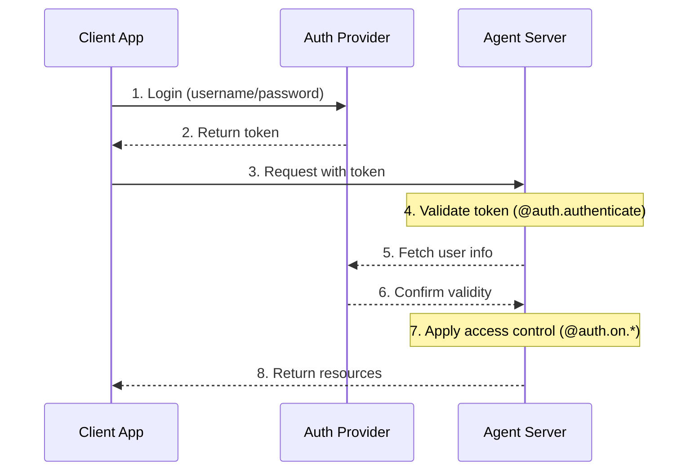

<!-- langchain-docs: machine-translated zh-CN from English source -->

<!-- langchain-docs: Authentication & access control | https://docs.langchain.com/langsmith/auth -->

# 身份验证和访问控制

LangSmith提供灵活的认证和授权系统，可以与大多数认证方案集成。

## 核心概念

### 身份验证与授权

虽然经常互换使用，但这些术语代表了不同的安全概念：

* [**Authentication**](#authentication)（“AuthN”）验证您是谁。它作为每个请求的中间件运行。
* [**Authorization**](#authorization)（“AuthZ”）决定_你可以做什么_。这会根据每个资源验证用户的权限和角色。

在 LangSmith 中，身份验证由您的 [⟦T8⟧](https://reference.langchain.com/python/langgraph-sdk/auth/Auth/authenticate) 处理程序处理，授权由您的 [⟦T9⟧](https://reference.langchain.com/python/langgraph-sdk/auth/Auth/on) 处理程序处理。

## 默认安全模型

LangSmith 提供不同的安全默认值：

### LangSmith

* 默认使用 LangSmith API 密钥
* 需要在 `x-api-key` 标头中提供有效的 API 密钥
* 可以使用您的身份验证处理程序进行定制

<Note>
**自定义授权**
LangSmith 中的所有计划**支持**自定义身份验证。
</Note>

### 自托管

* 无默认身份验证
* 完全灵活地实施您的安全模型
* 您控制身份验证和授权的各个方面


## 系统架构

典型的身份验证设置涉及三个主要组件：1. **身份验证提供商**（身份提供商/IdP）
   * 管理用户身份和凭证的专用服务
   * 处理用户注册、登录、密码重置等。
   * 身份验证成功后颁发令牌（JWT、会话令牌等）
   * 示例：Auth0、Supabase Auth、Okta 或您自己的身份验证服务器
2. **代理服务器**（资源服务器）
   * 您的代理或LangGraph应用程序，其中包含业务逻辑和受保护的资源
   * 与身份验证提供者验证令牌
   * 基于用户身份和权限实施访问控制
   * 不直接存储用户凭据
3. **客户端应用程序**（前端）
   * Web 应用程序、移动应用程序或 API 客户端
   * 收集对时间敏感的用户凭据并将其发送给身份验证提供商
   * 从身份验证提供者接收令牌
   * 在对代理服务器的请求中包含这些令牌

以下是这些组件通常如何交互的：



LangGraph 中的 [⟦T11⟧](https://reference.langchain.com/python/langgraph-sdk/auth/Auth/authenticate) 处理程序处理步骤 4-6，而 [⟦T12⟧](https://reference.langchain.com/python/langgraph-sdk/auth/Auth/on) 处理程序则实现步骤 7。

## 身份验证

LangGraph 中的身份验证作为中间件在每个请求上运行。您的 [⟦T13⟧](https://reference.langchain.com/python/langgraph-sdk/auth/Auth/authenticate) 处理程序接收请求信息并且应该：1. 验证凭据
2. 如果有效，则返回包含用户身份和用户信息的[user info](https://reference.langchain.com/python/langgraph-sdk/auth/types/MinimalUserDict)
3. 如果无效，则引发 [HTTP exception](https://reference.langchain.com/python/langgraph-sdk/auth/exceptions/HTTPException) 或 AssertionError

```python
from langgraph_sdk import Auth

auth = Auth()

@auth.authenticate
async def authenticate(headers: dict) -> Auth.types.MinimalUserDict:
    # Validate credentials (e.g., API key, JWT token)
    api_key = headers.get(b"x-api-key")
    if not api_key or not is_valid_key(api_key):
        raise Auth.exceptions.HTTPException(
            status_code=401,
            detail="Invalid API key"
        )

    # Return user info - only identity and is_authenticated are required
    # Add any additional fields you need for authorization
    return {
        "identity": "user-123",        # Required: unique user identifier
        "is_authenticated": True,      # Optional: assumed True by default
        "permissions": ["read", "write"], # Optional: for permission-based auth
        # You can add more custom fields if you want to implement other auth patterns
        "role": "admin",
        "org_id": "org-456"

    }
```

返回的用户信息可用：

* 通过 [⟦T14⟧](https://reference.langchain.com/python/langgraph-sdk/auth/types/AuthContext) 发送给您的授权处理人员
* 通过 `config["configuration"]["langgraph_auth_user"]` 在您的申请中

<Accordion title="Supported Parameters">
  [⟦T16⟧](https://reference.langchain.com/python/langgraph-sdk/auth/Auth/authenticate) 处理程序可以按名称接受以下任何参数：

  * 请求（Request）：原始ASGI请求对象
  * path (str): 请求路径，例如`"/threads/abcd-1234-abcd-1234/runs/abcd-1234-abcd-1234/stream"`
  * method (str): HTTP 方法，例如 `"GET"`
  * path_params(dict[str, str])：URL路径参数，例如`{"thread_id": "abcd-1234-abcd-1234", "run_id": "abcd-1234-abcd-1234"}`
  * query_params(dict[str, str])：URL查询参数，例如`{"stream": "true"}`
  * headers (dict[bytes, bytes]): 请求头
  * 授权 (str | None)：授权标头值（例如，`"Bearer <token>"`）

  在我们的许多教程中，为了简洁起见，我们只会显示“授权”参数，但您可以根据需要选择接受更多信息
  实施您的自定义身份验证方案。
</Accordion>

### 代理认证

自定义身份验证允许委派访问。您在 `@auth.authenticate` 中返回的值将添加到运行上下文中，为代理提供用户范围的凭据，让它们代表用户访问资源。```mermaid actions={false}
sequenceDiagram
  %% Actors
  participant ClientApp as Client
  participant AuthProv  as Auth Provider
  participant LangGraph as Agent Server
  participant SecretStore as Secret Store
  participant ExternalService as External Service

  %% Platform login / AuthN
  ClientApp  ->> AuthProv: 1. Login (username / password)
  AuthProv   -->> ClientApp: 2. Return token
  ClientApp  ->> LangGraph: 3. Request with token

  Note over LangGraph: 4. Validate token (@auth.authenticate)
  LangGraph  -->> AuthProv: 5. Fetch user info
  AuthProv   -->> LangGraph: 6. Confirm validity

  %% Fetch user tokens from secret store
  LangGraph  ->> SecretStore: 6a. Fetch user tokens
  SecretStore -->> LangGraph: 6b. Return tokens

  Note over LangGraph: 7. Apply access control (@auth.on.*)

  %% External Service round-trip
  LangGraph  ->> ExternalService: 8. Call external service (with header)
  Note over ExternalService: 9. External service validates header and executes action
  ExternalService  -->> LangGraph: 10. Service response

  %% Return to caller
  LangGraph  -->> ClientApp: 11. Return resources
```

身份验证后，平台会创建一个特殊的配置对象，该对象通过可配置上下文传递到您的图形和所有节点。
该对象包含有关当前用户的信息，包括从 [⟦T23⟧](https://reference.langchain.com/python/langgraph-sdk/auth/Auth/authenticate) 处理程序返回的任何自定义字段。

要使代理能够代表用户执行操作，请使用 [custom authentication middleware](/langsmith/custom-auth)。这将允许代理与外部系统（如 MCP 服务器、外部数据库，甚至代表用户的其他代理）进行交互。

有关更多信息，请参阅[Use custom auth](/langsmith/custom-auth#enable-agent-authentication)指南。

### 使用 MCP 进行代理身份验证

有关如何向 MCP 服务器验证代理的信息，请参阅 [MCP conceptual guide](/oss/python/langchain/mcp)。

## 授权

身份验证后，LangGraph 调用您的 [⟦T24⟧](https://reference.langchain.com/python/langgraph-sdk/auth/Auth) 处理程序来控制对特定资源（例如线程、助手、cron）的访问。这些处理程序可以：

1. 通过直接修改`value["metadata"]`字典，添加资源创建时要保存的元数据。请参阅 [supported actions table](#supported-actions) 了解每个操作的值可以采用的类型列表。
2. 在搜索/列表或读取操作期间通过返回 [filter dictionary](#filter-operations) 按元数据过滤资源。
3. 如果访问被拒绝，则引发 HTTP 异常。如果您只想实现简单的用户范围访问控制，则可以对所有资源和操作使用单个 [⟦T26⟧](https://reference.langchain.com/python/langgraph-sdk/auth/Auth) 处理程序。如果您想根据资源和操作进行不同的控制，可以使用[resource-specific handlers](#resource-specific-handlers)。有关支持访问控制的资源的完整列表，请参阅 [Supported Resources](#supported-resources) 部分。

```python
@auth.on
async def add_owner(
    ctx: Auth.types.AuthContext,
    value: dict  # The payload being sent to this access method
) -> dict:  # Returns a filter dict that restricts access to resources
    """Authorize all access to threads, runs, crons, and assistants.

    This handler does two things:
        - Adds a value to resource metadata (to persist with the resource so it can be filtered later)
        - Returns a filter (to restrict access to existing resources)

    Args:
        ctx: Authentication context containing user info, permissions, the path, and
        value: The request payload sent to the endpoint. For creation
              operations, this contains the resource parameters. For read
              operations, this contains the resource being accessed.

    Returns:
        A filter dictionary that LangGraph uses to restrict access to resources.
        See [Filter Operations](#filter-operations) for supported operators.
    """
    # Create filter to restrict access to just this user's resources
    filters = {"owner": ctx.user.identity}

    # Get or create the metadata dictionary in the payload
    # This is where we store persistent info about the resource
    metadata = value.setdefault("metadata", {})

    # Add owner to metadata - if this is a create or update operation,
    # this information will be saved with the resource
    # So we can filter by it later in read operations
    metadata.update(filters)

    # Return filters to restrict access
    # These filters are applied to ALL operations (create, read, update, search, etc.)
    # to ensure users can only access their own resources
    return filters
```

<a id="resource-specific-handlers"></a>
### 特定于资源的处理程序

您可以通过将资源和操作名称与 [⟦T27⟧](https://reference.langchain.com/python/langgraph-sdk/auth/Auth) 装饰器链接在一起来注册特定资源和操作的处理程序。
发出请求时，将调用与该资源和操作匹配的最具体的处理程序。以下是如何注册特定资源和操作的处理程序的示例。对于以下设置：

1.经过身份验证的用户能够创建线程、读取线程以及在线程上创建运行
2、只有拥有“assistants:create”权限的用户才可以创建新的助手
3. 对所有用户禁用所有其他端点（例如，删除助手、crons、存储）。

<Tip>
**支持的处理程序**
有关支持的资源和操作的完整列表，请参阅下面的 [Supported Resources](#supported-resources) 部分。
</Tip>

```python
# Generic / global handler catches calls that aren't handled by more specific handlers
@auth.on
async def reject_unhandled_requests(ctx: Auth.types.AuthContext, value: Any) -> False:
    print(f"Request to {ctx.path} by {ctx.user.identity}")
    raise Auth.exceptions.HTTPException(
        status_code=403,
        detail="Forbidden"
    )

# Matches the "thread" resource and all actions - create, read, update, delete, search
# Since this is **more specific** than the generic @auth.on handler, it will take precedence
# over the generic handler for all actions on the "threads" resource
@auth.on.threads
async def on_thread(
    ctx: Auth.types.AuthContext,
    value: Auth.types.threads.create.value
):
    # Setting metadata on the thread being created
    # will ensure that the resource contains an "owner" field
    # Then any time a user tries to access this thread or runs within the thread,
    # we can filter by owner
    metadata = value.setdefault("metadata", {})
    metadata["owner"] = ctx.user.identity
    return {"owner": ctx.user.identity}


# Thread creation. This will match only on thread create actions
# Since this is **more specific** than both the generic @auth.on handler and the @auth.on.threads handler,
# it will take precedence for any "create" actions on the "threads" resources
@auth.on.threads.create
async def on_thread_create(
    ctx: Auth.types.AuthContext,
    value: Auth.types.threads.create.value
):
    # Reject if the user does not have write access
    if "write" not in ctx.permissions:
        raise Auth.exceptions.HTTPException(
            status_code=403,
            detail="User lacks the required permissions."
        )
    # Setting metadata on the thread being created
    # will ensure that the resource contains an "owner" field
    # Then any time a user tries to access this thread or runs within the thread,
    # we can filter by owner
    metadata = value.setdefault("metadata", {})
    metadata["owner"] = ctx.user.identity
    return {"owner": ctx.user.identity}

# Reading a thread. Since this is also more specific than the generic @auth.on handler, and the @auth.on.threads handler,
# it will take precedence for any "read" actions on the "threads" resource
@auth.on.threads.read
async def on_thread_read(
    ctx: Auth.types.AuthContext,
    value: Auth.types.threads.read.value
):
    # Since we are reading (and not creating) a thread,
    # we don't need to set metadata. We just need to
    # return a filter to ensure users can only see their own threads
    return {"owner": ctx.user.identity}

# Run creation, streaming, updates, etc.
# This takes precedenceover the generic @auth.on handler and the @auth.on.threads handler
@auth.on.threads.create_run
async def on_run_create(
    ctx: Auth.types.AuthContext,
    value: Auth.types.threads.create_run.value
):
    metadata = value.setdefault("metadata", {})
    metadata["owner"] = ctx.user.identity
    # Inherit thread's access control
    return {"owner": ctx.user.identity}

# Assistant creation
@auth.on.assistants.create
async def on_assistant_create(
    ctx: Auth.types.AuthContext,
    value: Auth.types.assistants.create.value
):
    if "assistants:create" not in ctx.permissions:
        raise Auth.exceptions.HTTPException(
            status_code=403,
            detail="User lacks the required permissions."
        )
```请注意，我们在上面的示例中混合了全局处理程序和特定于资源的处理程序。由于每个请求都由最具体的处理程序处理，因此创建 `thread` 的请求将匹配 `on_thread_create` 处理程序，但不匹配 `reject_unhandled_requests` 处理程序。然而，对 `update` 线程的请求将由全局处理程序处理，因为我们没有针对该资源和操作的更具体的处理程序。

<a id="filter-operations"></a>
### 过滤操作

授权处理程序可以返回 `None`、布尔值或过滤字典。

* `None` 和 `True` 表示“授权访问所有底层资源”
* `False` 表示“拒绝访问所有底层资源（引发 403 异常）”
* 元数据过滤字典将限制对资源的访问

过滤字典是具有与资源元数据匹配的键的字典。它支持三种运算符：* 默认值是精确匹配的简写，或下面的“$eq”。例如，`{"owner": user_id}`将仅包含元数据包含`{"owner": user_id}`的资源
* `$eq`：完全匹配（例如，`{"owner": {"$eq": user_id}}`） - 这相当于上面的简写，`{"owner": user_id}`
* `$contains`：列出成员资格（例如，`{"allowed_users": {"$contains": user_id}}`）或列表包含（例如，`{"allowed_users": {"$contains": [user_id_1, user_id_2]}}`）。这里的值必须分别是列表的元素或列表元素的子集。存储资源中的元数据必须是列表/容器类型。

使用逻辑 `AND` 过滤器处理具有多个键的字典。例如，`{"owner": org_id, "allowed_users": {"$contains": user_id}}`将仅匹配“所有者”为`org_id`且“allowed_users”列表包含`user_id`的元数据的资源。
有关更多信息，请参阅参考文献[⟦T48⟧](https://reference.langchain.com/python/langgraph-sdk/auth/Auth)(Auth)。

## 常见访问模式

以下是一些典型的授权模式：

### 单一所有者资源

这种通用模式允许您将所有线程、助手、cron 和运行范围限定为单个用户。它对于常见的单用户用例（例如常规聊天机器人风格的应用程序）非常有用。

```python
@auth.on
async def owner_only(ctx: Auth.types.AuthContext, value: dict):
    metadata = value.setdefault("metadata", {})
    metadata["owner"] = ctx.user.identity
    return {"owner": ctx.user.identity}
```

### 基于权限的访问

此模式允许您根据**权限**控制访问。如果您希望某些角色拥有更广泛或更严格的资源访问权限，那么它会很有用。```python
# In your auth handler:
@auth.authenticate
async def authenticate(headers: dict) -> Auth.types.MinimalUserDict:
    ...
    return {
        "identity": "user-123",
        "is_authenticated": True,
        "permissions": ["threads:write", "threads:read"]  # Define permissions in auth
    }

def _default(ctx: Auth.types.AuthContext, value: dict):
    metadata = value.setdefault("metadata", {})
    metadata["owner"] = ctx.user.identity
    return {"owner": ctx.user.identity}

@auth.on.threads.create
async def create_thread(ctx: Auth.types.AuthContext, value: dict):
    if "threads:write" not in ctx.permissions:
        raise Auth.exceptions.HTTPException(
            status_code=403,
            detail="Unauthorized"
        )
    return _default(ctx, value)


@auth.on.threads.read
async def rbac_create(ctx: Auth.types.AuthContext, value: dict):
    if "threads:read" not in ctx.permissions and "threads:write" not in ctx.permissions:
        raise Auth.exceptions.HTTPException(
            status_code=403,
            detail="Unauthorized"
        )
    return _default(ctx, value)
```

## 支持的资源

LangGraph 提供三个级别的授权处理程序，从最通用到最具体：

1. **全局处理程序** (`@auth.on`)：匹配所有资源和操作
2. **资源处理程序**（例如，`@auth.on.threads`、`@auth.on.assistants`、`@auth.on.crons`）：匹配特定资源的所有操作
3. **操作处理程序**（例如，`@auth.on.threads.create`、`@auth.on.threads.read`）：匹配特定资源上的特定操作

将使用最具体的匹配处理程序。例如，对于线程创建，`@auth.on.threads.create`优先于`@auth.on.threads`。
如果注册了更具体的处理程序，则不会为该资源和操作调用更通用的处理程序。

<Tip>
“类型安全”
每个处理程序在 `Auth.types.on.<resource>.<action>.value` 处都有可用于其 `value` 参数的类型提示。例如：

```python
@auth.on.threads.create
async def on_thread_create(
ctx: Auth.types.AuthContext,
value: Auth.types.on.threads.create.value  # Specific type for thread creation
):
...

@auth.on.threads
async def on_threads(
ctx: Auth.types.AuthContext,
value: Auth.types.on.threads.value  # Union type of all thread actions
):
...

@auth.on
async def on_all(
ctx: Auth.types.AuthContext,
value: dict  # Union type of all possible actions
):
...
```

更具体的处理程序提供更好的类型提示，因为它们处理更少的操作类型。
</Tip>

<a id="supported-actions"></a>
#### 支持的操作和类型

以下是所有支持的操作处理程序：|资源 |处理程序 |描述 |值类型|
|----------|---------|-------------|------------|
| **话题** | `@auth.on.threads.create` |线程创建 | [⟦T60⟧](https://reference.langchain.com/python/langgraph-sdk/auth/types/ThreadsCreate) |
| | `@auth.on.threads.read` |主题检索 | [⟦T62⟧](https://reference.langchain.com/python/langgraph-sdk/auth/types/ThreadsRead) |
| | `@auth.on.threads.update` |主题更新 | [⟦T64⟧](https://reference.langchain.com/python/langgraph-sdk/auth/types/ThreadsUpdate) |
| | `@auth.on.threads.delete` |删除主题 | [⟦T66⟧](https://reference.langchain.com/python/langgraph-sdk/auth/types/ThreadsDelete) |
| | `@auth.on.threads.search` |列出主题 | [⟦T68⟧](https://reference.langchain.com/python/langgraph-sdk/auth/types/ThreadsSearch) |
| | `@auth.on.threads.create_run` |创建或更新运行 | [⟦T70⟧](https://reference.langchain.com/python/langgraph-sdk/auth/types/RunsCreate) |
| **助理** | `@auth.on.assistants.create` |助理创作 | [⟦T72⟧](https://reference.langchain.com/python/langgraph-sdk/auth/types/AssistantsCreate) |
| | `@auth.on.assistants.read` |助理检索 | [⟦T74⟧](https://reference.langchain.com/python/langgraph-sdk/auth/types/AssistantsRead) |
| | `@auth.on.assistants.update` |助理更新 | [⟦T76⟧](https://reference.langchain.com/python/langgraph-sdk/auth/types/AssistantsUpdate) |
| | `@auth.on.assistants.delete` |助理删除| [⟦T78⟧](https://reference.langchain.com/python/langgraph-sdk/auth/types/AssistantsDelete) |
| | `@auth.on.assistants.search` |上市助理| [⟦T80⟧](https://reference.langchain.com/python/langgraph-sdk/auth/types/AssistantsSearch) |
| **克朗** | `@auth.on.crons.create` | Cron 工作创造 | [⟦T82⟧](https://reference.langchain.com/python/langgraph-sdk/auth/types/CronsCreate) |
| | `@auth.on.crons.read` | Cron 作业检索 | [⟦T84⟧](https://reference.langchain.com/python/langgraph-sdk/auth/types/CronsRead) |
| | `@auth.on.crons.update` | Cron 作业更新 | [⟦T86⟧](https://reference.langchain.com/python/langgraph-sdk/auth/types/CronsUpdate) |
| | `@auth.on.crons.delete` | Cron 作业删除 | [⟦T88⟧](https://reference.langchain.com/python/langgraph-sdk/auth/types/CronsDelete) |
| | `@auth.on.crons.search` |列出 cron 作业 | [⟦T90⟧](https://reference.langchain.com/python/langgraph-sdk/auth/types/CronsSearch) |
| **商店** | `@auth.on.store` |所有店铺运营| `Auth.types.on.store.value` |
| | `@auth.on.store.put` |储存物品 | `Auth.types.on.store.put.value` |
| | `@auth.on.store.get` |检索物品 | `Auth.types.on.store.get.value` |
| | `@auth.on.store.search` |搜索项目 | `Auth.types.on.store.search.value` |
| | `@auth.on.store.delete` |删除项目 | `Auth.types.on.store.delete.value` |
| | `@auth.on.store.list_namespaces` |列出命名空间 | `Auth.types.on.store.list_namespaces.value` |存储授权与线程和助手不同。处理程序必须重写 `value` 中的可变 `namespace` 字段以限定每个用户的数据范围，而不是返回元数据过滤器。有关演练，请参阅 [Isolate store per user](/langsmith/store-auth)。

<Note>
《关于跑步》

运行的范围仅限于其父线程以进行访问控制。这意味着权限通常是从线程继承的，反映了数据模型的会话性质。除创建之外的所有运行操作（读取、列出）均由线程的处理程序控制。
有一个特定的 `create_run` 处理程序用于创建新的运行，因为它有更多参数可供您在处理程序中查看。
</Note>

## 后续步骤

有关实施细节：

* 查看[setting up authentication](/langsmith/set-up-custom-auth)的入门教程
* 请参阅实施 [custom auth handlers](/langsmith/custom-auth) 的操作指南

---

<div className="source-links">
<Callout icon="terminal-2">
    通过 MCP 向 Claude、VSCode 等发送[Connect these docs](/use-these-docs) 以获得实时答案。
</Callout>
<Callout icon="edit">
    [Edit this page on GitHub](https://github.com/langchain-ai/docs/edit/main/src/langsmith/auth.mdx) 或 [file an issue](https://github.com/langchain-ai/docs/issues/new/choose)。
</Callout>
</div>