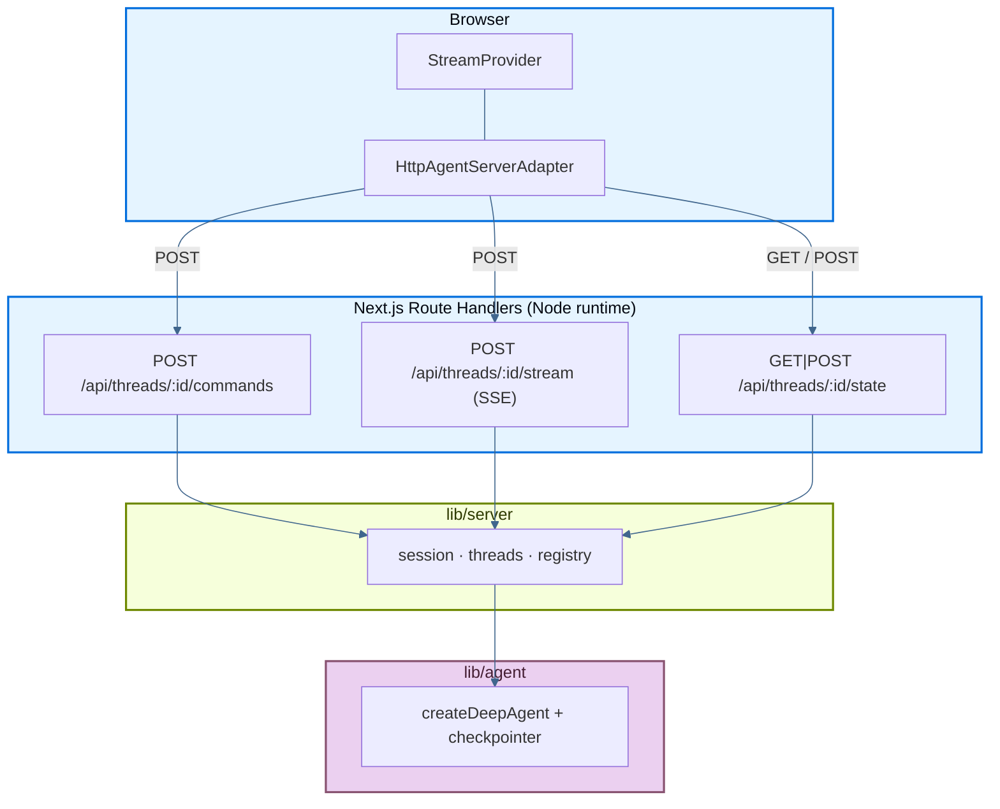

<!-- langchain-docs: machine-translated zh-CN from English source -->

<!-- langchain-docs: Deploy with Next.js | https://docs.langchain.com/langsmith/deploy-nextjs -->

# 使用 Next.js 进行部署

以下页面详细介绍了一个示例应用程序，该应用程序完全在 [Next.js App](https://nextjs.org/) 路由器项目内部署 LangChain **深度代理**：流式聊天 UI、子代理和线程历史记录，所有这些都由实现为 Next.js 路由处理程序 (HTTP + SSE) 的 [Agent Streaming Protocol](https://github.com/langchain-ai/agent-protocol/tree/main/streaming) 支持。没有单独的后端进程。

来源：部署手册中的[⟦T4⟧](https://github.com/langchain-ai/deployment-cookbook/tree/main/js-next)。

## 部署到 Vercel

<Steps>

<Step title="Import the repository">

单击下面的 **使用 Vercel 部署**，或手动导入 [⟦T5⟧](https://github.com/langchain-ai/deployment-cookbook)。

<a href="https://vercel.com/new/clone?repository-url=https%3A%2F%2Fgithub.com%2Flangchain-ai%2Fdeployment-cookbook&root-directory=js-next&env=OPENAI_API_KEY&envDescription=OpenAI%20API%20key%20for%20the%20agent%20and%20its%20subagents" target="_blank" rel="noopener noreferrer">
  
</a>

</Step>

<Step title="Configure the project">

将**根目录**设置为`js-next`，并在项目设置中添加`OPENAI_API_KEY`。

</Step>

<Step title="Deploy">

部署项目。路由处理程序已设置 `runtime = "nodejs"`，SSE 路由设置 `dynamic = "force-dynamic"`，这是 Vercel 进行流式处理所需的。

</Step>

</Steps>

（可选）通过添加 [⟦T10⟧](https://github.com/langchain-ai/deployment-cookbook/blob/main/js-next/.env.example) 中的变量来启用 LangSmith 跟踪。

## 所需的 API 端点

该应用程序在`/api/threads/...`下公开代理流协议。路线处理程序住在`app/api/threads/`。

### 最低（流媒体聊天）

这三个端点足以与 `@langchain/react` 的 `HttpAgentServerAdapter` 运行单线程流式聊天：|方法|路径|目的|
| ---| ---| ---|
| `POST` | `/api/threads/:threadId/commands` |接受协议命令（`run.start`，...）并启动代理运行 |
| `POST` | `/api/threads/:threadId/stream` |运行的 SSE 协议事件流 |
| `GET` / `POST` | `/api/threads/:threadId/state` |读取并引导检查点线程状态 |

客户端使用 `GET /state`（以及 404 上的 `POST /state`）引导线程，因此在发送第一条消息之前不会发生 404 水合。

### 可选（线程侧边栏）

此示例还实现了线程历史记录侧边栏的端点。如果您的 UI 不需要多线程管理，请忽略它们：

|方法|路径|目的|
| ---| ---| ---|
| `GET` | `/api/threads` |列出检查点已知的线程 |
| `DELETE` | `/api/threads/:threadId` |删除线程的会话和检查点 |
| `POST` | `/api/threads/:threadId/history` |分页检查点历史记录（代理协议）|

### 请求流程



1.引导线程状态（`GET`/`POST /state`）。
2. 提交时，SDK 发送`run.start` 到`/commands` 并接收`run_id`。
3. SDK订阅`/stream`（SSE）进行回放+直播协议事件。
4. 子代理 (`task`) 运行时发出命名空间事件，表现为 `stream.subagents`。

## 生产坚持该代理开箱即用，使用内存中的 `MemorySaver` 检查指针 (`lib/agent/index.ts`) 和进程本地会话映射 (`lib/server/registry.ts`)。这适用于本地开发和单实例服务器，但在 Vercel（无服务器、多个副本）上，对话状态在冷启动或实例中**不持久**。

对于生产，请换入 [durable checkpointer](/oss/python/langgraph/checkpointers#checkpointer-libraries)：

|套餐 |后端|
| ---| ---|
| [⟦T42⟧](https://www.npmjs.com/package/@langchain/langgraph-checkpoint-redis) | Redis (`RedisSaver`) |
| [⟦T44⟧](https://www.npmjs.com/package/@langchain/langgraph-checkpoint-postgres) | Postgres (`PostgresSaver`) |
| [⟦T46⟧](https://www.npmjs.com/package/@langchain/langgraph-checkpoint-sqlite) | SQLite (`SqliteSaver`) |

替换`lib/agent/index.ts`中的`MemorySaver`，并将新的检查指针传递给`createDeepAgent`。路由处理程序和 `lib/server/threads.ts` 帮助程序保持不变。

### Vercel 上的 Redis

Vercel 的常见选择是通过 [Marketplace](https://vercel.com/docs/redis)（例如 [Upstash Redis](https://vercel.com/marketplace/upstash)）使用 Redis。在您的 Vercel 项目上安装集成；凭据会自动作为环境变量注入。

然后接线`@langchain/langgraph-checkpoint-redis`：

```ts
import { RedisSaver } from "@langchain/langgraph-checkpoint-redis";

const checkpointer = await RedisSaver.fromUrl(process.env.REDIS_URL!);
```

使用 Redis 提供程序公开的连接字符串（Upstash 提供 REST 和 Redis 协议 URL；检查点需要 Redis URL）。

您还需要在 `lib/server/registry.ts` 中有一个共享会话/重播存储，以便 SSE 重新连接可以跨无服务器调用工作。检查指针交换是持久线程历史的主要步骤；会话存储是实时运行重放的一个单独关注点。有关更多信息，请参阅 [checkpointer libraries](/oss/python/langgraph/checkpointers#checkpointer-libraries) 和 [add memory / persistence](/oss/python/langgraph/add-memory)。

## 本地开发

```bash
cp .env.example .env.local   # set OPENAI_API_KEY
pnpm install
pnpm dev
```

打开[http://localhost:3000](http://localhost:3000)。

```bash
pnpm build   # production build
pnpm start   # serve the production build
pnpm lint    # eslint
```

## 项目布局

- `lib/agent/`：带有`researcher`和`math-whiz`子代理和模拟工具的深度代理（`createDeepAgent`）。标记为`server-only`。
- `lib/server/`：协议服务器逻辑：`session.ts`（SSE 运行）、`threads.ts`（检查指针支持的状态）、`serialize.ts`、`registry.ts`。
- `app/api/threads/`：上述协议端点的路由处理程序。
- `lib/chat/threads-client.ts`：浏览器线程引导和侧边栏帮助程序。
- `components/`：聊天界面（`ChatApp`、`Chat`、`MessageList`、`Subagents`、`ThreadHistory`、...）。

## 另请参阅

- [Frameworks and platforms overview](/langsmith/deploy-frameworks-and-platforms)
- [Agent Streaming Protocol](https://github.com/langchain-ai/agent-protocol/tree/main/streaming)
- [⟦T72⟧](https://github.com/langchain-ai/streaming-cookbook) — 自定义协议服务器的原始 Vite + Hono 参考
- [Next.js Route Handlers](https://nextjs.org/docs/app/building-your-application/routing/route-handlers)

---

<div className="source-links">
<Callout icon="terminal-2">
    通过 MCP 向 Claude、VSCode 等发送[Connect these docs](/use-these-docs) 以获得实时答案。
</Callout>
<Callout icon="edit">
    [Edit this page on GitHub](https://github.com/langchain-ai/docs/edit/main/src/langsmith/deploy-nextjs.mdx) 或 [file an issue](https://github.com/langchain-ai/docs/issues/new/choose)。
</Callout>
</div>