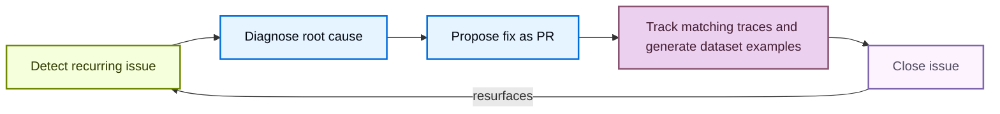

<!-- langchain-docs: machine-translated zh-CN from English source -->

<!-- langchain-docs: Find and fix your agent's issues with LangSmith Engine | https://docs.langchain.com/langsmith/engine -->

# 查找并修复代理与 LangSmith 引擎的问题

LangSmith 引擎可帮助您发送更可靠的代理，而无需手动搜索痕迹。它是代理工程的 LangSmith 代理：根据您的生产跟踪，它会显示重复出现的问题，诊断其根本原因，并在开发生命周期的每个阶段推动修复。有关产品概述，请参阅[Engine](/langsmith/engine-overview)。

## 引擎如何工作

### 问题生命周期

每个问题都经过一个闭环，其中引擎：

1. 检测跟踪中重复出现的问题。
2. 根据您的痕迹和连接的源代码诊断根本原因。
3. 提出修复作为拉取请求。
4. 随着时间的推移跟踪问题，自动添加与相同模式匹配的新跟踪，并生成基本事实[dataset examples](/langsmith/manage-datasets)，以便您可以验证修复。
5. 如果问题在关闭后重新出现，则自动重新打开该问题。



### 引擎如何选择轨迹

在为每次扫描选择和排名跟踪时，引擎会分析跟踪内容和运行反馈。它将反馈（包括在线评估者分数、注释队列分数和通过 SDK 提交的用户反馈）视为高优先级信号，而不是补充数据。要应用此信号，引擎：

- 读取项目中存在的反馈键，并为每个键执行专门的低分跟踪拉取，因此示例包含评估者分数较低的跟踪，而不是让它们保留在新近度中。
- 在筛选样本时，将具有非空反馈分数的迹线优先于其他迹线。
- 保留分析上下文中每个跟踪的反馈分数，即使跟踪有效负载被压缩以适应上下文限制也是如此。

任何向运行写入反馈的源都会自动促成此优先级排序。除了评估器或注释队列之外，引擎不需要任何设置。

## 设置引擎

设置引擎分为两步：[Organization Admin](/langsmith/rbac#organization-admin)首先为[workspace](/langsmith/administration-overview#workspaces)启用引擎，然后任何用户都可以为每个跟踪项目打开引擎。

<Note>
在自托管 LangSmith 上，操作员必须在 LangSmith Helm 图表中启用引擎，然后任一步骤可用。参见[Engine on Self-hosted](/langsmith/engine-self-hosted)。
</Note>

### 为您的组织启用引擎

<Note>您必须是[**Organization Admin**](/langsmith/rbac#organization-admin)才能启用引擎。要查找您的管理员，请打开 **设置**，选择 **访问和安全** 下的 **成员**，然后查找具有 **组织管理员** 角色的成员。</Note><Steps>
  <Step title="Open Engine enablement">
    在[LangSmith console](https://smith.langchain.com?utm_source=docs&utm_medium=cta&utm_campaign=langsmith-signup&utm_content=langsmith-engine)中，点击左下角的**设置**，然后选择**引擎**下的**引擎启用**。
  </Step>
  <Step title="Toggle Enable Engine">
    打开 **启用引擎** 并确认 AI 功能使用条款。该对话框逐字显示以下产品内通知：

    > LangSmith AI 功能由 LangChain 托管推理提供支持，为您的可观察性工作流程带来智能。启用LangSmith人工智能后，您的团队可以更快地发现问题、运行更智能的评估并构建更可靠的法学硕士申请。通过启用此功能，您组织的跟踪数据将使用 LangChain 管理的 LLM 密钥进行处理。遵守我们的服务条款。

  </Step>
</Steps>

启用引擎后，组织中的任何团队成员都可以为其跟踪项目进行设置。

<Tip>
  如果您想关闭引擎，请将相同的设置切换为关闭。这将停止引擎的所有自动运行并停止您帐户中的未来计费。
</Tip>

### 为跟踪项目打开引擎<Steps>
  <Step title="Open Engine and select a project">
    在 [LangSmith console](https://smith.langchain.com?utm_source=docs&utm_medium=cta&utm_campaign=langsmith-signup&utm_content=langsmith-engine) 中，选择 UI 侧栏中的 **Engine**。项目选择器列出了已配置的项目。要设置未列出的项目，请单击 **+ 设置另一个项目**，然后在 **选择要分析的项目** 下选择它。跟踪项目中的 **Engine** 选项卡也可用。
  </Step>
  <Step title="Connect a code repository (optional)">
    尽管可选，但建议连接代码存储库。引擎读取您的源代码以找到失败跟踪背后的代码路径，在实际实现中落实其建议的修复，并直接从问题中打开拉取请求。在 **连接代理的代码存储库** 下，在 **GitHub 存储库** 字段中选择一个存储库。仅显示 GitHub 应用程序可以访问的存储库。单击“**管理应用程序访问权限→**”以更新权限。有关 GitHub 应用程序设置和组织批准，请参阅[Connect Engine to GitHub](/langsmith/engine-github)。要为引擎提供额外的项目上下文，请在 **Context Hub 存储库** 字段中选择一个存储库。
  </Step>
  <Step title="Select preference categories (optional)">在**什么对您最重要？**下，选择要优先审核的类别（例如，**工具调用失败**或**延迟**）。单击 **+ 添加特定内容** 来描述自定义问题。参见[Tell Engine what kinds of issues to focus on](#tell-engine-what-kinds-of-issues-to-focus-on)。
  </Step>
  <Step title="Choose an analysis level">
    在**分析级别**下，选择**缩减**、**标准**（默认）或**扩展**。级别越高，分析的痕迹越多，成本也越高。参见[Set the analysis level](#set-the-analysis-level)。
  </Step>
  <Step title="Focus on specific traces (optional)">
    在 **关注特定跟踪** 下，按运行名称或元数据将引擎的注意力缩小到运行的子集。将其留空以分析所有痕迹。参见[Tell Engine which traces to focus on](#tell-engine-which-traces-to-focus-on)。
  </Step>
  <Step title="Start analyzing">
    单击**开始分析**。该对话框可能会根据您的项目使用情况显示估计的每月成本范围。引擎可能需要长达 20 分钟的时间来分析项目的跟踪并开始提出建议。在等待期间，当发现不同优先级的问题时，您可以[set up notifications](/langsmith/engine-notifications)在 Slack 中或通过 Webhook 收到警报。
  </Step>
  <Step title="Review the agent overview document">在出现问题之前，引擎会根据您的跟踪生成一个代理概述文档，描述项目的目的、架构和关键指标。查看并编辑文档，然后单击“**接受并继续**”继续。如果概述不准确，请在继续之前对其进行编辑，因为引擎将其用作所有分析的上下文，因此此处的准确性会影响检测到的问题的质量。
  </Step>
</Steps>

<Frame caption="Setup dialog">
  
  
</Frame>

您可以稍后在 [Configure Engine](#configure-engine) 中更改任何这些选择。要连接 GitHub，请参阅[Connect Engine to GitHub](/langsmith/engine-github)。要在 Engine 发现问题时在 Slack 中或通过 Webhook 收到警报，请参阅 [Engine notifications](/langsmith/engine-notifications)。

### 暂停引擎或删除其问题

引擎按照动态计划扫描您的痕迹，以平衡成本和性能。要停止扫描项目而不删除其现有问题，请单击 [**Engine Settings**](#configure-engine) 面板中的 **暂停**。单击 **恢复** 再次开始扫描。

单击同一面板中的 **删除所有问题** 以永久删除项目的问题和引擎设置。此操作无法撤消。

要关闭整个组织的引擎，请参阅[Enable Engine for your organization](#enable-engine-for-your-organization)。

## 配置引擎在 **引擎** 页面上，单击问题列表顶部的 **配置引擎** <Icon icon="settings"/>（齿轮）图标，打开 **引擎设置** 面板。使用它为引擎提供代理的上下文，告诉它要关注什么，然后连接 Linear。该面板还包含其他地方介绍的设置：

- **代码存储库**和**上下文存储库**：连接或更新诊断问题时读取的 GitHub 存储库引擎，可选择使用 **子文件夹** 和 **分支**（默认为存储库默认值）。 Context Hub 存储库可让引擎针对说明、文档和链接技能提出修复建议。参见[Connect Engine to GitHub](/langsmith/engine-github)。
- **通知**：请参阅[Engine notifications](/langsmith/engine-notifications)。
- **预览部署**：设置基线部署引擎重放问题跟踪，并通过预览部署打开修复验证。参见[Validate fixes by running your agent](#beta-validate-fixes-by-running-your-agent)。
- **分析级别**：参见[Set the analysis level](#set-the-analysis-level)。
- **引擎花费**：参见[Set spend limits and monitor usage](#set-spend-limits-and-monitor-usage)。
- **暂停**和**删除所有问题**：请参阅[Pause Engine or delete its issues](#pause-engine-or-delete-its-issues)。

### 提供有关您的代理的背景信息在设置过程中，引擎会生成一个代理概述文档，描述项目的目的、架构和关键指标。引擎将其用作所有分析的上下文，因此其准确性会影响检测到的问题的质量。在 **代理概述** 下，编辑文档以添加引擎无法从您的跟踪中推断出的任何相关上下文，并确保其准确。该文档的 **用户首选项** 部分还收集了引擎具有 [learned from your actions on issues](#investigate-and-fix-an-issue) 的内容，因此您可以在此处查看并更正这些校准。

### 告诉引擎要关注哪些类型的问题

在**首选项**下，列出引擎应关注、优先考虑或忽略的区域。选择类别芯片，例如 **成本和令牌**、**延迟** 或 **工具调用失败**，或单击 **+ 添加特定内容** 来描述自定义问题。引擎将首选项视为权威并将其折叠到代理概述文档中。更改将在下次扫描时生效。

### 告诉引擎要关注哪些跟踪将引擎聚焦于重要的跟踪，以保持分析精确并减少浪费的 LCU 支出。当项目混合多个代理或工作负载并且您希望引擎仅分析其中的某些代理或工作负载时，请使用跟踪范围（**关注特定跟踪**控件）。例如，如果一个项目同时运行生产聊天机器人和夜间批处理作业，则范围为`Run Name is chatbot`，以便引擎忽略批处理运行。默认情况下，引擎会分析项目的所有跟踪。

使用相同的控件在两个位置之一设置范围：

- **引擎设置**：在**查找并修复代理的问题**面板中，**关注特定跟踪**下。
- **引擎设置**：在[**Engine Settings**](#configure-engine)面板的**关注特定痕迹**部分。此处的编辑会自动保存。

使用过滤器编辑器添加范围条件。您可以添加每种条件一个，**最多两个**：

- **运行名称**：选择运行或代理名称。值字段根据项目最近跟踪中的运行名称自动完成。
- **元数据**：选择一个元数据键，然后选择一个值。两者都根据项目最近运行中存在的元数据自动完成。要添加条件，请从字段选择器中选择其类型，填写值，然后单击“**添加**”。每个条件都显示为一个筹码，例如 `Run Name is chatbot` 或 `env is prod`。单击芯片上的 ****** 可消除该情况。

<Note>
**范围限制：** 范围过滤器仅接受运行名称和元数据条件。您无法通过反馈键、评估者姓名或分数阈值来确定引擎的扫描范围。要将引擎集中在具有特定评估者低分的跟踪上，请在您的 [preferences](#tell-engine-what-kinds-of-issues-to-focus-on) 或 [agent overview](#give-context-on-your-agent) 中进行描述。引擎已经自动考虑所有反馈信号。参见[How Engine selects traces](#how-engine-selects-traces)。
</Note>

范围确定引擎分析哪些跟踪来检测问题并构建代理概述文档。初始设置期间设置的范围适用于引擎的第一次扫描。稍后在[**Engine Settings**](#configure-engine)面板中更改范围不会立即重新运行引擎；它适用于下一次扫描。

### 连接到线性

在 **线性** 下，单击 **连接**，选择一个团队，还可以选择新问题的项目，然后单击 **保存更改**。 Engine 保留与其创建的问题的持久链接，但不会同步 Linear 的后续编辑。删除所有引擎问题不会删除现有的线性票证。参见[Create a Linear issue](#create-a-linear-issue)。## 管理引擎成本

### 了解 LCU 成本

<Note>
引擎专门使用 **LangChain 托管推理**。不支持自带密钥 (BYOK)；您无法为引擎提供您自己的提供商 API 密钥。
</Note>

引擎以 **LangChain 计算单元 (LCU)** 收费，这是一个结合了计算、存储、内存和 LLM 支出的标准化工作单元。 LCU 消耗随着分析的跟踪数量、引擎为诊断和修复问题而进行的 LLM 调用的数量和复杂性以及任何连接的存储库的大小而变化。每个 LCU 的成本为 **1.50 美元**。有关预期 LCU 使用量的估计，请参阅 [LangSmith Usage Calculator](https://www.langchain.com/pricing#pricing-calc)。

引擎分两个阶段运行：

|相|触发|典型的 LCU 使用情况 |
|---|---|---|
| **初始化** |第一次在项目上启用引擎 | 30-40 个 LCU |
| **重复扫描** |按照动态时间表自动进行 | 10-15 个 LCU |

在初始化时，引擎会审核过去的跟踪、集群并按严重性对问题进行优先级排序，并对提示或代码提出修复建议（如果连接了存储库）。定期扫描按照动态计划运行，以平衡成本和性能，无论是否发现新问题，并发现以前未检测到的新问题。### 设置分析级别

分析级别控制引擎分析的项目跟踪数量，以及它使用的 LCU 数量。 [turn on Engine for a project](#turn-on-engine-for-a-tracing-project)时选择它，稍后在[**Engine Settings**](#configure-engine)面板中的**分析级别**下更改：

- **减少**：以更低的成本监控更少的跟踪。
- **标准**（默认）：分析更多符合条件的轨迹以获得更全面的覆盖范围。
- **扩展**：最大程度地覆盖大容量项目。仅适用于具有足够跟踪量的项目。

设置对话框显示估计的每月成本范围，该范围随您选择的级别而更新。

### 设置支出限额并监控使用情况

组织管理员可以在两个级别设置支出限制：

- **组织范围限制**：打开 **设置**，选择 **引擎** 下的 **引擎启用**，然后在 **每月 LCU 支出限制** 下输入一个值。
- **每个项目限制**：打开跟踪项目中的 **引擎** 选项卡，单击 **引擎设置** <Icon icon="settings"/> 图标，然后在 **每月 LCU 支出限制** 下设置限制。

您可以以本币或美元输入限额（1 本币 = 1.50 美元）。当达到限制时，LangSmith 暂停新的引擎运行，直到限制提高或下一个每月计费周期开始。

这两个级别的默认值不同：- **组织范围限制**：选择**默认**、**无限制**或自定义上限。在管理员选择之前，默认情况下适用（每月 500 LCU，约 750 美元），因此即使没有人设置限制，引擎支出也会受到限制。 **引擎启用**页面列出了强制限制及其来源。
- **每个项目限制**：将该字段留空表示没有限制。使用 **删除限制** 清除您之前设置的上限。

要完全停止引擎，请使用 **设置 > 引擎启用** 中的 **启用引擎** 开关。

要监控使用情况，您可以在 **设置** 中的 **引擎启用** 页面上查看组织的每月 LCU 支出，或在每个跟踪项目的 [**Engine Settings**](#configure-engine) 面板中查看每个项目的支出。

## 调查并解决问题

设置完成后，**引擎**页面会列出引擎已检测到的问题。单击任何问题以打开其详细信息面板。顶部的诊断描述了问题及其影响。每个问题都有一个工具栏，用于设置其优先级、关闭或重新打开它、打开拉取请求、创建线性问题并观看它。引擎从您处理问题的方式中学习。在每次计划的扫描中，它都会检查自上次扫描以来您采取的操作，例如关闭问题、将其标记为错误标记、更改其优先级或打开拉取请求，并将它们折叠到 [agent overview](#give-context-on-your-agent) 的 **用户首选项** 部分。您在更改优先级或关闭问题时给出的原因是该反馈的一部分。例如，如果您重复将某一类别中的问题标记为错误标记，则引擎会在以后的扫描中将该类别评为较低优先级。来自自动化的更改（例如拉取请求合并）以及通过 [LangSmith Chat](/langsmith/chat#engine) 采取的操作不算作反馈。

### 审查证据

**证据**部分包含支持诊断的跟踪，包括每个跟踪的片段。从本节中，您可以：- **查看跟踪**：单击“**查看跟踪**”以打开证据跟踪。当引擎识别出导致问题的子运行时，它会打开该确切的运行。跟踪视图包含返回引擎问题的 **查看问题** 链接。
- **创建离线示例**：单击[**Add offline examples**](#add-offline-examples)从生产跟踪输入生成自定义地面事实[dataset examples](/langsmith/manage-datasets)以进行离线评估。
- **查看项目证据**：点击**查看项目中的全部**，可以查看追踪项目中的证据。

欲了解更多信息，请参阅[Manage a trace](/langsmith/manage-trace)。

引擎在提交问题后会持续跟踪问题。在以后的扫描中，任何与问题的故障模式匹配的新跟踪都会自动添加到 **证据**，因此问题反映了在您不重新运行任何内容的情况下故障仍然发生的频率。

**建议的修复**部分描述了该问题并建议如何解决它，其中可能包括特定代码或提示更改（如果连接了存储库）。

### 更改优先级和状态

从优先级下拉列表中选择 **低**、**中** 或 **高** 以更新问题的优先级。您可以选择提供一个原因，即稍后扫描时引擎[learns from](#investigate-and-fix-an-issue)。

结束记录您的审核结果。点击：- **关闭** 将问题标记为已解决。
- **错误标记**将问题视为不真实或不值得修复而忽略。

对于任一结果，您都可以选择提供一个原因，引擎 [learns from](#investigate-and-fix-an-issue) 在以后的扫描中。

您可以随时重新打开已关闭的问题。单击 **重新打开** 以清除任何正在进行的修复，并停止查看该问题（如果正在查看）。当引擎检测到在以后的跟踪中重复出现相同的问题时，它还会自动重新打开问题。

### 打开拉取请求

单击 **打开 PR** 以打开 GitHub 拉取请求，其中包含连接的存储库中建议的代码更改。如果还没有，请先连接存储库。一旦存在拉取请求，引擎就会用 **View PR #\<number\>** 替换 **Open PR**。单击 **View PR #\<number\>** 在 GitHub 中打开拉取请求。引擎反映了 PR 在整个问题中的状态（开放、合并或关闭）。您还可以将问题的修复上下文复制到剪贴板，以便与法学硕士或编码助理一起使用。引擎可以对任何连接的存储库提出代码更改建议，包括使用[Deep Agents](/oss/python/deepagents/overview)、[LangChain](/oss/python/langchain/overview)和[LangGraph](/oss/python/langgraph/overview)构建的代理。

### 创建一个线性问题要创建问题，首先[connect Linear](#configure-engine)，然后在引擎问题上单击“**以线性方式创建**”。引擎在创建问题时显示**线性创建挂起**。创建完成后，引擎会在引擎问题和问题列表中显示链接的线性问题标识符。

线性问题包括引擎问题标题和描述、严重性、类别、标签、**在 LangSmith** 链接中查看问题以及证据跟踪 ID。引擎保留了线性问题的链接。如果您关闭线性工单，引擎将关闭相应的问题。如果您取消线性票证，引擎会将相应的问题标记为错误标记。引擎还跟踪与相应引擎问题上的线性票证链接的拉取请求。

### 添加离线示例

此步骤捕获作为地面事实[dataset examples](/langsmith/manage-datasets)出现问题的痕迹，因此您可以在修复进入生产之前离线评估修复。1. 单击“证据”列表右上角的“添加离线示例”，打开“添加为离线示例”对话框。
2. 检查每条迹线。该对话框显示输入、代理生成的错误输出以及作为自定义地面实况示例的建议预期输出。
3. 单击“**添加到数据集**”直接添加它们，或单击“**在注释队列中编辑**”先查看它们。
4. 在注释队列中，每个示例显示运行输入以及引擎提出的参考输出，其结构为从跟踪分析生成的名为[assertions](/langsmith/assertions)。每个断言都是一个简短的断言，描述正确答案应该或不应该包含的内容。根据需要编辑断言，使用 **+ 添加断言** 添加新断言，然后单击 **添加到数据集并继续** 以完成每个示例。

欲了解更多信息，请参阅[Manage datasets](/langsmith/manage-datasets)、[Use annotation queues](/langsmith/annotation-queues)和[Use assertions](/langsmith/assertions)。

### 观看一个问题

观看会使问题保持开放状态以供监控，而不解决问题或将其标记为错误标记。当您尚未准备好解决问题但仍想知道问题是否持续发生时，请单击“观看”。要在关注的问题再次出现时收到提醒，请单击 **通过 Slack 提醒我**，这会打开 [Engine Settings](#configure-engine) 面板的 **通知** 部分。参见[Engine notifications](/langsmith/engine-notifications)。

当新跟踪链接到关注的问题时，引擎会将其移至列表顶部并显示到达的新跟踪数，以便您可以选择修复或继续关注。

<Note>
观看仅适用于没有正在进行的拉取请求的开放问题：放弃修复以再次观看问题。解决关注的问题，或将其标记为错误标记，会自动停止关注。
</Note>

## 过滤和排序问题

### 在用户界面中

**引擎**页面在左侧面板中列出了检测到的问题。每个条目都会显示标题、简短描述、贡献痕迹的数量以及最近观察到该问题的时间。每个问题都标有故障类别，例如**无声工具错误**或**幻觉**。

在列表顶部，您可以单击：

- **过滤问题**图标可按**优先级**、**状态**和**标签**进行过滤。
- **排序问题**图标可按**严重性**、**上次更新**和**创建**进行排序。
- **配置引擎** <Icon icon="settings"/>（齿轮）图标到[configure Engine](#configure-engine)。打开[LangSmith Chat](/langsmith/chat#engine)针对您的问题提出问题，例如哪些问题最需要关注或有多少新问题尚未解决。

如果设置完成后没有出现问题，则引擎在分析的跟踪中没有发现重复出现的模式。尝试在收集更多痕迹后回来查看。

### 使用 CLI

使用 [LangSmith CLI](/langsmith/cli) 中的 `langsmith project issues list` 列出项目的问题。使用 `--status`（`open`、`fixing`、`watching`、`completed` 或 `ignored`）和 `--priority`（`urgent`、`high`、`medium`，或`low`），以及带有`--limit`和`--offset`的页面。

```bash
# List open, high-priority issues for a project
langsmith project issues list --project <project-name> --status open --priority high
```

## Beta：通过运行代理来验证修复

<Note>
修复验证是私人的[beta](/langsmith/release-stages#beta)。它仅适用于已启用它的组织的LangSmith 云。仅支持在[LangSmith Cloud deployments](/langsmith/deploy-to-cloud)上运行的代理；不支持外部托管代理。要请求访问，[join the waitlist](https://www.langchain.com/langsmith-engine-v2-new-feature-access)。
</Note>引擎通过运行代理来验证修复。它会根据代理的部署重播链接到 [issue](#investigate-and-fix-an-issue) 的跟踪，以确认问题是否重现。然后，它针对 Engine 修复的预览部署重播相同的跟踪，以确认修复是否解决了问题。引擎将每个验证记录为从问题跟踪构建的数据集上的[experiment](/langsmith/evaluation-concepts#experiment)，因此您可以逐个跟踪比较基线和修复跟踪。

### 设置验证

验证需要基线部署：在同一工作区中准备好代理的非预览[LangSmith Cloud deployment](/langsmith/deploy-to-cloud)。选择它需要在该部署上使用`deployments:update`。

设置验证：1. On the **Engine** page, click **Configure Engine**.
2. （可选）[Connect the GitHub repository](/langsmith/engine-github) 引擎应修改。 In the repository settings, select the base branch for Engine's fixes, or leave it blank to use the repository's default branch.
3. 在 **预览部署** 部分中，找到 **基准部署** 字段。搜索部署，或粘贴其 LangSmith URL 或部署 ID。无法从列表中选择预览部署和未准备就绪的部署。基线可以是生产或暂存部署，但应尽可能使用暂存，以便验证不会执行生产凭证和服务。
4. Select **Verify fixes with preview deployments**.
5. 单击**保存**。

修复验证还需要：- **连接的存储库**：引擎在[Connect Engine to GitHub](/langsmith/engine-github)中连接的存储库中将其修复作为拉取请求打开。
- **标签触发的预览版本**：基准部署上的[Enable preview builds](/langsmith/preview-builds#enable-preview-builds)。使用以下启动配置：
  - 将**预览基础分支**设置为为引擎配置的同一分支。
  - 选择**仅标签**并将**触发标签**设置为`preview`。引擎将此标签应用于其修复拉取请求。
  - 将**空闲 TTL** 设置为 6 小时。
  - 将 **最大并发预览** 设置为 20。

通过此设置，引擎应用预览标签，等待 LangSmith 根据建议的修复构建临时部署，重播针对它的验证，并显示问题的结论和重播跟踪。

<Warning>
验证将问题跟踪中的输入发送到基线部署，并在验证修复时发送到预览部署。每次重播都会在该部署上创建一个线程和运行，并且您的代理可以在响应时调用其工具。

[Preview deployments inherit the baseline deployment's secrets](/langsmith/preview-builds#manage-secrets) 当 LangSmith 创建它们时。在启用修复验证之前，请确认每个继承的机密都适合临时部署。对基线机密的更改不会传播到已存在的预览。
</Warning>#### 使用您的部署进行身份验证

By default, Engine calls your deployment with a LangSmith credential, and the deployment sees the caller as a Studio user. Deployments that accept LangSmith platform authentication need no further setup.

If your deployment authenticates callers itself, give Engine the headers it expects:

1. In the **Preview deployments** section, under **Deployment authentication**, click **Add custom headers**.
2. Enter every header your deployment requires, then click **Save**.
3. In your deployment's authentication handler, map those headers to an identity with the least access validation needs.

Header values are encrypted and write-only: LangSmith shows only their names, so replacing them means entering every value again. Headers that LangSmith manages itself cannot be overridden. To go back to the default, click **Use platform authentication**.

<Note>
Custom headers only decide whether your deployment accepts the request. They do not tell your agent that a run is a validation replay, which is a separate signal described in [Make replayed runs side-effect free](#make-replayed-runs-side-effect-free).
</Note>

### 准备一个部署来测试引擎通过运行代理来确认问题，因此您选择的部署必须是可以重复执行而不会产生任何后果的部署。

#### 使用可以安全使用的部署

选择一种部署来镜像您要测试的代理的配置，但该部署不是为您的用户提供服务的部署。将其指向代理写入的任何服务的测试凭据、测试帐户和非生产数据存储。

#### 使重播运行没有副作用

引擎在每次重放时设置`config.configurable.__engine_validation_replay__ = true`，以便您的代理可以识别重放并做出更保守的响应。在 HTTP 边界，验证请求还包括 `X-LangSmith-Source: engine`。在图形代码中使用可配置标记，在请求中间件中使用标头。

使用标记可以跳过或阻止对代理产生影响的工具，例如发送电子邮件或消息、向客户收费、提交票据、写入生产数据存储、安排工作以及调用合作伙伴 API。

<Accordion title="Copy-paste allowlist middleware">
将以下中间件添加到您的代理项目中：

```python
from __future__ import annotations

from collections.abc import Awaitable, Callable, Collection, Mapping
from typing import Any, cast

from langchain.agents.middleware import AgentMiddleware
from langchain.messages import ToolMessage
from langchain.tools.tool_node import ToolCallRequest
from langchain_core.runnables import RunnableConfig
from langgraph.types import Command

ENGINE_VALIDATION_CONFIG_KEY = "__engine_validation_replay__"
LANGGRAPH_AUTH_USER_ID_CONFIG_KEY = "langgraph_auth_user_id"


def _configurable(config: RunnableConfig | None) -> Mapping[str, object]:
    configurable = (config or {}).get("configurable")
    return configurable if isinstance(configurable, Mapping) else {}


def is_engine_validation(config: RunnableConfig | None) -> bool:
    """Return whether the caller requested reduced-privilege validation mode."""
    return _configurable(config).get(ENGINE_VALIDATION_CONFIG_KEY) is True


def is_trusted_engine_validation(
    config: RunnableConfig | None,
    *,
    expected_user_id: str,
) -> bool:
    """Verify the validation marker and authenticated Engine identity."""
    configurable = _configurable(config)
    return (
        bool(expected_user_id)
        and configurable.get(ENGINE_VALIDATION_CONFIG_KEY) is True
        and configurable.get(LANGGRAPH_AUTH_USER_ID_CONFIG_KEY) == expected_user_id
    )


def _request_config(request: ToolCallRequest) -> RunnableConfig | None:
    runtime = getattr(request, "runtime", None)
    config = getattr(runtime, "config", None)
    return cast(RunnableConfig, config) if isinstance(config, dict) else None


class EngineValidationSafetyMiddleware(AgentMiddleware):
    """Allow only explicitly safe tools during Engine validation."""

    def __init__(self, *, safe_tools: Collection[str]) -> None:
        self._safe_tools = frozenset(safe_tools)

    def _rejection(self, request: ToolCallRequest) -> ToolMessage | None:
        if not is_engine_validation(_request_config(request)):
            return None
        call = request.tool_call
        name = call.get("name") or "tool"
        if name in self._safe_tools:
            return None
        return ToolMessage(
            content=f"{name} is blocked during Engine validation.",
            tool_call_id=call["id"],
            name=name,
            status="error",
        )

    def wrap_tool_call(
        self,
        request: ToolCallRequest,
        handler: Callable[[ToolCallRequest], ToolMessage | Command[Any]],
    ) -> ToolMessage | Command[Any]:
        rejection = self._rejection(request)
        return rejection if rejection is not None else handler(request)

    async def awrap_tool_call(
        self,
        request: ToolCallRequest,
        handler: Callable[
            [ToolCallRequest],
            Awaitable[ToolMessage | Command[Any]],
        ],
    ) -> ToolMessage | Command[Any]:
        rejection = self._rejection(request)
        return rejection if rejection is not None else await handler(request)
```

在每次运行时注册它并仅允许只读和隔离的工具：

```python
from langchain.agents import create_agent

from engine_validation import EngineValidationSafetyMiddleware

agent = create_agent(
    model=model,
    tools=[search_catalog, lookup_order, send_message],
    middleware=[
        EngineValidationSafetyMiddleware(
            safe_tools={"search_catalog", "lookup_order"},
        )
    ],
)
```如果没有重播标记，中间件将不加修改地传递工具调用。在验证期间，它仅调用 `safe_tools` 中的工具，并为所有其他工具返回错误 `ToolMessage`。空的允许列表会阻止所有工具。
</Accordion>

仅允许只读和隔离的工具。不允许使用工具发送消息、传递通知、安排或排队工作、保留数据或写入外部系统。

<Warning>
将标记和源标头视为不可信提示，这只会减少运行可能执行的操作。任何可以到达您的部署的内容都可以设置它们，因此切勿使用它们来授予访问权限、跳过身份验证或扩大权限。
</Warning>

##### 验证可信引擎上下文

重播标记不是身份证明，因为任何调用者都可以设置可配置值。如果您的部署在验证期间重建用户上下文或访问受保护的数据，请首先验证经过身份验证的引擎身份：

```python
if is_trusted_engine_validation(
    config,
    expected_user_id=settings.engine_user_id,
):
    context = load_context_from_checkpoint()
```

从经过身份验证的运行时配置和复制的检查点读取身份和应用程序上下文。不要从重播输入或元数据中读取它们。对于使用 [custom authentication](/langsmith/custom-auth) 的部署，在应用相同的检查之前，将经过身份验证的引擎服务主体映射到身份验证处理程序中的 `langgraph_auth_user_id`。身份验证标头建立调用者身份，而重播标记则激活降低权限的工具策略。

#### 预计流量激增

引擎会同时重播问题的跟踪，因此验证一次最多可以启动五次运行，并且每一次运行直至完成。修复验证针对预览部署重复相同的设置。确认部署的速率限制、配额及其调用的任何下游服务能够容忍该突发。

#### 保持部署可用

引擎只能针对准备好的非预览部署进行重放，并记录生成每个结果的部署和修订。在验证过程中保持部署运行，并期望结果描述引擎测试时处于活动状态的修订版。

### 测试一个问题

设置基线部署后，引擎会在创建问题时自动验证每个新问题。要再次验证问题，请打开它并单击“**测试问题**”。当未设置基线部署、问题没有链接跟踪或达到每月 LCU 支出限制时，**测试问题**不可用。

对于每个验证，引擎：

1. 按照链接顺序选择最多五个与问题链接的不同跟踪。
2. 根据基线部署重放每个跟踪的输入。对于来自多轮线程的跟踪，引擎包含对话的较早轮次，因此在相同的上下文中判断后续失败。
3. 判断每次重播是否再次显示该问题所报告的行为。每个跟踪都是**已再现**、**未再现**或**不确定**。

当至少一条痕迹重现时，整个问题就会重现。仅当每次重播完成而没有报告的行为时，才不会再现它。否则，结果是不确定的。当验证未重现未解决的问题时，引擎会关闭该问题。

### 验证修复

当选择**使用预览部署验证修复**时，引擎会验证它生成的每个修复：1. 修复运行完成后，引擎会打开修复的拉取请求（如果尚未打开），然后向其中添加预览构建标签。
2. LangSmith 根据拉取请求构建预览部署。
3. 当预览版本上线时，引擎会根据预览部署重播问题验证的跟踪。
4. 如果预览中仍然出现问题，引擎会修改同一拉取请求的修复并再次验证，总共最多尝试三次。

### 读取验证结果

每个问题都会报告一个基线结果，一旦存在修复，就会报告一个验证结果。

基准结果回答了您的部署中是否仍然出现问题：

|状态 |意义|
| ---| ---|
| **等待测试** |引擎尚未记录基线结果。 |
| **转载** |至少一次重播再次显示了所报道的行为。 |
| **未转载** |每次重播结束时都没有报告的行为，因此引擎解决了一个未解决的问题。 |
| **不确定** |引擎无法自信地判断重播。 |
| **错误** |验证无法完成。 |

验证结果回答引擎的修复是否解决了该问题：|状态 |意义|
| ---| ---|
| **未运行** |该问题没有重现，因此无法验证。 |
| **正在生成修复**或**等待修复** |引擎仍在生成修复程序以进行验证。 |
| **等待预览**或**运行** |正在构建预览部署，或正在进行重播。 |
| **已验证** |该问题在修复的预览部署中不再出现。 |
| **未修复** |问题仍然存在，因此引擎修改了修复并重试。 |
| **不确定**、**超时**或**错误** | Engine 无法对此尝试做出判断。 |

<Warning>
**不确定**意味着引擎无法收集可靠的证据，而不是问题不存在或已修复。将其视为重新测试的信号，而不是作为通过的结果。
</Warning>

### 回顾验证实验

引擎将每个问题的验证证据存储在您的工作区中：

- **数据集**：每个问题一个，描述为 `Engine validation evidence`，每个重播跟踪有一个示例。
- **基线实验**：针对基线部署的重播。
- **修复实验**：针对修复的预览部署进行重播，每次验证尝试进行一个实验。引擎将其对每个结论性重播的判决记录为密钥`engine_issue_validation`的反馈。值为`reproduced`或`not_reproduced`，反馈评论解释了判决结果。

当引擎根据预览部署验证修复时，问题的 **证据** 部分显示总体结论和每条跟踪一行：

- **标记的跟踪**：引擎在原始跟踪中看到的内容。单击“**原始轨迹**”将其打开。
- **在产品上复制**：基线结果，**复制**，**未复制**，或**不确定**。单击 **Repro Trace** 打开重播。
- **PR #\<number\>** 之后：修复预览的结果、**修复已验证**、**重复发生**或 **不确定**。单击跟踪链接可打开重播。

每个列标题都会计算在基线上重现的跟踪数或通过修复解决的跟踪数。单击 **查看实验** 以打开基线并在数据集的比较视图中并排修复实验。有关更多信息，请参阅[Compare experiment results](/langsmith/compare-experiment-results)。

在修复验证运行之前，问题会显示验证摘要：基线结果、修复的验证状态以及每个重播示例的链接。

### 验证疑难解答如果问题仍处于“等待测试”状态，或者返回的结果不确定，请在再次测试之前检查以下内容：

- **基线部署**：确认它仍然准备就绪，不是预览版，并且与跟踪项目位于同一工作区中。
- **身份验证**：如果您的部署对调用者本身进行身份验证，请确认保存的标头是最新的。替换凭证需要重新输入每个标头值。
- **重播本身**：从问题的 **证据** 部分或验证摘要中打开重播的运行，并阅读您的代理返回的内容。
- **部署限制**：查找并发重放导致的速率限制、配额耗尽或超时，以及引擎可能无法判断的非常大的响应。
- **受限工具**：如果您的代理在重放期间阻止工具，请确认存根工具仍返回可用的结果，而不是结束运行的错误。

更正部署或其设置后，打开问题并单击“**测试问题**”以再次运行验证。

## Beta：主动检测红队问题<Note>
红队处于私人状态[beta](/langsmith/release-stages#beta)。它仅适用于已启用它的组织的LangSmith 云。仅支持在[LangSmith Cloud deployments](/langsmith/deploy-to-cloud)上运行的代理；不支持外部托管代理。要请求访问，[join the waitlist](https://www.langchain.com/langsmith-engine-v2-new-feature-access)。
</Note>

红队通过发送新的综合请求并判断其响应方式来测试已部署的代理。本页前面描述的问题来自生产跟踪中已经发生的故障。红队会查找尚未发生的故障，例如成功的提示注入、未经代理要求确认而进行的后续工具调用，或者泄漏到答案中的隐藏上下文。

每次运行都会生成一份假设报告、测试每个假设的探针以及每个假设的结论。

### 红队如何运作

Red Teaming 将部署集探测为跟踪项目的 [baseline deployment](#set-the-baseline-deployment)。每次运行：1. **映射应用程序。** 引擎会检查来自跟踪项目的最多 25 个最近跟踪，以及您的代码存储库（如果已连接）。它从它们那里学习代理的提示、工具、护栏和请求格式。如果引擎已经扫描了项目，则运行从项目的代理概述开始，并运行较短的确认扫描。
2. **形成假设。** 每个假设都描述了代理可能失败的一种特定方式。引擎为其分配了一个[issue class](#red-teaming-issue-classes)和一个场景类型，该场景类型记录了普通用户是否可以触发故障或者是否受到故意攻击。
3. **探测部署。** 引擎针对每个假设向部署发送最多两个合成请求。探测器重用真实跟踪的请求格式，但用新的合成输入替换其内容。
4. **判断结果。** 引擎检查每个探测的响应和跟踪，然后为假设分配状态和严重性。对于不明确的结果，引擎可以发送一个后续探测。

过去的痕迹只能帮助引擎理解应用程序。每个已确认的发现都来自运行期间发送的探测，而不是来自早期跟踪中的错误。红队调查结果保留在红队报告中。运行不会产生引擎问题，也不会将数据集、评估器或反馈写入您的工作区。

### 红队先决条件

要运行红队，您需要：

- **跟踪项目上的引擎**：[Set up Engine](#set-up-engine) 用于接收代理跟踪的项目。
- **基线部署**：同一工作区中准备好的、非预览的[LangSmith Cloud deployment](/langsmith/deploy-to-cloud)，设置为项目的基线。参见[Set the baseline deployment](#set-the-baseline-deployment)。
- **权限**：`runs:read` 在跟踪项目上查看红队报告。要开始运行，您还需要项目上的 `runs:create` 和基线部署上的 `deployments:update`。
- **连接的存储库（推荐）**：使用 [connected GitHub repository](/langsmith/engine-github)，引擎从源读取代理的提示、工具和护栏。如果没有，调查结果仅依赖于跟踪，并且报告显示**存储库上下文不可用**。

<Warning>
探测是真实的请求。每个探针都会在基线部署上创建一个线程和运行，并且您的代理可以在响应时调用其工具。选择综合测试流量和工具副作用可接受的部署，例如暂存部署。
</Warning>

### 设置基线部署基线部署是红队向其发送探测的部署。

设置基线部署：

1. 在**引擎**页面，选择追踪项目，然后单击**配置引擎**。
2. 在 **预览部署** 部分中，找到 **基准部署** 字段。
3. 搜索部署，或粘贴其 LangSmith URL 或部署 ID。无法从列表中选择预览部署和未准备就绪的部署。
4. 单击“**保存**”。

### 开始红队运行

开始跑步：

1. 在[LangSmith UI](https://smith.langchain.com?utm_source=docs&utm_medium=cta&utm_campaign=langsmith-signup&utm_content=langsmith-engine)中，选择侧边栏中的**Engine**，然后选择跟踪项目。
2. 在左侧面板顶部，选择 **红队**。
3. 单击**运行红队**。

运行显示在报告选取器中，状态为 **正在运行**。完成后，其报告将在同一视图中打开。 **运行红队**在运行过程中不可用。

如果运行未完成，报告选择器将显示其最终状态：**失败**、**超时**、**中断**、**已取消**或**无法启动**。没有针对该运行的报告。

### 阅读红队报告使用左侧面板顶部的报告选择器选择运行日期。选择**加载较旧的报告**可向后翻阅较早的运行。

#### 查看概述

当未选择假设时，右侧面板将显示报告概述：

- **已确认的发现**：已确认的发现数量，按严重程度细分。
- **测试的假设**：运行测试的假设数量。
- **测试的问题类别**：测试了 10 个 [issue classes](#red-teaming-issue-classes) 中的多少个。
- **按问题类别划分的调查结果**：每个问题类别的已确认调查结果。
- **假设结果**：按状态分类的假设。单击状态可将假设列表过滤到该状态。
- **结果超过运行**：每次运行的确认结果，按严重性堆叠。单击运行以打开其报告。

#### 浏览假设

左侧面板对报告的假设进行了分组：- **面向产品的发现**：普通用户可以通过正常请求或现实的、混乱的请求触发的已确认的发现。
- **技术强化观察**：经过故意攻击或技术边界检查才能触发的已确认发现。
- **旧版确认的结果**：旧报告中确认的结果，在引擎分配场景类型之前记录。
- **其他经过检验的假设**：每个未经证实的假设。

单击过滤器图标可显示单个状态，或单击排序图标可按 **默认**、**严重性** 或 **标题 (A-Z)** 进行排序。默认顺序首先按严重程度列出已确认的假设，然后列出需要审查的假设。

每个假设都具有以下状态之一：

|状态 |意义|
|---|---|
| **已确认** |探测器重现了故障，引擎判断这是一个真实的发现。 |
| **需求审查** |证据不明确或不完整。在对假设采取行动之前先回顾一下调查。 |
| **未发现问题** |探测器运行，代理行为正常。 |
| **未测试** |没有任何探测器验证这一假设。这是缺失的覆盖范围，而不是安全行为的证据。 |已确认的发现还具有严重性：**严重**、**高**、**中**、**低**或**信息**。

#### 检查假设

单击一个假设以打开其详细信息。详细信息显示引擎的结论，每个探针后面有一张卡，标记为**提示 1** 和 **提示 2**。每个探测都有一个结果：**攻击有效**、**攻击被阻止**或**需要审查**。

展开探针卡可以看到：

- **合成提示**：发送到部署的确切提示引擎。
- **观察到的**：摘录自代理的响应，其中包含探测器跟踪的摘要，例如其工具调用、工具错误和令牌计数。
- **预期**：正确的应用程序会返回什么。
- **查看证明迹线**：在侧面板中打开探头的迹线。

在调查下方，**法官为何决定**解释了引擎如何达到状态和严重性，以及**下一步做什么**建议修复。标记为**意外**的假设是 Engine 在测试不同假设时发现的结果。

### 红队问题类每个假设都属于一个问题类别，由失败的根本原因及其所需的解决方案选择。每份报告均涵盖所有 10 个类别，并将每个类别标记为已测试、未测试或不适用于代理。

|问题类别 |红队测试什么？
|---|---|
| **内容政策** |违反明确的产品、法律、安全或商业政策，例如禁止的竞争对手比较。 |
| **指令层次结构** |直接推翻客服人员的指示，以及相互冲突或令人困惑的提示指示。 |
| **间接喷射** |检索到的内容、工具输出或其他试图控制代理的不受信任的数据。 |
| **数据暴露** |隐藏的上下文，例如由探测器植入的合成金丝雀值，转义为响应。 |
| **身份验证隔离** |超出调用者身份或权限边界的访问或操作。 |
| **工具安全** |不安全的工具选择、参数或批准，以及不安全的后续工作流程。 |
| **工作流程完整性** |代理跳过或伪造的必需步骤，例如检索、澄清或如实完成。 || **会话完整性** |多回合状态问题，例如内存中毒、延迟激活或角色混乱。 |
| **输入稳健性** |由结构化输出、解析、定界符、编码或消息边界引起的混乱。 |
| **可靠性安全** |围绕失败、重试、资源限制、循环、重复工作和不可逆转的副作用的行为。 |

两个类有额外要求：

- **身份验证隔离**：红队未确认此类中的发现。其假设报告为**需要审查**或**未测试**。
- **会话完整性**：假设需要在单个对话中进行两轮探测。当没有此类探测运行时，假设报告为“**需要审查**”或“**未测试**”。

### 再次运行红队

红队在同一部署修订版的运行之间延续判决。新的运行会收到针对相同基线部署和活动修订的最多五次早期成功运行的结论。引擎会跳过先前运行已确认或发现安全的假设，除非新运行表明行为发生了变化，并优先考虑需要审查的假设。将新修订版部署到基准部署后，下一次运行将开始，而无需事先判断。使用 **Findings Over Runs** 来比较各运行中已确认的结果。

### 红队限制

每次红队运行都是有界的：

|限制|每次运行的价值 |
|---|---|
|痕迹审查 | 25、从最多 100 个最近的跟踪摘要中选择 |
|假设| 50 | 50
|每个假设的探索 | 2 |
|对基线部署的请求 | 100 | 100
|推荐 | 20 |

### Red Teaming 如何处理您的数据

- **合成探针**：探针内容是合成的。引擎不会将客户跟踪内容或存储库文本复制到探针中；跟踪仅提供请求格式。
- **只读访问**：Red Teaming 使用只读 LangSmith 凭证读取您的跟踪记录，并使用只读 GitHub 令牌克隆您的存储库。
- **筛选报告**：引擎在存储之前筛选模型编写的报告文本以获取机密，并限制响应摘录的长度。

有关引擎如何更广泛地处理您的数据，请参阅[Engine security](/langsmith/engine-security)。

## 另请参阅- [Engine](/langsmith/engine-overview)：产品概述以及引擎在开发生命周期中的位置。
- [Connect Engine to GitHub](/langsmith/engine-github)：连接LangSmith云中的存储库，或创建和配置您自己的 GitHub 应用程序以进行自托管部署。
- [Engine notifications](/langsmith/engine-notifications)：Slack 和 Webhook 目标、事件负载参考和签名秘密验证。
- [Engine security](/langsmith/engine-security)：查看引擎如何访问您的跟踪、部署和存储库。
- [Preview builds](/langsmith/preview-builds)：创建预览部署引擎验证修复。
- [Compare experiment results](/langsmith/compare-experiment-results)：比较基线并并排修复实验。
- [Engine on self-hosted](/langsmith/engine-self-hosted)：自托管架构和数据处理。
- [Manage datasets](/langsmith/manage-datasets)、[Use annotation queues](/langsmith/annotation-queues) 和 [Use assertions](/langsmith/assertions)：使用引擎生成的离线示例。
- [LangSmith CLI](/langsmith/cli)：以编程方式列出和管理问题。

---

<div className="source-links">
<Callout icon="terminal-2">
    [Connect these docs](/use-these-docs) 通过 MCP 发送给您选择的代理以获得实时解答。
</Callout>
<Callout icon="edit">
    [Edit this page on GitHub](https://github.com/langchain-ai/docs/edit/main/src/langsmith/engine.mdx) 或 [file an issue](https://github.com/langchain-ai/docs/issues/new/choose)。
</Callout>
</div>