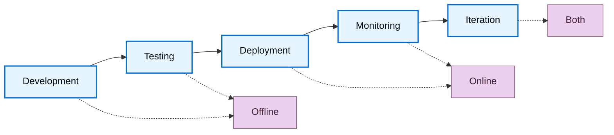

<!-- langchain-docs: machine-translated zh-CN from English source -->

<!-- langchain-docs: Evaluation concepts | https://docs.langchain.com/langsmith/evaluation-concepts -->

# 评估概念

LLM 输出是不确定的，这使得响应质量难以评估。评估 (evals) 是一种分解“好”的外观并对其进行衡量的方法。 LangSmith 评估提供了一个用于衡量整个应用程序生命周期（从部署前测试到生产监控）质量的框架。

## 评估什么

在进行评估之前，请确定对您的应用程序重要的内容。将您的系统分解为其关键组件——LLM 调用、检索步骤、工具调用、输出格式——并确定每个组件的质量标准。

**从手动策划的示例开始。** 创建 5-10 个示例，说明每个关键组件的“良好”外观。这些示例可以作为您的基本事实，并告诉您使用哪些评估方法。例如：
- **RAG系统**：良好检索（相关文档）和良好答案（准确、完整）的示例。
- **代理**：正确的工具选择和正确的参数格式或代理所采取的轨迹的示例。
- **聊天机器人**：解决用户意图的有用的品牌响应示例。一旦您通过示例定义了“好”，您就可以衡量您的系统产生类似质量输出的频率。

## 线下和线上评价

LangSmith 支持两种类型的评估，它们在开发工作流程中具有不同的用途：

### 线下评价

<Icon icon="flask" iconType="solid" /> 使用离线评估进行**部署前测试**：
- **基准测试**：比较多个版本以找到最佳执行者。
- **回归测试**：确保新版本不会降低质量。
- **单元测试**：验证各个组件的正确性。
- **回测**：根据历史数据测试新版本。

离线评估目标是[_datasets_](#datasets)的[_examples_](#examples)：精心策划的测试用例，其中包含定义“好”的参考输出。

### 在线评价

<Icon icon="radar" iconType="solid" /> 使用在线评估进行**生产监控**：
- **实时监控**：持续跟踪实时流量的质量。
- **异常检测**：标记异常模式或边缘情况。
- **生产反馈**：确定要添加到离线数据集的问题。

在线评估目标为[tracing](/langsmith/observability-quickstart)的[_runs_](#runs)和[_threads_](#threads)：没有参考输出的真实生产轨迹。目标的这种差异决定了您可以评估的内容：离线评估可以根据预期答案检查正确性，而在线评估则侧重于质量模式、安全性和现实世界的行为。

## 评估生命周期

随着您的开发和[deploy your application](/langsmith/deployment)，您的评估策略从部署前测试演变为生产监控。在开发和测试期间，离线评估会根据策划的数据集验证功能。部署后，在线评估会监控实时流量的生产行为。随着应用程序的成熟，两种评估类型在迭代反馈循环中协同工作，以不断提高质量。

### 1. 离线评估开发

在生产部署之前，使用离线评估来验证功能、对不同方法进行基准测试并建立信心。

按照[quickstart](/langsmith/evaluation-quickstart)进行您的第一次离线评估。

### 2. 初步部署并在线评估

部署后，使用在线评估来监控生产质量、检测意外问题并收集真实数据。

了解如何[configure online evaluations](/langsmith/online-evaluations-llm-as-judge)进行生产监控。

### 3.持续改进在迭代反馈循环中一起使用两种评估类型。在线评估暴露问题，这些问题成为离线测试用例，离线评估验证修复，在线评估确认生产改进。

## 核心评估目标

评估在不同的目标上运行，具体取决于它们是离线还是在线。

### 离线评估目标

离线评估在数据集和示例上运行。参考输出的存在可以对预期结果和实际结果进行比较。

#### 数据集

数据集是用于评估应用程序的_示例集合_。一个例子是测试输入、参考输出对。

#### 示例

每个示例包括：

- **输入**：传递到应用程序的输入变量的字典。
- **参考输出**（可选）：参考输出字典。这些不会传递到您的应用程序，它们仅在评估器中使用。
- **元数据**（可选）：附加信息的字典，可用于创建数据集的过滤视图。

了解更多关于[managing datasets](/langsmith/manage-datasets)的信息。

＃＃＃＃ 实验_实验_表示在数据集上评估特定应用程序版本的结果。每个实验都会捕获数据集中每个示例的输出、评估者分数和执行跟踪。

通常在给定的数据集上运行多个实验来测试不同的应用程序配置（例如，不同的提示或 LLM）。 LangSmith 显示与数据集相关的所有实验，并支持并排[comparing multiple experiments](/langsmith/compare-experiment-results)。

学习[how to analyze experiment results](/langsmith/analyze-an-experiment)。

### 在线评估目标

在线评估在生产流量的运行和线程上运行。如果没有参考输出，评估人员就专注于实时检测问题、异常和质量下降。

#### 运行

_run_ 是来自 [deployed application](/langsmith/deployment) 的单个执行跟踪。每次运行包含：
- **输入**：您的应用程序收到的实际用户输入。
- **输出**：您的应用程序实际返回的内容。
- **中间步骤**：所有子运行（工具调用、LLM 调用等）。
- **元数据**：标签、用户反馈、延迟指标等。与数据集中的示例不同，运行不包括参考输出。在线评估人员必须在不知道“正确”答案应该是什么的情况下评估质量，而是依赖质量启发法、安全检查和无参考评估技术。

了解更多关于[runs and traces in the Observability concepts](/langsmith/observability-concepts#runs)的信息。

#### 话题

_线程_是代表多轮对话的相关运行的集合。在线评估器可以在线程级别运行来评估整个对话而不是单个回合。这使得能够评估对话级别的属性，例如交互过程中的一致性、主题维护和用户满意度。

## 评估者

_评估者_是对应用程序性能进行评分的工作区级资源。他们为离线和在线评估提供测量层，根据可用数据调整输入。由于评估器的范围仅限于工作区，因此您可以将单个评估器附加到多个跟踪项目和数据集，而无需每次都重新创建它。

使用以下任一方式运行评估器：- [Evaluators](/langsmith/evaluators) 页面，将它们附加到跟踪项目或数据集
- [Playground](/langsmith/prompt-engineering-concepts#playground)
- LangSmith SDK（[Python](https://docs.smith.langchain.com/reference/python/reference) 和 [TypeScript](https://docs.smith.langchain.com/reference/js)）
- [Rules](/langsmith/rules)，在跟踪项目或数据集上自动运行它们

### 将评估器附加到跟踪项目或数据集

单个评估器可以附加到许多跟踪项目和数据集。采样率、过滤器和[spend limits](/langsmith/evaluator-spend)等配置是根据附加项目或数据集设置的，而不是根据评估器设置的。在“**项目和数据集**”选项卡下查看评估者附加的项目和数据集。

### 评估器输入

评估者输入因评估类型而异：

**离线评估者**收到：
- [Example](#examples)：来自[dataset](#datasets)的示例，包含输入、参考输出和元数据。
- [Run](/langsmith/observability-concepts#runs)：在示例输入上运行应用程序的实际输出和中间步骤。

**在线评估员**收到：
- [Run](/langsmith/observability-concepts#runs)：包含输入、输出和中间步骤的生产跟踪（没有可用的参考输出）。

### 评估器输出

评估者返回**反馈**，即评估的分数。反馈是一本字典或字典列表。每本词典包含：- `key`：指标名称。
- `score` | `value`：指标值（`score`表示数字指标，`value`表示分类指标）。
- `comment`（可选）：对分数的附加推理或解释。

### 评估技巧

LangSmith支持多种评估方法：

- [Human](#human)
- [Code](#code)
- [LLM-as-judge](#llm-as-judge)
- [Pairwise](#pairwise)

#### 人类

_人工评估_涉及对应用程序输出和执行跟踪的手动审查。这种方法是[often an effective starting point for evaluation](https://hamel.dev/blog/posts/evals/#looking-at-your-traces)。 LangSmith 提供用于检查应用程序输出和跟踪（所有中间步骤）的工具。

**注释队列**

[Annotation queues](/langsmith/annotation-queues) 简化人类跑步反馈的结构化收集。它们通过提供具有规定规则、团队协作功能和进度跟踪的有组织的工作流程来补充[inline annotation](/langsmith/annotate-traces-inline)。

LangSmith支持两种队列类型：

- **单次运行队列**：针对自定义标题项目一次检查一次运行。对于分类问题或从生产跟踪构建数据集很有用。单次运行队列还支持[assertions](/langsmith/assertions)，这是一种自由形式的接受标准，离线评估器可以根据该标准对未来的运行进行评分。
- **成对队列**：并排比较两次运行以确定哪个更好。专为实验之间的快速 A/B 比较而设计。主要功能包括每次运行配置多个审阅者、启用预留以防止冲突以及将带注释的运行直接导出到数据集以供将来评估。

#### 代码

_代码评估器_是确定性的、基于规则的函数。它们非常适合检查，例如验证聊天机器人响应的结构不为空、生成的代码是否编译或分类是否完全匹配。

#### 法学硕士法官

_法学硕士作为评判评估者_使用法学硕士对申请结果进行评分。评分规则和标准通常编码在 LLM 提示中。这些评估者可以是：

- **无参考**：检查输出是否包含攻击性内容或遵守特定标准。
- **基于参考**：将输出与参考进行比较（例如，检查相对于参考的事实准确性）。

法学硕士作为评判评估者需要仔细审查分数并及时调整。少样本评估器在评分器提示中包括输入、输出和预期成绩的示例，通常可以提高性能。

了解[how to define an LLM-as-a-judge evaluator](/langsmith/llm-as-judge)。

#### 成对_成对评估者_使用启发式（例如，哪个响应更长）、LLM（带有成对提示）或人工审阅者来比较两个应用程序版本的输出。

当直接对输出进行评分很困难但比较两个输出很简单时，成对评估效果很好。例如，在摘要任务中，选择两个摘要中信息更丰富的摘要通常比为单个摘要分配绝对分数更容易。

学习[how run pairwise evaluations](/langsmith/evaluate-pairwise)。

### 无参考与基于参考的评估器

了解评估器是否需要参考输出对于确定何时可以使用它至关重要。

**无参考评估者** 在不与预期输出进行比较的情况下评估质量。这些适用于离线和在线评估：
- **安全检查**：毒性检测、PII 检测、内容政策违规
- **格式验证**：JSON 结构、必填字段、架构合规性
- **质量启发**：响应长度、延迟、特定关键字
- **无参考的法学硕士作为法官**：清晰、连贯、乐于助人、语气**基于参考的评估器**需要参考输出，并且仅适用于离线评估：
- **正确性**：与参考答案的语义相似性
- **事实准确性**：根据基本事实进行事实核查
- **精确匹配**：具有已知标签的分类任务
- **基于参考的法学硕士作为法官**：将输出质量与参考进行比较

在设计评估策略时，无参考评估器可以在离线测试和在线监控之间提供一致性，而基于参考的评估器可以在开发过程中实现更精确的正确性检查。

## 评估类型

LangSmith支持不同开发和部署阶段的多种评估方法。了解何时使用每种类型有助于制定全面的评估策略。

线下和线上评估有不同的目的：
- **离线评估类型** 使用参考输出在精选数据集上测试预部署
- **在线评估类型** 监控实时流量的生产行为，无需参考输出

了解更多关于[evaluation types and when to use each](/langsmith/evaluation-types)的信息。

## 最佳实践

### 构建数据集

构建数据集有多种策略：

**手动策划的示例**这是推荐的起点。创建 10-20 个涵盖常见场景和边缘情况的高质量示例。这些示例定义了您的应用程序的“良好”外观。

**历史痕迹**

一旦投入生产，将真实的痕迹转换为示例。对于高流量应用：
- **用户反馈**：添加收到负面反馈的运行以进行测试。
- **启发式**：识别有趣的运行（例如，长延迟、错误）。
- **法学硕士反馈**：使用法学硕士来检测值得注意的对话。

**综合数据**

从现有示例中生成更多示例。从几个高质量的手工制作的示例作为模板开始时效果最佳。

### 数据集组织

**分割**

分割是数据集的命名子集，用于将示例分割成单独的组。常见模式包括：- **ML 式分割**：将示例分为训练集、验证集和测试集，以避免过度拟合，即模型在训练数据上表现良好，但在未见过的数据上表现不佳。
- **基于类别的分割**：当数据集跨越多个任务类别时，分别评估不同的输入类型。
- **分阶段推出**：将探索性示例隔离，直到您准备好将它们包含在主要评估集中。

拆分与元数据不同：使用拆分进行高级组织分组以进行评估，使用元数据来获取每个示例的信息，例如标签和出处。

在机器学习中，最佳实践是每个示例恰好属于一个分割。 LangSmith 允许示例属于多个分割，这在示例适合多个评估类别时非常有用。

了解如何[create and manage dataset splits](/langsmith/manage-datasets-in-application#create-and-manage-dataset-splits)。

**版本**

当示例发生变化时，LangSmith自动创建数据集[versions](/langsmith/manage-datasets#version-a-dataset)。 [Tag versions](/langsmith/manage-datasets#tag-a-version) 标志着重要的里程碑。以 CI 管道中的特定版本为目标，以确保数据集更新不会破坏工作流程。

### 人类反馈收集

人类反馈通常提供最有价值的评估，特别是对于主观质量维度。

**注释队列**[Annotation queues](/langsmith/annotation-queues) 支持结构化收集人类反馈。标记特定运行以供审查，在简化的界面中收集注释，并将带注释的运行传输到数据集以供将来评估。

注释队列通过提供附加功能来补充[inline annotation](/langsmith/annotate-traces-inline)：对运行进行分组、指定条件和配置审阅者权限。

### 评估与测试

测试和评估是相似但不同的概念。

**评估根据指标来衡量绩效。**指标可以是模糊的或主观的，但事实证明，相对而言更有用。他们通常会相互比较系统。

**测试断言正确性。** 系统只有通过所有测试才能部署。

评估指标可以转化为测试。例如，回归测试可以断言新版本在相关指标上必须优于基准版本。当系统运行成本高昂时，同时运行测试和评估以提高效率。

可以使用[pytest](/langsmith/pytest)或[Vitest/Jest](/langsmith/vitest-jest)等标准测试工具编写评估。

## 快速参考：离线与在线评估

下表总结了离线和在线评估之间的主要区别：| | **线下评测** | **在线评估** |
|---|---|---|
| **运行于** |数据集（示例）|跟踪项目（运行/线程）|
| **数据访问** |输入、输出、参考输出 |仅输入、输出 |
| **何时使用** |部署前、开发期间|生产、部署后|
| **主要用例** |基准测试、单元测试、回归测试、回溯测试 |实时监控、生产反馈、异常检测 |
| **评估时间** |对策划的测试集进行批处理 |实时或近乎实时的实时交通状况 |
| **安装位置** |评估选项卡（SDK、UI、Playground）| [Observability tab](/langsmith/online-evaluations-llm-as-judge)（自动规则）|
| **数据要求** |需要数据集管理 |无需数据集，评估实时痕迹 |

---

<Callout icon="terminal-2">
    通过 MCP 向 Claude、VSCode 等发送[Connect these docs](/use-these-docs) 以获得实时答案。
</Callout>
<Callout icon="edit">
    [Edit this page on GitHub](https://github.com/langchain-ai/docs/edit/main/src/langsmith/evaluation-concepts.mdx) 或 [file an issue](https://github.com/langchain-ai/docs/issues/new/choose)。
</Callout>

