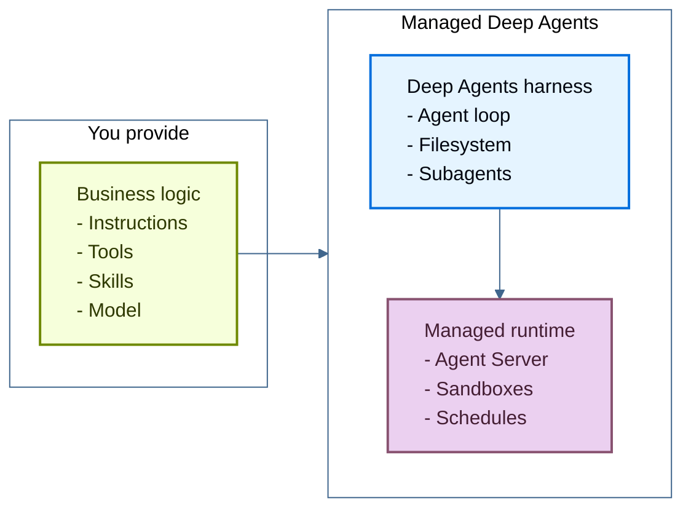

<!-- langchain-docs: machine-translated zh-CN from English source -->

<!-- langchain-docs: Managed Deep Agents | https://docs.langchain.com/langsmith/javascript/managed-deep-agents-overview -->

# 托管Deep Agents

托管 Deep Agents (MDA) 是构建和部署生产代理的最简单方法。您专注于您的代理人所做的事情。 MDA 运行它。无需运行服务器，也无需连接基础设施。

您编写代理的智能：它的指令、它可以调用的工具、它遵循的技能，然后您选择驱动它的模型。 MDA 提供了以下所有内容：

- **Deep Agents 工具**：代理循环，用于规划、调用工具、管理文件系统以及委托给子代理。参见[Deep Agents](/oss/javascript/deepagents/overview)。
- **托管运行时**：[LangSmith Deployment's Agent Server](/langsmith/agent-server-overview) 托管并操作代理，并在重新启动时保持会话运行。

## 代理示例

托管深度代理由一个项目文件夹组成，其中包含其行为的业务逻辑：

当您使用 `mda` CLI 上传此文件夹时，它将自动在托管 LangSmith 基础设施上运行。
您提供业务逻辑，托管Deep Agents提供代理工具和生产基础设施。

要开始使用，请参阅[Managed Deep Agents quickstart](/langsmith/javascript/managed-deep-agents-quickstart)。

## 核心能力

代理的每个部分都映射到一个文件或目录。添加您的代理需要的：|能力|路径|描述 |
| ---| ---| ---|
| [Model and configuration](/langsmith/javascript/managed-deep-agents-agent-definition) | `agent.ts` |模型和核心选项。必需的。 |
| [Instructions](/langsmith/javascript/managed-deep-agents-instructions) | `instructions.md` |定义代理行为方式的系统提示。 |
| [Skills](/langsmith/javascript/managed-deep-agents-skills) | `skills/` |代理在相关时加载特定于任务的剧本。 |
| [Tools](/langsmith/javascript/managed-deep-agents-tools) | `tools/` |代理调用以运行应用程序逻辑或访问外部服务的函数。 |
| [MCP connectors](/langsmith/javascript/managed-deep-agents-mcp-connectors) | `connectors/` |为代理提供工具的远程 MCP 服务器。 |
| [Middleware](/langsmith/javascript/managed-deep-agents-middleware) | `middleware/` |围绕模型和工具调用运行的自定义逻辑。 |
| [Sandbox](/langsmith/javascript/managed-deep-agents-sandboxes) | `sandbox/` |用于运行代理编写的代码的隔离文件系统和 shell。 |
| [Memory](/langsmith/javascript/managed-deep-agents-memory) | `memory.ts` |跨线程持续存在的偏好和知识。 |
| [Identity](/langsmith/javascript/managed-deep-agents-identity) | `identity.ts` |用于多用户部署的每个调用者专用线程、内存和凭据。 |
| [Channels](/langsmith/javascript/managed-deep-agents-channels) | `channels/` |与消息服务（例如 Slack）的连接开始运行并接收响应。 |
| [Schedules](/langsmith/javascript/managed-deep-agents-schedules) | `schedules/` |定期运行代理的托管 cron 计划。 |
| [Evals](/langsmith/javascript/managed-deep-agents-evals) | `evals/` |测试代理的港口式任务。 |

完整布局请参见[Project structure](/langsmith/javascript/managed-deep-agents-project-structure)。

## 后续步骤<CardGroup cols={2}>
  <Card title="Quickstart" icon="rocket" href="/langsmith/javascript/managed-deep-agents-quickstart">
    使用 `mda` CLI 创建并部署您的第一个托管深度代理。
  </Card>
  <Card title="Tutorial" icon="book" href="/langsmith/javascript/managed-deep-agents-tutorial">
    添加自定义搜索工具、持久内存和每日日程安排。
  </Card>
</CardGroup>

---

<Callout icon="terminal-2">
    通过 MCP 向 Claude、VSCode 等发送[Connect these docs](/use-these-docs) 以获得实时答案。
</Callout>
<Callout icon="edit">
    [Edit this page on GitHub](https://github.com/langchain-ai/docs/edit/main/src/langsmith/managed-deep-agents-overview.mdx) 或 [file an issue](https://github.com/langchain-ai/docs/issues/new/choose)。
</Callout>

