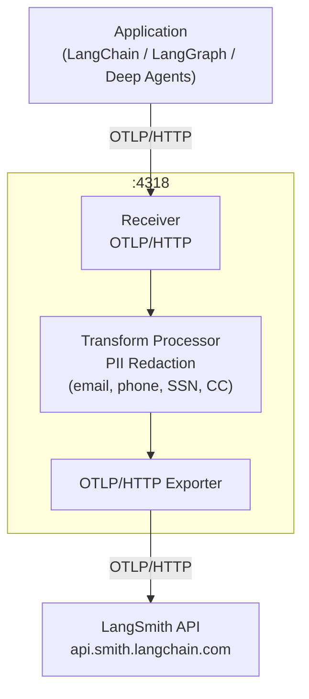

<!-- langchain-docs: machine-translated zh-CN from English source -->

<!-- langchain-docs: Redact sensitive data with the OpenTelemetry Gateway architecture | https://docs.langchain.com/langsmith/otel-gateway-trace-redaction -->

# 使用 OpenTelemetry Gateway 架构编辑敏感数据

[LangChain](/langsmith/trace-with-langchain)、[LangGraph](/langsmith/trace-with-langgraph) 和 [Deep Agents](/langsmith/trace-deep-agents) 应用程序支持 [OpenTelemetry-based tracing](/langsmith/trace-with-opentelemetry)。您可以通过您控制的 OpenTelemetry 收集器路由它们，应用编辑规则来剥离敏感字段，并将清理后的跟踪转发到 LangSmith，而不是直接将跟踪发送到 LangSmith。

跟踪通过 OTLP/HTTP 从您的应用程序流向收集器。收集器运行一个转换处理器，在将清理后的跨度转发到 LangSmith API 之前，该处理器会编辑敏感的跨度属性，例如提示输入和模型完成。



## 先决条件

以下两种方法都需要以下环境变量。将 `OTEL_EXPORTER_OTLP_ENDPOINT` 设置为您的收集器的地址：

```bash
LANGSMITH_OTEL_ENABLED="true"
LANGSMITH_TRACING="true"
LANGSMITH_OTEL_ONLY="true"
LANGSMITH_PROJECT="my-project"
OTEL_EXPORTER_OTLP_ENDPOINT="http://<my-otel-collector-endpoint>:4318"
```

有关`LANGSMITH_PROJECT`的更多信息，请参阅[Log traces to a specific project](/langsmith/log-traces-to-project)。

## 配置收集器

这两种方法还需要一个 OpenTelemetry 收集器作为应用程序和 LangSmith 之间的中介运行。以下配置在端口 `4318` 上设置一个 OTLP 接收器、一个编辑 `gen_ai.prompt` 和 `gen_ai.completion` span 属性的转换处理器，以及一个将清理后的跟踪转发到 LangSmith API 的导出器：

```yaml
receivers:
  otlp:
    protocols:
      http:
        endpoint: 0.0.0.0:4318


processors:
  transform/redact:
    error_mode: ignore
    trace_statements:
      - context: span
        statements:
          - replace_pattern(attributes["gen_ai.completion"], "[\\s\\S]*", "[REDACTED]")
          - replace_pattern(attributes["gen_ai.prompt"], "[\\s\\S]*", "[REDACTED]")

exporters:
  otlphttp/langsmith:
    traces_endpoint: "https://api.smith.langchain.com/otel/v1/traces"
    headers:
      x-api-key: "${env:LANGSMITH_API_KEY}"
      Langsmith-Project: "${env:LANGSMITH_PROJECT}"
      x-Tenant-Id: "${env:LANGSMITH_TENANT_ID}" # Required if API key is not scoped to a specific workspace


service:
  pipelines:
    traces:
      receivers: [otlp]
      processors: [transform/redact]
      exporters: [otlphttp/langsmith]
```

## 使用 LangChain、LangGraph 或 Deep Agents 进行跟踪如果您的应用程序已使用 [LangChain](/langsmith/trace-with-langchain)、[LangGraph](/langsmith/trace-with-langgraph) 或 [Deep Agents](/langsmith/trace-deep-agents)，请使用此方法。跟踪集成会根据您的环境变量自动处理跨度创建，因此不需要额外的检测代码：

```python
from langchain.agents import create_agent
from langchain.tools import tool
from langchain_openai import ChatOpenAI


@tool
def tell_joke(topic: str) -> str:
   llm = ChatOpenAI()
   response = llm.invoke(f"Tell me a short, funny joke about {topic}.")
   return response.content


agent = create_agent(
   model=ChatOpenAI(),
   tools=[tell_joke],
   system_prompt="When the user asks for jokes, use the tell_joke tool for each topic.",
)


topics = ["programming", "python", "kubernetes", "machine learning"]


result = agent.invoke(
   {"messages": [{"role": "user", "content": f"Tell me jokes about these topics: {', '.join(topics)}"}]}
)


print(result["messages"][-1].content)
```

## 直接使用 OpenTelemetry SDK 进行跟踪

如果您需要对跟踪器提供程序和导出程序进行编程控制，请使用此方法。例如，设置每个请求的项目名称或在运行时配置自定义标头。您可以在代码中显式配置提供程序，而不是单独依赖环境变量：

```python
import os

from langchain.prompts import ChatPromptTemplate
from langchain_openai import ChatOpenAI
from opentelemetry import trace
from opentelemetry.exporter.otlp.proto.http.trace_exporter import OTLPSpanExporter
from opentelemetry.sdk.trace import TracerProvider
from opentelemetry.sdk.trace.export import BatchSpanProcessor


project_name = os.environ["LANGSMITH_PROJECT"]
otlp_endpoint = os.environ["OTEL_EXPORTER_OTLP_ENDPOINT"]


provider = TracerProvider()
provider.add_span_processor(
   BatchSpanProcessor(
       OTLPSpanExporter(
           endpoint=otlp_endpoint+"/v1/traces",
           headers={"Langsmith-Project": project_name},
       )
   )
)
trace.set_tracer_provider(provider)


chain = ChatPromptTemplate.from_template("Tell me a joke about {topic}") | ChatOpenAI()


for topic in ["programming", "python", "databases", "kubernetes", "machine learning"]:
   print(f"Asking about {topic}...")
   result = chain.invoke({"topic": topic})
   print(f"  {result.content[:100]}\n")


provider.force_flush()
provider.shutdown()
```

<Note>
如果您希望在不通过收集器路由的情况下编辑敏感数据，请参阅[Prevent logging of sensitive data in traces](/langsmith/mask-inputs-outputs)。
</Note>

---

<div className="source-links">
<Callout icon="terminal-2">
    通过 MCP 向 Claude、VSCode 等发送[Connect these docs](/use-these-docs) 以获得实时答案。
</Callout>
<Callout icon="edit">
    [Edit this page on GitHub](https://github.com/langchain-ai/docs/edit/main/src/langsmith/otel-gateway-trace-redaction.mdx) 或 [file an issue](https://github.com/langchain-ai/docs/issues/new/choose)。
</Callout>
</div>