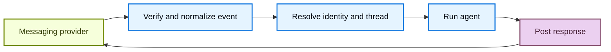

<!-- langchain-docs: machine-translated zh-CN from English source -->

<!-- langchain-docs: Connect Managed Deep Agents to channels | https://docs.langchain.com/langsmith/python/managed-deep-agents-channels -->

# 将托管Deep Agents连接到通道

通道使托管深度代理可在外部消息传递服务中使用。来自服务的消息可以启动代理运行，并且代理的最终响应通过同一服务返回。

<Note>
托管 Deep Agents 处于 **公共 [beta](/langsmith/release-stages)** 状态，并且仅在美国地区的 [LangSmith Cloud](/langsmith/cloud) 上可用。
</Note>

## 项目结构

通道声明位于项目级 `channels/` 目录中：

```text
my-agent/
  agent.py
  channels/
    slack.py
```


## 了解渠道

通道结合了外部消息传递集成的三个部分：

- **入站事件**：验证并标准化提供程序事件，然后启动代理运行。
- **出站消息传送**：将代理的响应发送回原始对话。
- **配置**：创建并配置将服务连接到已部署代理的提供者资源。

在托管Deep Agents中，通道将已部署的代理连接到消息传递提供程序。

托管运行时处理通道生命周期：



提供程序适配器确定接受哪些事件、提供程序对话如何映射到托管Deep Agents线程以及如何传递响应。通道声明公开了该提供程序支持的配置。## 声明项目中的通道

将每个通道放在`channels/`下的单独模块中。

从每个文件导出模块级`channel`。


文件名成为配置的通道名称并标识部署中的通道。

不要将声明命名为 `channels/channel.py`。


通道名称在项目中必须是唯一的。

提供者工厂创建声明。

例如，`channels.slack()` 创建一个 Slack 通道。


请参阅提供程序指南以了解其声明、应用程序配置和部署过程。

## 区分通道和连接器

通道接收启动代理运行并传递响应的消息。 [MCP connector](/langsmith/python/managed-deep-agents-mcp-connectors) 为远程 MCP 服务器提供代理工具。项目可以使用其中之一或两者。

## 支持的频道

<CardGroup cols={2}>
  <Card title="Slack" icon="brand-slack" href="/langsmith/python/managed-deep-agents-channels-slack">
    从 Slack 提及、直接消息和线程回复开始运行。
  </Card>
</CardGroup>

## 另请参阅

- [Identity](/langsmith/python/managed-deep-agents-identity)：对调用者进行身份验证，范围通道运行到已解析的用户。
- [Schedules](/langsmith/python/managed-deep-agents-schedules)：通过配置的通道交付预定结果。
- [Deploy an agent](/langsmith/python/managed-deep-agents-deploy)：部署项目更改并配置机密。
- [CLI reference](/langsmith/python/managed-deep-agents-cli)：查看频道项目文件约定。

---<div className="source-links">
<Callout icon="terminal-2">
    通过 MCP 向 Claude、VSCode 等发送[Connect these docs](/use-these-docs) 以获得实时答案。
</Callout>
<Callout icon="edit">
    [Edit this page on GitHub](https://github.com/langchain-ai/docs/edit/main/src/langsmith/managed-deep-agents-channels.mdx) 或 [file an issue](https://github.com/langchain-ai/docs/issues/new/choose)。
</Callout>
</div>