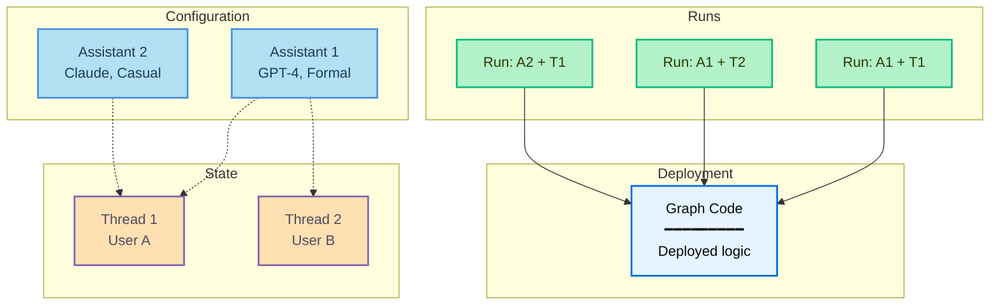

<!-- langchain-docs: machine-translated zh-CN from English source -->

<!-- langchain-docs: Runs | https://docs.langchain.com/langsmith/runs -->

# 运行

_run_ 是对 [assistant](/langsmith/assistants) 的调用。执行运行时，您可以指定要使用的助手 - 通过默认助手的图形 ID，或通过特定配置的助手 ID。

下图显示了 **run** 如何将助手与线程结合起来来执行图形：

- **图表**（浅蓝色）：包含代理逻辑的已部署代码
- **助手**（蓝色）：配置选项（模型、提示、工具）
- **线程**（橙色）：对话历史记录的状态容器
- **运行**（绿色）：将助手 + 线程配对的执行

**组合示例：**
- **运行：A1 + T1**：助理 1 配置应用于用户 A 的对话
- **运行：A1 + T2**：同一个助手为用户 B 提供服务（不同的对话）
- **运行：A2 + T1**：不同的助手应用于用户 A 的对话（配置开关）

执行运行时：

- 每次运行可能有自己的输入、配置覆盖和元数据。
- 运行可以是无状态的（无线程）或有状态的（在 [thread](/langsmith/use-threads) 上执行以实现对话持久性）。
- 多次运行可以使用相同的助手配置。
- 助手的配置会影响底层图表的执行方式。代理服务器 API 提供了多个用于创建和管理运行的端点。更多详情请参阅[API reference](/langsmith/server-api-ref)。

## 在本节中

<CardGroup cols={2}>
  <Card title="Kick off background runs" icon="player-play" href="/langsmith/background-run">
    异步运行代理并轮询结果。
  </Card>
  <Card title="Run multiple agents on the same thread" icon="messages" href="/langsmith/same-thread">
    在共享线程上使用多个助手来组合代理功能。
  </Card>
  <Card title="Stateless runs" icon="player-skip-forward" href="/langsmith/stateless-runs">
    当不需要对话历史记录时，执行运行时不会保留状态。
  </Card>
  <Card title="Cancel a run" icon="player-stop" href="/langsmith/cancel-run">
    通过 API 取消单次运行或多次运行。
  </Card>
</CardGroup>

---

<Callout icon="terminal-2">
    通过 MCP 向 Claude、VSCode 等发送[Connect these docs](/use-these-docs) 以获得实时答案。
</Callout>
<Callout icon="edit">
    [Edit this page on GitHub](https://github.com/langchain-ai/docs/edit/main/src/langsmith/runs.mdx) 或 [file an issue](https://github.com/langchain-ai/docs/issues/new/choose)。
</Callout>

