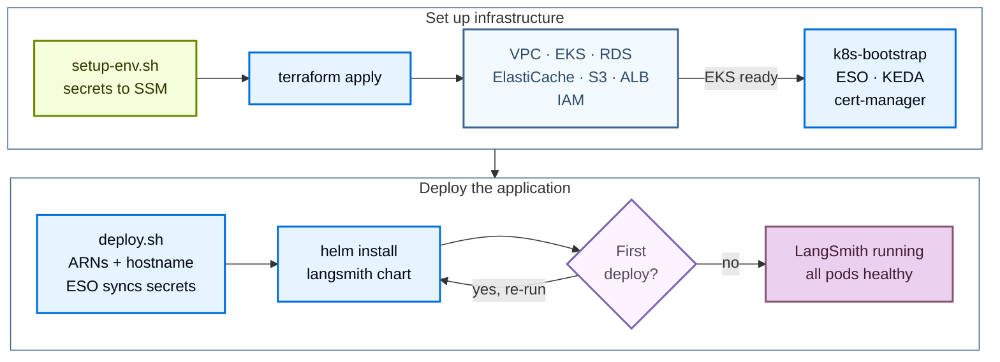

<!-- langchain-docs: machine-translated zh-CN from English source -->

<!-- langchain-docs: Deploy LangSmith on AWS with Terraform | https://docs.langchain.com/langsmith/self-host-terraform-aws-deploy -->

# 使用 Terraform 在 AWS 上部署 LangSmith

使用公共 [Terraform modules](https://github.com/langchain-ai/terraform/tree/main/modules/aws) 将 LangSmith 部署到 AWS。通过将部署管理为代码，您可以跨账户版本控制、查看和重现 LangSmith 环境，而无需单击 AWS 控制台。

安装分两个阶段运行：

1. **基础设施**：Terraform 提供 VPC、EKS、RDS、ElastiCache、S3 和 IAM。
2. **应用程序**：Helm 针对集群安装 LangSmith 图表。

基本安装后，通过设置标志和重新部署来启用可选附加组件。



## 先决条件

### 所需工具

|工具|版本 |目的|
|---|---|---|
| AWS CLI | v2 |身份验证、查询 AWS 资源、管理 EKS kubeconfig |
|地形 | 1.5 | 1.5运行基础设施模块 |
| `kubectl` | 1.33 | 1.33检查EKS集群 |
|头盔| 3.12 | 3.12安装和管理LangSmith图表|
| `eksctl` |最新 |可选，方便 kubeconfig 和调试 |

在 macOS 上安装：

```bash
brew install awscli kubectl helm eksctl
brew tap hashicorp/tap && brew install hashicorp/tap/terraform
```

验证每个工具是否位于 `PATH`：

```bash
aws --version
terraform version
kubectl version --client
helm version
```

对于 Linux，请遵循 [AWS CLI install guide](https://docs.aws.amazon.com/cli/latest/userguide/getting-started-install.html) 并使用您的发行版的包管理器来获取其余工具。

### 所需的 AWS IAM 权限运行 Terraform 的 IAM 用户或角色需要创建和管理云基础的权限。以下管理策略覆盖整个表面区域。使用它们作为起点，并在部署稳定后削减到最低权限。

|政策 |目的|
|---|---|
| `AmazonEKSClusterPolicy` |创建和管理 EKS 集群 |
| `AmazonVPCFullAccess` |创建 VPC、子网、路由表和 NAT |
| `AmazonRDSFullAccess` |创建和管理 RDS PostgreSQL 实例 |
| `AmazonElastiCacheFullAccess` |创建ElastiCache Redis集群 |
| `AmazonS3FullAccess` |创建 S3 存储桶和 VPC 终端节点 |
| `IAMFullAccess` |创建 IRSA 角色和策略 |

<Tip>
身份验证后从`modules/aws/`运行`make preflight`。预检脚本确认活动凭据可以执行每个所需的操作并报告第一个缺失的权限，这比在 `terraform apply` 中发现间隙更快。
</Tip>

### 验证

使用 CLI 配置 AWS 凭证：

```bash
aws configure
```

或者导出环境变量：

```bash
export AWS_ACCESS_KEY_ID="..."
export AWS_SECRET_ACCESS_KEY="..."
export AWS_DEFAULT_REGION="us-west-2"
```

确认凭据有效并且目标区域已在帐户中启用：

```bash
aws sts get-caller-identity
aws ec2 describe-availability-zones --query 'AvailabilityZones[].ZoneName' --output table
```

### 许可证密钥和域名

必须在 `terraform apply` 之前准备好两个非 AWS 项目：- **LangSmith 许可证密钥。** [Contact sales](https://www.langchain.com/contact-sales) 请求一个。密钥由设置脚本存储在 AWS SSM Parameter Store 中，而不是存储在 `tfvars` 中。
- **解析为 AWS 账户的域或子域**，以及覆盖该账户的 ACM 证书（或 `letsencrypt` / `none` 对于 `tls_certificate_source` 变量）。

### 集群大小参考

两个独立的设置控制能力：

- **基础设施容量**直接通过基础设施变量`eks_managed_node_groups`、`postgres_instance_type`、`redis_instance_type` 设置实例类型和节点数量。模块默认为 1 个 `m5.4xlarge` 节点组（最少 3 个，最多 10 个）、RDS 的 `db.t3.large` 和 ElastiCache 的 `cache.m6g.xlarge`。
- **`sizing_profile`** 选择 Helm 大小调整覆盖（pod 资源请求和限制）。 `init-values.sh`和`deploy.sh`阅读； Terraform 没有。

在部署之前，根据目标层调整基础架构的大小。有关每层建议，请参阅[Scaling guidance](/langsmith/self-host-scale)。

<Note>
对于生产工作负载，还计划配置外部 [LangChain Managed ClickHouse](/langsmith/langsmith-managed-clickhouse) 或自我管理的外部 ClickHouse 集群。仅 dev/POC 支持集群内 ClickHouse。
</Note>

## 快速入门

<Tip>
有关 `make` 目标、所需变量和常见约束的简明备忘单，请参阅 [AWS quick reference](/langsmith/self-host-terraform-aws-quick-reference)。
</Tip>要获得从零到正在运行的 LangSmith 实例的最快路径，请按顺序运行以下命令：

```bash
# 1. Clone the public modules
git clone https://github.com/langchain-ai/terraform.git
cd terraform/modules/aws

# 2. Generate terraform.tfvars interactively (Enter accepts current values)
make quickstart

# 3. Load secrets into SSM Parameter Store
#    Must be sourced, not executed
source infra/scripts/setup-env.sh

# 4. Provision infrastructure (~20 to 25 min)
make init
make plan
make apply

# 5. Configure kubectl
make kubeconfig
kubectl get nodes

# 6. Deploy LangSmith via Helm (~5 to 10 min)
make init-values
make deploy

# 7. Confirm
kubectl get pods -n langsmith
kubectl get ingress -n langsmith
```

通过一个命令链接基础设施和应用程序：

```bash
make quickdeploy          # interactive, prompts before terraform apply
make quickdeploy-auto     # non-interactive, auto-approves terraform
```

`make quickdeploy` 依次运行 `terraform apply` → `kubeconfig` → `init-values` → `helm deploy`。如果任何步骤失败，该命令将退出并显示从该步骤恢复的说明。

以下部分详细介绍了每个阶段。

## 提供基础设施

Terraform 提供以下 AWS 资源：

|资源 |目的|
|---|---|
| VPC + 子网 + NAT |集群和托管服务的专用网络|
| EKS 集群 + 节点组 | Kubernetes 计算 |
| RDS PostgreSQL | LangSmith 运营数据 |
| ElastiCache Redis |队列和缓存|
| S3存储桶+VPC端点|跟踪有效负载 blob 存储 |
| ALB + 听众 |使用 TLS 的公共入口 |
| SSM 参数存储条目 |应用程序机密，由外部机密操作员同步到集群中 |
| IRSA 角色 + IAM 策略 |每服务 AWS 访问 |
| KEDA，ESO 认证经理 |与基础设施一起安装的 Bootstrap 工作负载 |

### 克隆并配置

```bash
git clone https://github.com/langchain-ai/terraform.git
cd terraform/modules/aws
```

所有后续命令都从`modules/aws/`运行。运行 `make help` 以获得完整的目标列表。

使用交互式向导生成 `terraform.tfvars`：

```bash
make quickstart
```该向导会提示命名前缀、区域、EKS 大小、TLS 源、外部与集群内服务以及可选的附加标志。上面写着`infra/terraform.tfvars`。重新运行向导会预先选择现有值；在每次提示时按 Enter 键以保留当前配置。

喜欢手动编辑？复制示例并填写必填字段：

```bash
cp infra/terraform.tfvars.example infra/terraform.tfvars
vi infra/terraform.tfvars
```

所需的最少变量：

```hcl
name_prefix = "acme"
environment = "prod"
region      = "us-west-2"

eks_cluster_version = "1.33"
eks_managed_node_groups = {
  default = {
    name           = "node-group-default"
    instance_types = ["m5.4xlarge"]
    min_size       = 3
    max_size       = 10
  }
}

postgres_source = "external"
redis_source    = "external"

tls_certificate_source = "acm"
acm_certificate_arn    = "arn:aws:acm:us-west-2:<account-id>:certificate/<cert-id>"
langsmith_domain       = "langsmith.example.com"
```

请参阅每个输入变量的[AWS variables reference](/langsmith/self-host-terraform-aws-variables)。

<Tip>
在应用之前配置远程状态后端。编辑 `infra/backend.tf` 以指向您控制的 S3 存储桶和 DynamoDB 锁定表。 Terraform 存储库默认为首次评估提供本地后端。
</Tip>

### 将机密加载到 SSM 参数存储中

```bash
source infra/scripts/setup-env.sh
```

该脚本读取 `terraform.tfvars`，派生 SSM 路径 `/langsmith/{name_prefix}-{environment}/`，然后对于每个机密，要么重用导出的值，读取现有的 SSM 参数，自动生成一个（用于盐和令牌），要么提示您。许可证密钥和管理员密码是您以交互方式提供的两个值。必须获取脚本（而不是执行），因为 `make` 无法将环境变量导出回父 shell。

该脚本管理以下 SSM 参数：| SSM 密钥 |如何设置 |笔记|
|---|---|---|
| `postgres-password` |提示| RDS 使用此密码 |
| `redis-auth-token` |自动生成 (`openssl rand -hex 32`) | ElastiCache 需要十六进制 |
| `langsmith-api-key-salt` |自动生成 (`openssl rand -base64 32`) |永不旋转，会破坏所有 API 密钥 |
| `langsmith-jwt-secret` |自动生成 (`openssl rand -base64 32`) |永不轮换，使所有会话无效 |
| `langsmith-license-key` |提示|来自您的 LangChain 客户团队 |
| `langsmith-admin-password` |提示|必须包含符号 |
| `deployments-encryption-key` |自动生成 Fernet 密钥 | LangSmith 部署附加组件 |
| `agent-builder-encryption-key` |自动生成 Fernet 密钥 | Agent Builder 附加组件（由 Fleet 重复使用）|
| `insights-encryption-key` |自动生成 Fernet 密钥 |见解附加组件 |
| `polly-encryption-key` |自动生成 Fernet 密钥 |波莉附加组件 |

验证密钥是否存在并且 `TF_VAR_*` 环境变量已导出：

```bash
make secrets
```

### 申请

<Note>
在干净的帐户上配置 AWS 云基础需要 20 到 25 分钟。不要中断应用。
</Note>

```bash
make init
make plan
make apply
```

`make plan` 显示了建议的差异。在应用之前检查输出。 `make apply` 按依赖顺序进行配置：VPC 和安全组，然后是 EKS（约 12 分钟）和 RDS（约 8 分钟，并行），然后是节点组、ElastiCache、S3 和 ALB。

### 配置 kubectl

```bash
make kubeconfig
kubectl get nodes
kubectl get pods -n kube-system
```所有节点都应报告`Ready`，核心附加组件（CoreDNS、kube-proxy、VPC CNI、KEDA、ESO）应为`Running`。 cert-manager 仅在 `tls_certificate_source = letsencrypt` 或 `create_cert_manager_irsa = true` 时运行。

## 部署LangSmith

支持两种部署路径。选择一个。

### 脚本驱动的 Helm 部署（推荐）

最适合大多数部署。交互式提示将指导您选择尺寸和产品。

```bash
cd modules/aws

make init-values
make deploy
```

`init-values.sh` 提示输入管理员电子邮件，然后从 `terraform.tfvars` 读取 `sizing_profile` 和 `enable_*` 标志，并将匹配值文件从 `helm/values/examples/` 复制到 `helm/values/`。重新运行时，它会保留您的选择并刷新 Terraform 输出。

`make deploy` 运行 `helm/scripts/deploy.sh`，其中：

1.刷新kubeconfig。
2. 运行预检检查（AWS 凭证、集群可达性、`langchain` Helm 存储库）。
3. 应用外部 Secrets Operator `ClusterSecretStore` 和 `ExternalSecret`，以便集群直接从 SSM 读取机密。
4. 安装带有分层值文件的 LangSmith Helm 图表。

图表安装和 Pod 准备就绪预计需要 5 到 10 分钟。

#### 验证

```bash
kubectl get pods -n langsmith
kubectl get ingress -n langsmith
```

当所有 Pod 均为 `Running` 并且入口显示 ALB DNS 名称时，部署已准备就绪。使用您在 `langsmith_domain` 中配置的域（或 ALB DNS 名称）来访问 UI。如果您完成了脚本驱动的部署，那么您就完成了。以下部分是替代部署路径，而不是附加步骤。

### Terraform 管理的 Helm 部署

最适合想要在 Terraform 状态下进行完整部署的团队，或“自带基础设施”场景。 `app/` 模块直接管理外部秘密操作员接线、`helm_release` 和功能切换。

```bash
cd modules/aws

# Generate Helm values files from templates (required, the app module reads these)
make init-values

# Pull infra outputs into app/infra.auto.tfvars.json
make init-app

# Configure app-specific settings
cp app/terraform.tfvars.example app/terraform.tfvars
# Edit app/terraform.tfvars, set admin_email, sizing, and feature toggles

# Deploy
make plan-app
make apply-app
```

`app/terraform.tfvars` 文件控制应用程序配置：

```hcl
admin_email          = "admin@example.com"
sizing               = "production"   # production | production-large | dev | none
enable_agent_deploys = true
enable_agent_builder = true
enable_insights      = true
enable_polly         = true
clickhouse_host      = "clickhouse.example.com"
```

<Warning>
在`make plan-app`之前需要`make init-values`。应用程序模块从`helm/values/`读取值文件，并根据`infra/terraform.tfvars`中的大小和附加选项从`helm/values/examples/`填充它们。
</Warning>

对于“自带基础设施”，请跳过`make init-app`并在`app/terraform.tfvars`中手动设置所有变量。

## 启用附加组件

每个附加组件都由 `infra/terraform.tfvars` 中的标志控制。设置标志，重新运行`make init-values`复制匹配值文件，然后重新运行`make deploy`。

```hcl
enable_deployments     = true   # LangGraph Platform (required for Fleet, Agent Builder, and Polly)
enable_fleet           = true   # Fleet (formerly Agent Builder), standalone service (chart v0.15+)
enable_agent_builder   = false  # Older agent-builder path; mutually exclusive with enable_fleet
enable_insights        = true   # ClickHouse-backed analytics
enable_polly           = true   # Polly AI eval and monitoring
enable_usage_telemetry = false  # Extended usage telemetry
```

```bash
make init-values
make deploy
```

有关每个附加组件的详细信息，请参阅[LangSmith Deployment](/langsmith/deploy-self-hosted-full-platform)。

### 舰队

<Note>
Fleet 是以前称为 Agent Builder 的功能的当前形式，作为独立服务部署（图表 v0.15+）。
</Note>您可以使用`enable_fleet`启用舰队。在 AWS 上，它需要 `enable_deployments = true`，因为队列聊天 UI 通过LangSmith 部署附带的主机后端解析 OAuth 提供程序和令牌连接。它还需要外部 Postgres 和 Redis（`postgres_source = "external"` 和 `redis_source = "external"`）。

Terraform 在 RDS 上创建专用的 `langsmith_fleet` 数据库，并将 `langsmith-fleet-postgres` 和 `langsmith-fleet-redis` 密钥连接到现有 RDS 和 ElastiCache 实例。队列重用`langsmith_agent_builder_encryption_key`，因此从`enable_agent_builder` 迁移会保留相同的密钥和数据。

<Note>
Fleet 需要 LangSmith Helm 图表 `>=0.15.0` 以及许可证中的 Agent Builder 或 Fleet 权利。
</Note>

车队安装 `standalone-fleet-api-server`、`standalone-fleet-tool-server`、`standalone-fleet-trigger-server` 和 `standalone-fleet-queue` 服务。

<Warning>
请勿同时启用 `enable_fleet` 和 `enable_agent_builder`。舰队值文件设置 `config.agentBuilder.enabled: false`，因此这两个附加组件是互斥的。
</Warning>

## 可选：带有堡垒的私有 EKS 集群

对于必须运行完全私有 EKS API 端点的部署，模块提供堡垒主机模式：1. 首先，从工作站运行`create_bastion = true`和`enable_public_eks_cluster = true`，以便创建堡垒。
2. 初次部署后，设置`enable_public_eks_cluster = false`并重新申请。 EKS API 端点仅变为私有端点。
3. 所有后续 Terraform 工作都在堡垒上进行。将 SSM 放入其中，克隆存储库，复制您的 `terraform.tfvars` 和 SSM 密钥，然后从那里运行部署。

```hcl
enable_public_eks_cluster = false
create_bastion            = true

# Optional SSH access (SSM is the default and requires no key):
# bastion_key_name          = "my-keypair"
# bastion_enable_ssh        = true
# bastion_ssh_allowed_cidrs = ["203.0.113.0/24"]
```

通过 SSM 会话管理器连接：

```bash
terraform output bastion_ssm_command
aws ssm start-session --target <instance-id> --region us-west-2
```

<Note>
堡垒位于用于 SSM 代理连接的公有子网中，但如果您的 VPC 具有 SSM、SSMMessages 和 EC2Messages VPC 终端节点，则不需要公有 IP。该堡垒预装了 `kubectl`、`helm`、`terraform`、`git` 和 `jq`，并且已为 EKS 集群配置了 kubeconfig。在您的工作站上安装 AWS CLI 的 [Session Manager plugin](https://docs.aws.amazon.com/systems-manager/latest/userguide/session-manager-working-with-install-plugin.html)。
</Note>

## 可选：Envoy 网关入口

默认入口是 AWS 负载均衡器控制器 (ALB)。在`terraform.tfvars`中设置`enable_envoy_gateway = true`来安装[Envoy Gateway](https://gateway.envoyproxy.io/)。多命名空间数据平面部署需要 Envoy Gateway，其中 `langgraph-dataplane` 图表在其自己的命名空间中运行。

```hcl
# infra/terraform.tfvars
enable_envoy_gateway = true
```

```bash
source infra/scripts/setup-env.sh
make apply

make init-values
cp helm/values/examples/langsmith-values-ingress-envoy-gateway.yaml helm/values/
make deploy
```当 `tls_certificate_source = "acm"` 时，部署脚本会自动使用 ACM 证书 ARN 注释 Envoy Gateway NLB 服务。 TLS 在 NLB 处终止； Envoy 在内部看到纯 HTTP。

在单独的命名空间中运行数据平面图表时，每个数据平面命名空间应用一次 RBAC 清单：

```bash
kubectl apply -f helm/values/examples/dataplane-rbac.yaml
```

这将授予 `langsmith-host-backend` ServiceAccount 对数据平面命名空间中的 pod、pod 日志、部署和 ReplicaSet 的读取访问权限。如果没有它，代理运行日志不会在LangSmith UI 中传输。

## 后续步骤

- 参考[AWS variables](/langsmith/self-host-terraform-aws-variables)和[quick reference](/langsmith/self-host-terraform-aws-quick-reference)。
- 查看 [AWS architecture](/langsmith/self-host-terraform-aws-architecture) 的平台层、IRSA 和模块依赖性。
- 当出现故障时，检查[AWS troubleshooting guide](/langsmith/self-host-terraform-aws-troubleshooting)。
- 使用 [LangSmith Deployment](/langsmith/deploy-self-hosted-full-platform) 在 UI 中启用代理部署。

---

<div className="source-links">
<Callout icon="terminal-2">
    通过 MCP 向 Claude、VSCode 等发送[Connect these docs](/use-these-docs) 以获得实时答案。
</Callout>
<Callout icon="edit">
    [Edit this page on GitHub](https://github.com/langchain-ai/docs/edit/main/src/langsmith/self-host-terraform-aws-deploy.mdx) 或 [file an issue](https://github.com/langchain-ai/docs/issues/new/choose)。
</Callout>
</div>