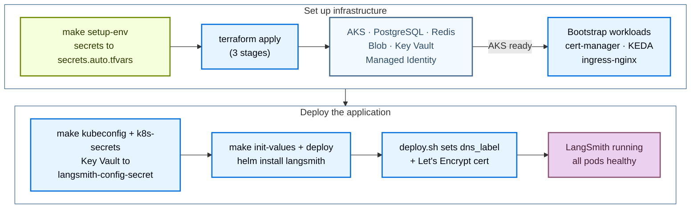

<!-- langchain-docs: machine-translated zh-CN from English source -->

<!-- langchain-docs: Deploy LangSmith on Azure with Terraform | https://docs.langchain.com/langsmith/self-host-terraform-azure-deploy -->

# 使用 Terraform 在 Azure 上部署 LangSmith

使用公共 [Terraform modules](https://github.com/langchain-ai/terraform/tree/main/modules/azure) 将 LangSmith 部署到 Azure。通过将部署管理为代码，您可以跨订阅版本化、查看和重现 LangSmith 环境，而无需单击 Azure 门户。

安装分两个阶段运行：

1. **基础设施**：Terraform 提供 AKS、Postgres、Redis、Blob 存储、Key Vault、证书管理器、KEDA 和入口。
2. **应用程序**：Helm 针对集群安装 LangSmith 图表。

基本安装完成后，通过设置标志和重新部署来启用三个可选附加组件（LangSmith 部署、Agent Builder 以及 Insights 和 Polly）。



## 先决条件

### 所需工具

|工具|版本 |目的|
|---|---|---|
| Azure CLI (`az`) | 2.50 | 2.50身份验证、查询 Azure 资源、管理 AKS 凭据 |
|地形 | 1.5 | 1.5运行基础设施模块 |
| `kubectl` |最新 |检查 AKS 集群 |
|头盔| 3.12 | 3.12安装和管理LangSmith图表|

```bash
brew install azure-cli kubectl helm
brew tap hashicorp/tap && brew install hashicorp/tap/terraform

az --version
terraform version
kubectl version --client
helm version
```

### 必需的 Azure RBAC

运行 Terraform 的身份需要在订阅上具有以下角色：|角色 |目的|
|---|---|
| `Contributor` |创建和管理所有 Azure 资源 |
| `User Access Administrator` |为 Key Vault、Blob、cert-manager 托管身份创建角色分配 |

`Owner` 包括两者。仅`Contributor`是不够的，因为角色分配需要用户访问管理员。

### 验证

```bash
az login
az account set --subscription <your-subscription-id>
az account show
```

您还需要 LangSmith 许可证密钥 ([contact sales](https://www.langchain.com/contact-sales)) 和 `dns_label`（Azure 子域，无需 DNS 设置）或自定义 `langsmith_domain`。

## 快速入门

<Tip>
有关 `make` 目标、所需变量和常见约束的简明备忘单，请参阅 [Azure quick reference](/langsmith/self-host-terraform-azure-quick-reference)。
</Tip>

对于从零到正在运行的 LangSmith 实例的最快路径：

```bash
# 1. Clone the public modules
git clone https://github.com/langchain-ai/terraform.git
cd terraform/modules/azure

# 2. Generate terraform.tfvars interactively
make quickstart

# 3. Bootstrap secrets (writes infra/secrets.auto.tfvars, chmod 600, gitignored)
make setup-env

# 4. Validate environment
make preflight

# 5. Provision infrastructure (~15 to 20 min)
make init
make apply

# 6. Get cluster credentials and push secrets into the cluster
make kubeconfig
make k8s-secrets

# 7. Deploy LangSmith via Helm (~10 min)
make init-values
make deploy
```

或者一次性运行步骤 5 到 7：

```bash
make deploy-all   # apply → kubeconfig → k8s-secrets → init-values → deploy
```

以下部分详细介绍了每个阶段。

## 提供基础设施

Terraform 提供以下 Azure 资源：|资源 |类型 |目的|
|---|---|---|
|资源组| `azurerm_resource_group` |所有资源的容器 |
|虚拟网络| `azurerm_virtual_network` |隔离网络（10.0.0.0/17）|
| AKS 集群 | `azurerm_kubernetes_cluster` | Kubernetes，所有工作负载都在这里运行 |
|入口控制器 |头盔|外部负载均衡器 + TLS 终止（默认为 nginx） |
| PostgreSQL 灵活服务器 | `azurerm_postgresql_flexible_server` |组织配置，运行元数据（外部层）|
| Azure 托管 Redis | `azapi_resource` (Microsoft.Cache/redisEnterprise) |跟踪摄取队列，发布/订阅（外部层）|
| Blob 存储 | `azurerm_storage_account` |原始跟踪对象，始终需要 |
|托管身份| `azurerm_user_assigned_identity` |用于 Pod 到 Blob 身份验证的工作负载身份 |
| Azure 密钥保管库 | `azurerm_key_vault` |存储所有 LangSmith 秘密 |
|证书经理 |头盔|自动化 TLS 证书管理 |
|科达|头盔|为工作人员提供事件驱动的自动缩放功能

### 克隆并配置

```bash
git clone https://github.com/langchain-ai/terraform.git
cd terraform/modules/azure
```

所有后续命令都从`modules/azure/`运行。运行 `make help` 以获得完整的目标列表。

使用交互式向导生成 `terraform.tfvars`：

```bash
make quickstart
```该向导运行包含 10 个部分的调查问卷，涵盖配置文件、订阅、命名、网络、AKS 大小、入口控制器、DNS/TLS、后端服务、Key Vault、大小配置文件和安全附加组件。每个部分都包括解释性背景、成本估算和权衡。重新运行是安全的；在每次提示时都会预先选择现有值。按 Enter 键保留它们。

更喜欢手动编辑：

```bash
cp infra/terraform.tfvars.example infra/terraform.tfvars
vi infra/terraform.tfvars
```

最低要求值：

```hcl
# Identity
subscription_id = "<your-azure-subscription-id>"

# Location
location = "eastus"

# Naming + tagging
identifier  = "-prod"      # suffix on all resource names
environment = "prod"

# Deployment tier, production recommended
postgres_source   = "external"   # Azure DB for PostgreSQL
redis_source      = "external"   # Azure Managed Redis
clickhouse_source = "in-cluster" # use "external" + LangChain Managed for production

# DNS + TLS (HTTPS via Let's Encrypt on a free Azure subdomain)
dns_label              = "langsmith-prod"   # → langsmith-prod.eastus.cloudapp.azure.com
tls_certificate_source = "letsencrypt"
letsencrypt_email      = "ops@example.com"

# Sizing
sizing_profile = "production"   # minimum | dev | production | production-large
```

<Warning>
集群内 ClickHouse 作为单个 Pod 运行，没有复制或备份，仅用于开发/POC。对于生产，请使用[LangChain Managed ClickHouse](/langsmith/langsmith-managed-clickhouse)。
</Warning>

<Info>
无论层如何，始终需要 Blob 存储。跟踪有效负载必须发送到 Azure Blob，而不是 ClickHouse。
</Info>

对于所有变量，请参阅[Azure variables reference](/langsmith/self-host-terraform-azure-variables)。

### 引导程序的秘密

```bash
make setup-env
```

`setup-env.sh` 写入`infra/secrets.auto.tfvars`（gitignored，`chmod 600`）。 Terraform 会自动选取该文件；不需要 shell 导出。- **首次运行：** 提示输入 PostgreSQL 密码、LangSmith 许可证密钥、管理员密码和管理员电子邮件。在本地生成 `api_key_salt`、`jwt_secret` 和四个 Fernet 加密密钥。
- **后续运行：** 从 Azure Key Vault 读取六个生成的机密（`api_key_salt`、`jwt_secret` 和四个 Fernet 密钥）。重新提示输入 PostgreSQL 密码、许可证密钥、管理员密码和管理员电子邮件，除非在环境中设置了 `LANGSMITH_PG_PASSWORD`、`LANGSMITH_LICENSE_KEY`、`LANGSMITH_ADMIN_PASSWORD` 和 `LANGSMITH_ADMIN_EMAIL`。

<Warning>
切勿提交`secrets.auto.tfvars`。它被忽略了。通过运行 `make setup-env` 在任何机器上重新生成。
</Warning>

### 飞行前

```bash
make preflight
```

验证 Azure CLI 身份验证、活动订阅、11 个必需的资源提供程序、RBAC（贡献者 + 用户访问管理员）、`terraform.tfvars` 和 `secrets.auto.tfvars` 存在以及 PATH 上的 `terraform`/`kubectl`/`helm`。

### 申请

<Note>
对于全新订阅，配置 Azure 云基础需要 15 到 20 分钟。不要中断应用。
</Note>

```bash
make init
make apply   # ~15 to 20 min on first run
```<Note>
在新部署中跳过 `make plan`。 `kubernetes_manifest` 资源在计划期间需要实时集群 API，但目前尚不存在。 `make apply` 在三个内部阶段处理资源排序：Azure 基础设施，包括 AKS → Kubernetes 引导程序（命名空间、秘密、证书管理器、KEDA）→ ClusterIssuer 和剩余清单。
</Note>

### 集群凭证和 Kubernetes Secrets

`make apply` 完成后，获取集群凭据并将机密推送到集群中：

```bash
make kubeconfig    # fetches AKS credentials, merges into ~/.kube/config
make k8s-secrets   # Key Vault → langsmith-config-secret in the langsmith namespace
```

`make k8s-secrets` 从 Key Vault 读取 8 个机密并创建或更新 `langsmith-config-secret`。可以安全地重新运行；使用`--dry-run=client | kubectl apply`就地更新。

### 验证基础设施

```bash
# All nodes Ready
kubectl get nodes

# Bootstrap components, all Running
kubectl get pods -n cert-manager     # 3 pods
kubectl get pods -n keda             # 3 pods
kubectl get pods -n ingress-nginx    # 2 pods (if using nginx)

# NGINX LoadBalancer, save the EXTERNAL-IP
kubectl get svc ingress-nginx-controller -n ingress-nginx

# Workload Identity ServiceAccount, should have client-id annotation
kubectl get sa langsmith-ksa -n langsmith \
  -o jsonpath='{.metadata.annotations}'

# Terraform outputs
terraform -chdir=infra output

# Key outputs consumed by Helm scripts
terraform -chdir=infra output -raw keyvault_name
terraform -chdir=infra output -raw storage_account_name
terraform -chdir=infra output -raw storage_container_name
terraform -chdir=infra output -raw storage_account_k8s_managed_identity_client_id
```

## 部署LangSmith

使用两个受支持的部署路径之一：

|路径|命令 |何时使用 |
|---|---|---|
| Helm 路径_（默认）_ | `make init-values && make deploy` |交互式输出、kubeconfig 刷新、预检检查。最适合首次部署和第二天重新部署。 |
|地形路径| `make init-app && make apply-app` | Helm 版本 + Kubernetes Secrets + 在 Terraform 状态下管理的 Workload Identity SA。最适合 GitOps 和 CI/CD 管道。 |

### Helm 路径（推荐）

#### 生成 Helm 值

```bash
cd terraform/modules/azure
make init-values
```

`make init-values` 读取 `terraform output` 和 `terraform.tfvars` 并生成填充了所有字段的 `helm/values/values-overrides.yaml`：- `config.hostname`，您的 FQDN（来自 `dns_label` 或 `langsmith_domain`）。
- `config.initialOrgAdminEmail`，第一个组织管理员帐户。
- `config.existingSecretName: langsmith-config-secret`，秘密参考。
- `config.blobStorage`，存储帐户名称 + 容器 + Workload Identity 客户端 ID。
- 8 个 ServiceAccounts 的工作负载身份注释（后端、平台后端、队列、摄取队列、主机后端、侦听器、代理构建器工具服务器、代理构建器触发服务器）。
- Ingress + TLS 块（证书管理器注释、TLS 秘密名称）。
- Postgres 和 Redis 外部秘密引用（当`postgres_source = "external"` / `redis_source = "external"` 时）。

还将尺寸覆盖和任何启用的附加覆盖从`helm/values/examples/`复制到`helm/values/`。

<Info>
管理员电子邮件从`terraform.tfvars`中的`langsmith_admin_email`读取（在`make setup-env`期间设置）并自动写入`values-overrides.yaml`。无需手动编辑。
</Info>

#### 部署

```bash
make deploy   # ~10 min
```

`make deploy` 执行以下操作：1. 验证`values-overrides.yaml`存在。
2. 通过`az aks get-credentials`刷新kubeconfig。
3. 使用 `service.beta.kubernetes.io/azure-dns-label-name` 注释 LoadBalancer 服务，这是 Azure 将 DNS 标签分配给公共 IP 所必需的。
4. 如果 `tls_certificate_source = "letsencrypt"` （幂等），则创建 `letsencrypt-prod` 证书管理器 `ClusterIssuer`。
5. 运行预检检查（工具、集群连接、Helm 存储库）。
6. 验证`langsmith-config-secret`是否存在；如果 Key Vault 丢失，则会自动创建。
7. 构建并记录价值链。
8. 在继续之前自动恢复任何卡住的 `pending-upgrade` 头盔释放。
9. 运行`helm upgrade --install langsmith langchain/langsmith --timeout 20m`。
10. 等待核心部署推出。
11. 使用 Workload Identity 客户端 ID 注释 `langsmith-ksa` ServiceAccount。
12. 打印访问 URL 和登录凭据位置。

<Info>
为什么`--timeout 20m`？ `langsmith-backend-auth-bootstrap` 作业将数据库迁移和组织初始化作为安装后挂钩运行。首次安装最多需要 5 分钟。如果没有较长的超时时间，即使安装最终成功，Helm 也可能会报告失败。
</Info>

<Tip>
**在第二个终端观看 Pod：**

```bash
# macOS
brew install watch
watch kubectl get pods -n langsmith

# Without watch
while true; do clear; kubectl get pods -n langsmith; sleep 3; done
```
</Tip>

如果您完成了 Helm 路径，请跳至 [Verify the deployment](#verify-the-deployment)。以下 Terraform 路径是 Helm 路径的替代路径，而不是额外的步骤。

### 地形路径当您希望在 Terraform 状态下管理 Helm 版本、Kubernetes Secrets 和 Workload Identity ServiceAccount 时，请使用此路径。

```bash
# Copy and configure app vars
cp app/terraform.tfvars.example app/terraform.tfvars
vi app/terraform.tfvars   # set admin_email at minimum

# Pull infra outputs into app/infra.auto.tfvars.json + terraform init
make init-app

# Deploy Helm release + K8s Secrets + WI ServiceAccount via Terraform
make apply-app
```

`app/terraform.tfvars` 中的功能标志：

```hcl
sizing                = "production"   # dev | production | production-large | none
enable_agent_deploys  = true           # LangSmith Deployment add-on
enable_agent_builder  = true           # Agent Builder add-on (requires agent_deploys)
enable_insights       = true           # Insights / ClickHouse add-on
enable_polly          = true           # Polly add-on (requires agent_deploys)
```

通过 Terraform 进行端到端（基础设施 + 应用程序）：

```bash
make deploy-all-tf   # apply → init-values → init-app → apply-app
```

### 验证部署

```bash
# All pods Running or Completed (~17 pods)
kubectl get pods -n langsmith

# Ingress host + TLS assigned
kubectl get ingress -n langsmith

# TLS certificate issued
kubectl get certificate -n langsmith   # READY: True

# Helm release status
helm list -n langsmith
```

预期的 pod 状态（大约 5 分钟后全部运行）：

```txt
langsmith-ace-backend-xxxxx              1/1   Running     0   5m
langsmith-backend-xxxxx                  1/1   Running     0   5m
langsmith-backend-auth-bootstrap-xxxxx   0/1   Completed   0   5m
langsmith-backend-ch-migrations-xxxxx    0/1   Completed   0   5m
langsmith-backend-migrations-xxxxx       0/1   Completed   0   5m
langsmith-clickhouse-0                   1/1   Running     0   5m
langsmith-frontend-xxxxx                 1/1   Running     0   5m
langsmith-ingest-queue-xxxxx             1/1   Running     0   5m
langsmith-platform-backend-xxxxx         1/1   Running     0   5m
langsmith-playground-xxxxx               1/1   Running     0   5m
langsmith-queue-xxxxx                    1/1   Running     0   5m
```

打开 `https://<HOSTNAME>` 并使用 Key Vault 中的管理员电子邮件和密码登录：

```bash
az keyvault secret show \
  --vault-name $(terraform -chdir=infra output -raw keyvault_name) \
  --name langsmith-admin-password \
  --query value -o tsv
```

### 价值链

`make deploy` 按此顺序应用 Helm 值文件（冲突时最后一个文件获胜）：

```txt
1. helm/values/values.yaml                              ← base values (chart defaults)
2. helm/values/values-overrides.yaml                    ← hostname, WI client-id, auth, postgres/redis
3. helm/values/langsmith-values-sizing-<profile>.yaml   ← resource requests + HPA settings
4. (add-on files when enable_* flags are set)
```

`helm/values/` 中的所有文件均被 gitignored（生成或包含实时机密）。源模板位于 `helm/values/examples/` 中并由 `make init-values` 复制。

### 第 2 天运营

```bash
make status         # 10-section health check
make status-quick   # skip Key Vault + K8s secret queries (faster)
make deploy         # re-deploy after any Helm value changes
make init-values    # re-generate values after Terraform changes
make kubeconfig     # refresh cluster credentials
make k8s-secrets    # re-create langsmith-config-secret from Key Vault
```

## 启用附加组件

每个附加组件都由 `infra/terraform.tfvars` 中的标志控制。设置标志，重新运行`make init-values`以重新生成值，然后重新运行`make deploy`。

### LangSmith 部署

启用 [LangSmith Deployment](/langsmith/deploy-self-hosted-full-platform)，它允许您直接从 [LangSmith UI](https://smith.langchain.com?utm_source=docs&utm_medium=cta&utm_campaign=langsmith-signup&utm_content=langsmith-self-host-terraform-azure-deploy) 将代理部署和管理为 API 服务器。这添加了三个新的 Pod。|吊舱 |角色 |工作负载身份 |
|---|---|---|
| `langsmith-host-backend` | LangSmith 部署控制平面API。管理部署生命周期，将状态存储在共享 PostgreSQL 中。 |是的 |
| `langsmith-listener` |监视主机后端，在 Kubernetes 中创建和更新 `LangGraphPlatform` CRD。 |是的 |
| `langsmith-operator` |协调 CRD。创建每个部署的 Deployment、StatefulSet 和服务。 |没有 |

#### 首先扩展节点池

在启用之前，将 `default_node_pool_min_count` 提高到至少 5。操作员按需生成代理部署 Pod，并需要节点空间：

```hcl
# infra/terraform.tfvars
default_node_pool_min_count = 5      # operator pods need headroom
enable_deployments          = true
```

<Warning>
如果没有足够的节点容量，操作员生成的代理 Pod 会无限期地保持在 `Pending` 状态。先扩展节点池，再启用。
</Warning>

#### 应用、重新生成值、部署

```bash
cd terraform/modules/azure
make apply          # scale up node pool (~5 min)
make init-values    # picks up enable_deployments = true → generates add-on overlay
make deploy         # rolls out host-backend + listener + operator
```

`make init-values` 将LangSmith 部署附加覆盖层 (`langsmith-values-agent-deploys.yaml`) 添加到价值链。它会自动注入：

```yaml
config:
  deployment:
    enabled: true                          # REQUIRED, without this listener and operator are skipped silently
    url: "https://<your-hostname>"         # must match config.hostname (with protocol)
    tlsEnabled: true                       # set based on tls_certificate_source
```

<Warning>
**`config.deployment.url` 必须包含 `https://`。** 缺少协议会导致操作员部署的代理无限期地停留在 `DEPLOYING` 状态。 URL 由`make init-values` 自动注入。不要在覆盖文件中手动设置；它会在下次运行时被覆盖。
</Warning><Warning>
**`config.deployment.enabled: true` 是必需的。** 仅设置 `config.deployment.url` 而不设置 `enabled: true` 会导致图表静默跳过创建 `listener` 和 `operator`。没有错误，它们永远不会出现。
</Warning>

#### 验证

```bash
# All three pods Running
kubectl get pods -n langsmith | grep -E "host-backend|listener|operator"

# LangSmith Deployment CRDs registered
kubectl get crd | grep langchain

# List LangSmith Deployments (empty on first deploy, populated when you create a deployment)
kubectl get lgp -n langsmith
```

预计：`langsmith-host-backend`、`langsmith-listener` 和 `langsmith-operator` 全部运行。 Pod 总数：约 20 个正在运行的作业 + 3 个已完成的作业。

KEDA 已与基础设施一起安装。使用 `enable_deployments = true`，操作员为每个代理部署的工作队列创建 KEDA `ScaledObject` 资源。 Worker Pod 在空闲时缩小到零，并根据 Redis 队列深度进行扩展。

### 代理生成器

从 LangSmith UI 提供可视化 AI 辅助创建和管理 LangGraph 代理。无需`terraform apply`；运行`make init-values && make deploy`。

**先决条件：** LangSmith 已启用部署 (`enable_deployments = true`)。如果不启用 Agent Builder，则会导致预检错误。|吊舱 |类型 |角色 |
|---|---|---|
| `langsmith-agent-builder-tool-server` |静态| MCP 工具执行服务器，AI 代码/文件编辑工具 |
| `langsmith-agent-builder-trigger-server` |静态| Webhook 接收器和预定触发引擎 |
| `langsmith-agent-bootstrap` |工作（已完成）|通过运营商注册捆绑的Agent Builder代理，运行一次 |
| `agent-builder-<hash>` + 队列 + Redis + `lg-<hash>-0` |动态（运营商管理）| Agent Builder 部署，由操作员在引导作业运行时创建 |

启用：

```hcl
# infra/terraform.tfvars
enable_deployments   = true    # required prerequisite
enable_agent_builder = true
```

```bash
cd terraform/modules/azure
make init-values    # appends langsmith-values-agent-builder.yaml to values chain
make deploy         # rolling update, ~10 min for bootstrap Job to complete
```

`make init-values` 将 Agent Builder 附加覆盖层 (`langsmith-values-agent-builder.yaml`) 附加到价值链。该覆盖启用 Agent Builder UI 和支持服务，设置 `backend.agentBootstrap.enabled: true`（将 Agent Builder 注册为 LangSmith 部署并创建所需的 ConfigMap 的安装后作业），并设置保守的代理工作 Pod 资源（1 到 2 个 CPU、512 MiB 到 1 GiB 内存），而不是图表的默认 4 到 8 GiB 内存。

验证：

```bash
# Static pods Running, bootstrap Job Completed
kubectl get pods -n langsmith | grep -E "tool-server|trigger-server|Bootstrap"

# Operator-managed dynamic pods (4 pods, api-server, queue, redis, postgres StatefulSet)
kubectl get pods -n langsmith | grep agent-builder

# Operator-managed LangSmith Deployment for Agent Builder
kubectl get lgp -n langsmith
```

预期：3 个静态 Pod（工具服务器、触发器服务器、引导作业）+ 4 个动态 Pod。总数：~26 个豆荚。在 `make deploy` 之后，**Agent Builder** 部分将出现在 LangSmith UI 导航中。<Warning>
**在 `agentBootstrap` 完成后滚动前端。** `agentBootstrap` 作业创建前端为 Polly UI 读取的 `langsmith-polly-config` ConfigMap。如果引导完成时前端正在运行，Polly 将显示“无法连接到 LangGraph 服务器”。修复：

```bash
kubectl rollout restart deployment langsmith-frontend -n langsmith
```
</Warning>

<Warning>
**加密密钥从`langsmith-config-secret`读取。**请勿在`values-overrides.yaml`中内联设置`config.agentBuilder.encryptionKey`。该图表从 `langsmith-config-secret` 到 `existingSecretName` 读取它。将其内联设置会覆盖秘密引用并造成不匹配。
</Warning>

`langsmith-agent-builder-tool-server` 和 `langsmith-agent-builder-trigger-server` 都需要工作负载标识才能访问 Azure Blob 存储。他们的联合凭证已在`modules/k8s-cluster/main.tf`中预先注册；无需额外设置。

### 见解和波莉

两个功能，都需要LangSmith部署。它们是相互独立的；启用其中一个而不启用另一个。

- **见解：** AI 支持的跟踪分析 (Clio)。 LangSmith 痕迹中的表面图案和异常。 Clio 在第一次 UI 调用时通过操作员部署为动态 LangGraph 部署。不添加新的静态 Pod。
- **Polly：** 人工智能驱动的评估和监控代理。作为动态LangGraph部署运行，由操作员管理。覆盖启用 Polly（顶级`polly.enabled: true`）；运营商管理其资源。无需`terraform apply`；运行`make init-values && make deploy`。

```hcl
# infra/terraform.tfvars
enable_deployments = true    # required prerequisite
enable_insights    = true    # Insights / Clio analytics
enable_polly       = true    # Polly AI evaluation agent
```

启用一项：

```hcl
enable_insights = true    # Insights only
# or
enable_polly    = true    # Polly only
```

```bash
cd terraform/modules/azure
make init-values    # appends insights + polly add-on overlays to the values chain
make deploy         # rolling update, ~5 min
```

`make init-values` 在 `terraform.tfvars` 中基于 `clickhouse_source` 附加附加叠加层：

- `clickhouse_source = "in-cluster"`，生成最小覆盖（仅顶层`insights.enabled: true`）。 Helm Chart 在内部管理 ClickHouse。
- `clickhouse_source = "external"`，生成带有`clickhouse.external.enabled: true`和`langsmith-clickhouse`秘密引用的完整覆盖。在部署之前使用 ClickHouse 主机和凭据创建此密钥。

<Warning>
**请勿手动复制集群内 ClickHouse 的 Insights 示例文件。** 示例 `helm/values/examples/langsmith-values-insights.yaml` 具有 `clickhouse.external.enabled: true` 和 `existingSecretName: langsmith-clickhouse`。使用集群内 ClickHouse 时手动复制它会导致`CreateContainerConfigError`，因为密钥不存在。始终使用 `make init-values` 生成正确的文件。
</Warning>

验证：

```bash
# ClickHouse already running from base install
# Insights and Polly deploy as dynamic pods when first invoked from the UI
kubectl get pods -n langsmith | grep -E "clickhouse|polly|clio"

# Watch for dynamic pods on first Insights use
kubectl get pods -n langsmith -w

# Confirm Insights is enabled in Helm values
helm get values langsmith -n langsmith | grep -A3 insights
# Expected: enabled: true
```

<Warning>
**加密密钥在首次启用后不得更改。** `insights_encryption_key` 和 `polly_encryption_key` 在首次启用后不得更改。更改其中任何一个都会永久损坏所有现有的加密数据。没有恢复路径。这些密钥位于 Key Vault 中并且永远不会自动轮换。
</Warning>

<Warning>
**首次 Polly 启用后滚动前端。** 如果启用后 Polly UI 显示“无法连接到LangGraph 服务器”，则前端在引导 ConfigMap 准备就绪之前启动。修复：

```bash
kubectl rollout restart deployment langsmith-frontend -n langsmith
```
</Warning>### 附加组件摘要

|相|新豆荚 |总~跑步|
|---|---|---|
|基础安装 |核心LangSmith（后端、前端、队列、摄取队列、clickhouse 等）| 〜17 |
| LangSmith 部署| `host-backend`、`listener`、`operator` | 〜20 |
|代理生成器| `tool-server`、`trigger-server`、`bootstrap` 作业 + 4 个动态 Agent Builder Pod | 〜26 |
|见解和波莉 |没有新的静态吊舱（Clio + Polly 在首次使用时动态出现）|休息时~22 |

## 入口控制器

将`ingress_controller`设置在`terraform.tfvars`之前`make apply`。有关完整的 TLS 兼容性矩阵，请参阅 [Azure module repo](https://github.com/langchain-ai/terraform/blob/main/modules/azure/INGRESS_CONTROLLERS.md) 中的`INGRESS_CONTROLLERS.md`。

|价值| Terraform 安装什么 |最适合 |
|---|---|---|
| `nginx` _（默认）_ | `ingress-nginx` 带有 Azure LB 的 Helm 图表 |标准部署。最简单的设置。 |
| `istio-addon` | AKS 服务网格附加组件（Azure 管理的 Istio）| Azure 管理的 Istio 网格、多数据平面、mTLS。 |
| `istio` | `istio-base` + `istiod` + `istio-ingressgateway` |自我管理的 Istio。全网格和边车注入。 |
| `agic` | Azure 应用程序网关 v2 + AKS 管理的 `ingress_application_gateway` 附加组件 |企业 Azure、本机 L7 WAF、仅 HTTP 或 dns01 + 自定义域。 |
| `envoy-gateway` | `gateway-helm` OCI 图表，Kubernetes 网关 API | Gateway API 原生，Ingress 的现代替代品。 |<Warning>
`letsencrypt` (HTTP-01) 仅适用于 `nginx`、`istio`（自我管理）和 `envoy-gateway`。 `istio-addon` 不会创建 IngressClass，因此 ACME 求解器无法接收流量。使用 `agic`，应用程序网关重写了 ACME 质询路径，因此 HTTP-01 求解器失败。对于两者，请将 `dns01` 与自定义域一起使用，或将 `none` 用于仅 HTTP。
</Warning>

## DNS 和 TLS

`dns_label` 为您提供免费的 Azure 子域 `<label>.<region>.cloudapp.azure.com`，无需域注册或 DNS 区域。 `deploy.sh` 自动注释正确的 LoadBalancer 服务。

**快速启动默认值（HTTP，零设置）：**

```hcl
dns_label              = "langsmith-prod"
tls_certificate_source = "none"
```

**使用 Let's Encrypt 添加 HTTPS（nginx、自管理 istio 或 envoy-gateway）：**

```hcl
dns_label              = "langsmith-prod"
tls_certificate_source = "letsencrypt"
letsencrypt_email      = "you@example.com"
```

**自定义域 + DNS-01（所有控制器，在防火墙后面工作）：**

```hcl
langsmith_domain       = "langsmith.mycompany.com"
tls_certificate_source = "dns01"
letsencrypt_email      = "you@example.com"
create_dns_zone        = true
# After deploy: add ingress_ip = "<lb-ip>" and re-run make apply (creates A record)
```

**dns01流程：**

1. `make apply` 创建 Azure DNS 区域并输出 4 个名称服务器。
2. 在您的注册商处，为指向这 4 个名称服务器的子域添加 NS 记录。
3. 验证：`dig NS langsmith.mycompany.com @8.8.8.8`。
4. `make deploy` 自动通过 DNS-01 颁发证书（Workload Identity 将 TXT 记录写入 Azure DNS）。
5. 获取LB IP，将`ingress_ip = "<ip>"`添加到`terraform.tfvars`，然后添加`make apply`（创建A记录）。
6. `make status` 准确显示每个阶段要添加的 NS 和 A 记录。<Note>
**为什么是 NS 记录，而不是 CNAME：** 证书管理器必须将 TXT 记录写入区域以证明所有权。这要求 Azure DNS 对子域具有权威，并且 NS 委派授予该权限。 CNAME仅对流量进行别名，不转移DNS权限； DNS-01 挑战失败。
</Note>

## 后续步骤

- 参考[Azure variables](/langsmith/self-host-terraform-azure-variables)和[quick reference](/langsmith/self-host-terraform-azure-quick-reference)。
- 查看[Azure architecture](/langsmith/self-host-terraform-azure-architecture)的模块结构、流量和工作负载身份。
- 当出现故障时，检查[Azure troubleshooting guide](/langsmith/self-host-terraform-azure-troubleshooting)。
- 使用 [LangSmith Deployment](/langsmith/deploy-self-hosted-full-platform) 在 UI 中启用代理部署。

---

<div className="source-links">
<Callout icon="terminal-2">
    通过 MCP 向 Claude、VSCode 等发送[Connect these docs](/use-these-docs) 以获得实时答案。
</Callout>
<Callout icon="edit">
    [Edit this page on GitHub](https://github.com/langchain-ai/docs/edit/main/src/langsmith/self-host-terraform-azure-deploy.mdx) 或 [file an issue](https://github.com/langchain-ai/docs/issues/new/choose)。
</Callout>
</div>