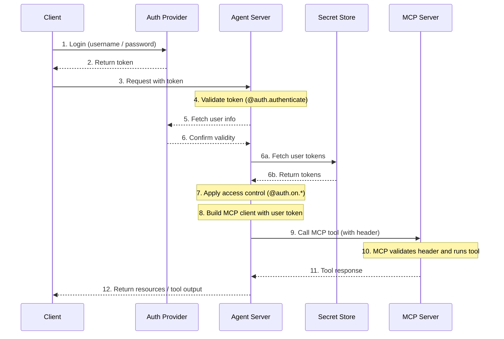

<!-- langchain-docs: machine-translated zh-CN from English source -->

<!-- langchain-docs: MCP endpoint in Agent Server | https://docs.langchain.com/langsmith/server-mcp -->

# 代理服务器中的 MCP 端点

模型上下文协议 (MCP) 是一种开放协议，用于以与模型无关的格式描述工具和数据源，使法学硕士能够通过结构化 API 发现和使用它们。

[Agent Server](/langsmith/agent-server) 使用[Streamable HTTP transport](https://spec.modelcontextprotocol.io/specification/2025-03-26/basic/transports/#streamable-http) 实现 MCP。这允许 LangGraph **代理** 作为 **MCP 工具**公开，使它们可与任何支持 Streamable HTTP 的 MCP 兼容客户端一起使用。

MCP 端点在 [Agent Server](/langsmith/agent-server) 的 `/mcp` 可用。

您可以设置 [custom authentication middleware](/langsmith/custom-auth) 使用 MCP 服务器对用户进行身份验证，以访问 LangSmith 部署中的用户范围工具。

此流程的示例架构：



## 要求

要使用 MCP，请确保安装了以下依赖项：

* `langgraph-api >= 0.2.3`
* `langgraph-sdk >= 0.1.61`

安装它们：

<CodeGroup>
```bash pip
pip install "langgraph-api>=0.2.3" "langgraph-sdk>=0.1.61"
```

```bash uv
uv add "langgraph-api>=0.2.3" "langgraph-sdk>=0.1.61"
```
</CodeGroup>

## 使用概述

要启用 MCP：

* 升级以使用 langgraph-api>=0.2.3。如果您正在部署 LangSmith，那么当您创建新修订版时，系统会自动为您完成此操作。
* MCP工具（代理）将自动暴露。
* 与任何支持 Streamable HTTP 的 MCP 兼容客户端连接。

＃＃＃ 客户使用符合 MCP 的客户端连接到代理服务器。以下示例展示了如何使用不同的编程语言进行连接。

<Tabs>
    <Tab title="JavaScript/TypeScript">
    ```bash
    npm install @modelcontextprotocol/sdk
    ```

        > **注意**
        > 将 `serverUrl` 替换为您的代理服务器 URL，并根据需要配置身份验证标头。

    ```js
    import { Client } from "@modelcontextprotocol/sdk/client/index.js";
    import { StreamableHTTPClientTransport } from "@modelcontextprotocol/sdk/client/streamableHttp.js";

    // Connects to the LangGraph MCP endpoint
    async function connectClient(url) {
        const baseUrl = new URL(url);
        const client = new Client({
            name: 'streamable-http-client',
            version: '1.0.0'
        });

        const transport = new StreamableHTTPClientTransport(baseUrl);
        await client.connect(transport);

        console.log("Connected using Streamable HTTP transport");
        console.log(JSON.stringify(await client.listTools(), null, 2));
        return client;
    }

    const serverUrl = "http://localhost:2024/mcp";

    connectClient(serverUrl)
        .then(() => {
            console.log("Client connected successfully");
        })
        .catch(error => {
            console.error("Failed to connect client:", error);
        });
    ```
    </Tab>
    <Tab title="Python">
    安装适配器：

    ```bash
    pip install langchain-mcp-adapters
    ```

    以下是如何连接到远程 MCP 端点并使用代理作为工具的示例：

    ```python
    # Create server parameters for stdio connection
    from mcp import ClientSession
    from mcp.client.streamable_http import streamablehttp_client
    import asyncio

    from langchain_mcp_adapters.tools import load_mcp_tools
    from langchain.agents import create_agent


    server_params = {
        "url": "https://mcp-finance-agent.xxx.us.langgraph.app/mcp",
        "headers": {
            "X-Api-Key":"lsv2_pt_your_api_key"
        }
    }

    async def main():
        async with streamablehttp_client(**server_params) as (read, write, _):
            async with ClientSession(read, write) as session:
                # Initialize the connection
                await session.initialize()

                # Load the remote graph as if it was a tool
                tools = await load_mcp_tools(session)

                # Create and run a react agent with the tools
                agent = create_agent("gpt-5.5", tools)

                # Invoke the agent with a message
                agent_response = await agent.ainvoke({"messages": "What can the finance agent do for me?"})
                print(agent_response)

    if __name__ == "__main__":
        asyncio.run(main())
    ```
    </Tab>
</Tabs>

## 将代理公开为 MCP 工具

部署后，您的代理将在 MCP 端点中显示为工具
使用此配置：

* **工具名称**：代理的名称。
* **工具描述**：代理的描述。
* **工具输入模式**：代理的输入模式。

### 设置名称和描述

您可以在`langgraph.json`中设置您的代理的名称和描述：

```json
{
    "graphs": {
        "my_agent": {
            "path": "./my_agent/agent.py:graph",
            "description": "A description of what the agent does"
        }
    },
    "env": ".env"
}
```

部署后，您可以使用LangGraph SDK 更新名称和描述。

### 架构

定义清晰、最小的输入和输出模式，以避免向法学硕士暴露不必要的内部复杂性。

默认的[MessagesState](/oss/python/langgraph/graph-api#messagesstate)使用`AnyMessage`，它支持许多消息类型，但对于直接LLM暴露来说太通用了。相反，定义使用显式类型输入和输出结构的**自定义代理或工作流程**。

例如，回答文档问题的工作流程可能如下所示：

```python
from langgraph.graph import StateGraph, START, END
from typing_extensions import TypedDict

# Define input schema
class InputState(TypedDict):
    question: str

# Define output schema
class OutputState(TypedDict):
    answer: str

# Combine input and output
class OverallState(InputState, OutputState):
    pass

# Define the processing node
def answer_node(state: InputState):
    # Replace with actual logic and do something useful
    return {"answer": "bye", "question": state["question"]}

# Build the graph with explicit schemas
builder = StateGraph(OverallState, input_schema=InputState, output_schema=OutputState)
builder.add_node(answer_node)
builder.add_edge(START, "answer_node")
builder.add_edge("answer_node", END)
graph = builder.compile()

# Run the graph
print(graph.invoke({"question": "hi"}))
```

欲了解更多详情，请参阅[low-level concepts guide](/oss/python/langgraph/graph-api#state)。

## 在部署中使用用户范围的 MCP 工具

<Tip>
**先决条件**
您已经添加了自己的 [custom auth middleware](/langsmith/custom-auth) 来填充 `langgraph_auth_user` 对象，使其可以通过图中每个节点的可配置上下文进行访问。
</Tip>

要使用户范围的工具可用于您的 LangSmith 部署，请首先实现如下所示的代码片段：

```python
from langchain_mcp_adapters.client import MultiServerMCPClient

def mcp_tools_node(state, config):
    user = config["configurable"].get("langgraph_auth_user")
         , user["github_token"], user["email"], etc.

    client = MultiServerMCPClient({
        "github": {
            "transport": "streamable_http", # (1)
            "url": "https://my-github-mcp-server/mcp", # (2)
            "headers": {
                "Authorization": f"Bearer {user['github_token']}"
            }
        }
    })
    tools = await client.get_tools() # (3)

    # Your tool-calling logic here

    tool_messages = ...
    return {"messages": tool_messages}
```

1. MCP 仅支持向`streamable_http` 和`sse` `transport` 服务器发出的请求添加标头。
2. 您的 MCP 服务器 URL。
3. 从 MCP 服务器获取可用工具。

_这也可以通过 [rebuilding your graph at runtime](/langsmith/graph-rebuild) 来完成，为新的运行提供不同的配置_

## 会话行为

当前的 LangGraph MCP 实现不支持会话。每个`/mcp`请求都是无状态且独立的。

## 身份验证

`/mcp` 端点使用与 LangGraph API 的其余部分相同的身份验证。设置详情请参阅[authentication guide](/langsmith/auth)。

## 禁用 MCP

要禁用 MCP 端点，请在 `langgraph.json` 配置文件中将 `disable_mcp` 设置为 `true`：

```json
{
  "$schema": "https://langgra.ph/schema.json",
  "http": {
    "disable_mcp": true
  }
}
```这将防止服务器公开 `/mcp` 端点。

---

<div className="source-links">
<Callout icon="terminal-2">
    通过 MCP 向 Claude、VSCode 等发送[Connect these docs](/use-these-docs) 以获得实时答案。
</Callout>
<Callout icon="edit">
    [Edit this page on GitHub](https://github.com/langchain-ai/docs/edit/main/src/langsmith/server-mcp.mdx) 或 [file an issue](https://github.com/langchain-ai/docs/issues/new/choose)。
</Callout>
</div>