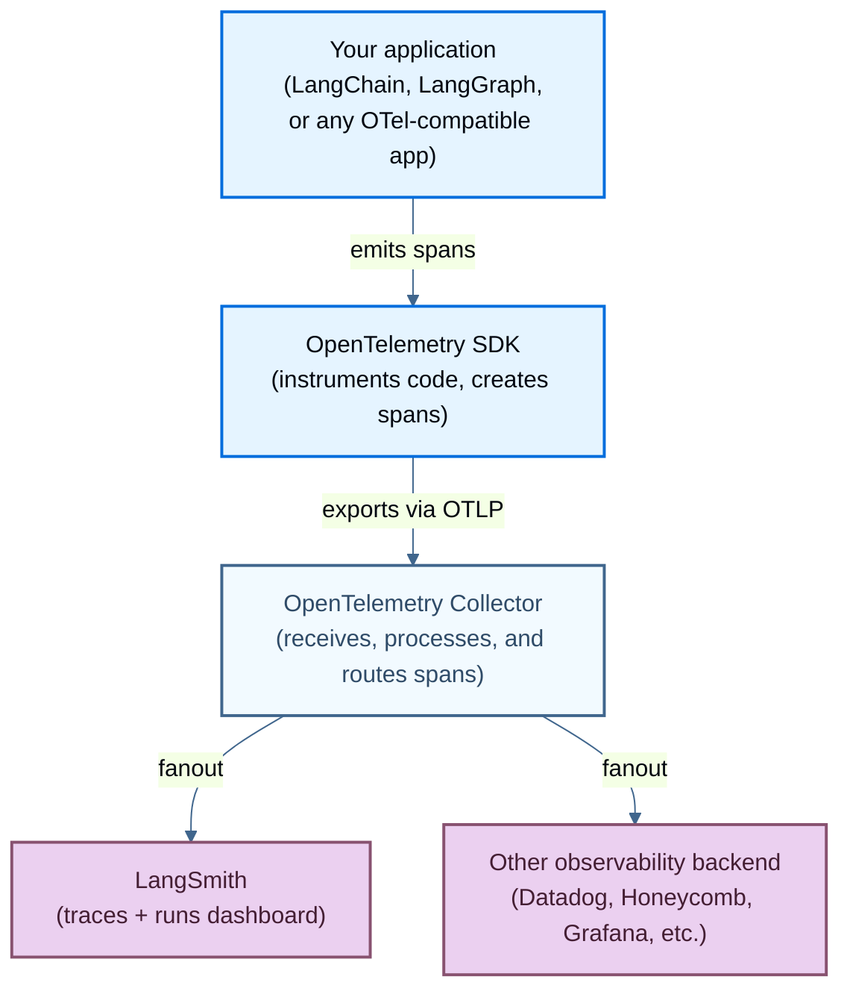

<!-- langchain-docs: machine-translated zh-CN from English source -->

<!-- langchain-docs: Trace with OpenTelemetry | https://docs.langchain.com/langsmith/trace-with-opentelemetry -->

# 使用 OpenTelemetry 进行跟踪

LangSmith 支持基于 OpenTelemetry 的跟踪，允许您从任何 OpenTelemetry 兼容的应用程序发送跟踪。本指南涵盖了LangChain应用程序的自动检测和其他框架的手动检测。

了解如何使用 OpenTelemetry 和 LangSmith 跟踪您的 LLM 申请。

## OTel 追踪的工作原理

下图显示了使用 LangSmith 进行 OpenTelemetry 跟踪的基本流程，包括扇出模式，其中单个跨度流路由到多个可观察性后端。



OpenTelemetry SDK 检测您的应用程序代码并发出跨度。 Span 通过 OTLP 协议传输到 OpenTelemetry Collector，该收集器将它们同时批处理并路由到一个或多个目的地 (_fanout_)。 LangSmith 在其 OTLP 端点接收跨度并将其显示为仪表板中的跟踪。

<Note>
在以下请求中适当更新自托管安装或区域 SaaS 的 LangSmith URL：GCP EU 使用 `eu.api.smith.langchain.com`； GCP 亚太地区使用`apac.api.smith.langchain.com`； AWS US 使用`aws.api.smith.langchain.com`。
</Note>

## 跟踪 LangChain 应用程序

如果您使用 LangChain 或 LangGraph，请使用内置集成来跟踪您的应用程序：1. 安装支持 OpenTelemetry 的 LangSmith 软件包：

   <CodeGroup>

   ```bash pip
   pip install "langsmith[otel]"
   pip install langchain
   ```

   </CodeGroup>

   <Info>
   需要 Python SDK 版本`langsmith>=0.3.18`。我们推荐 `langsmith>=0.4.25` 从重要的 OpenTelemetry 修复中受益。
   </Info>

2. 在您的 LangChain/LangGraph 应用程序中，通过设置 `LANGSMITH_OTEL_ENABLED` 环境变量来启用 OpenTelemetry 集成：

   <CodeGroup>

   ```bash Shell
   LANGSMITH_OTEL_ENABLED=true
   LANGSMITH_TRACING=true
   LANGSMITH_ENDPOINT=https://api.smith.langchain.com
   LANGSMITH_API_KEY=<your_langsmith_api_key>
   # For LangSmith API keys linked to multiple workspaces, set the LANGSMITH_WORKSPACE_ID environment variable to specify which workspace to use.
   ```

   </CodeGroup>

3. 创建具有跟踪功能的LangChain应用程序。例如：

   ```python
   import os
   from langchain_openai import ChatOpenAI
   from langchain_core.prompts import ChatPromptTemplate

   # Create a chain
   prompt = ChatPromptTemplate.from_template("Tell me a joke about {topic}")
   model = ChatOpenAI()
   chain = prompt | model

   # Run the chain
   result = chain.invoke({"topic": "programming"})
   print(result.content)
   ```

4. 应用程序运行后，在 LangSmith 仪表板 ([example](https://smith.langchain.com/public/a762af6c-b67d-4f22-90a0-728df16baeba/r)) 中查看跟踪。

## 跟踪非LangChain应用程序

对于非 LangChain 应用程序或自定义仪器，您可以使用标准 OpenTelemetry 客户端在 LangSmith 中跟踪您的应用程序。 （我们建议 **langsmith ≥ 0.4.25**。）

1. 安装 OpenTelemetry SDK、OpenTelemetry 导出程序包以及 OpenAI 包：

   <CodeGroup>

   ```bash pip
   pip install openai
   pip install opentelemetry-sdk
   pip install opentelemetry-exporter-otlp
   ```

   </CodeGroup>

2. 为端点设置环境变量，替换您的特定值：

   <CodeGroup>

   ```bash Shell
   OTEL_EXPORTER_OTLP_ENDPOINT=https://api.smith.langchain.com/otel
   OTEL_EXPORTER_OTLP_HEADERS="x-api-key=<your langsmith api key>"
   ```

   </CodeGroup>

   <Note>
   根据 otel 导出器的配置方式，如果您仅发送跟踪，则可能需要将 `/v1/traces` 附加到端点。
   </Note><Note>
   如果您是自托管 LangSmith，请将基本端点替换为您的 LangSmith API 端点并附加 `/api/v1`。例如：`OTEL_EXPORTER_OTLP_ENDPOINT=https://ai-company.com/api/v1/otel`
   </Note>

   可选：指定除“default”之外的自定义项目名称：

   <CodeGroup>

   ```bash Shell
   OTEL_EXPORTER_OTLP_ENDPOINT=https://api.smith.langchain.com/otel
   OTEL_EXPORTER_OTLP_HEADERS="x-api-key=<your langsmith api key>,Langsmith-Project=<project name>"
   ```

   </CodeGroup>

3. 记录跟踪。

   此代码设置一个 OTEL 跟踪器和导出器，将跟踪发送到 LangSmith。然后，它调用 OpenAI 并发送所需的 OpenTelemetry 属性。

   ```python
   from openai import OpenAI
   from opentelemetry import trace
   from opentelemetry.sdk.trace import TracerProvider
   from opentelemetry.sdk.trace.export import (
       BatchSpanProcessor,
   )
   from opentelemetry.exporter.otlp.proto.http.trace_exporter import OTLPSpanExporter

   client = OpenAI(api_key=os.getenv("OPENAI_API_KEY"))

   otlp_exporter = OTLPSpanExporter(
       timeout=10,
   )

   trace.set_tracer_provider(TracerProvider())
   trace.get_tracer_provider().add_span_processor(
       BatchSpanProcessor(otlp_exporter)
   )

   tracer = trace.get_tracer(__name__)

   def call_openai():
       model = "gpt-5.4-mini"
       with tracer.start_as_current_span("call_open_ai") as span:
           span.set_attribute("langsmith.span.kind", "LLM")
           span.set_attribute("langsmith.metadata.user_id", "user_123")
           span.set_attribute("gen_ai.system", "OpenAI")
           span.set_attribute("gen_ai.request.model", model)
           span.set_attribute("llm.request.type", "chat")

           messages = [
               {"role": "system", "content": "You are a helpful assistant."},
               {
                   "role": "user",
                   "content": "Write a haiku about recursion in programming."
               }
           ]

           for i, message in enumerate(messages):
               span.set_attribute(f"gen_ai.prompt.{i}.content", str(message["content"]))
               span.set_attribute(f"gen_ai.prompt.{i}.role", str(message["role"]))

           completion = client.chat.completions.create(
               model=model,
               messages=messages
           )

           span.set_attribute("gen_ai.response.model", completion.model)
           span.set_attribute("gen_ai.completion.0.content", str(completion.choices[0].message.content))
           span.set_attribute("gen_ai.completion.0.role", "assistant")
           span.set_attribute("gen_ai.usage.prompt_tokens", completion.usage.prompt_tokens)
           span.set_attribute("gen_ai.usage.completion_tokens", completion.usage.completion_tokens)
           span.set_attribute("gen_ai.usage.total_tokens", completion.usage.total_tokens)

           return completion.choices[0].message

   if __name__ == "__main__":
       call_openai()
   ```

4. 在 LangSmith 仪表板 ([example](https://smith.langchain.com/public/4f2890b1-f105-44aa-a6cf-c777dcc27a37/r)) 中查看跟踪。

<Note>
如果您的跨度引用来自另一个服务或进程的父级，请参阅 [Context propagation in distributed tracing](#context-propagation-in-distributed-tracing) 了解父子链接的工作原理以及何时可以删除跨度。
</Note>

## 将跟踪发送给备用提供商

虽然 LangSmith 是 OpenTelemetry 跟踪的默认目标，但您还可以配置 OpenTelemetry 将跟踪发送到其他可观测平台。

<Info>
在 LangSmith Python SDK **≥ 0.4.1** 中可用。我们建议 **≥ 0.4.25** 进行修复，以提高 OTEL 导出和混合扇出稳定性。
</Info>

### 使用环境变量进行全局配置默认情况下，LangSmith OpenTelemetry 导出器会将数据发送到LangSmith API OTEL 端点，但这可以通过设置标准 OTEL 环境变量来自定义：

```bash
OTEL_EXPORTER_OTLP_ENDPOINT: Override the endpoint URL
OTEL_EXPORTER_OTLP_HEADERS: Add custom headers (LangSmith API keys and Project are added automatically)
OTEL_SERVICE_NAME: Set a custom service name (defaults to "langsmith")
OTEL_RESOURCE_ATTRIBUTES: Attach custom metadata fields at the process level (see below)
```

### 添加进程级资源属性

您可以使用标准 OpenTelemetry `OTEL_RESOURCE_ATTRIBUTES` 环境变量将自定义元数据附加到进程发出的每个跟踪。与跨度级别属性（在代码中为每个跨度设置）不同，资源属性在进程级别设置一次并自动传播到所有跨度。这使得它们非常适合您想要用来标记跟踪的任何自定义元数据，例如用户名、请求 ID、环境或部署版本。

该值是以逗号分隔的 `key=value` 对列表：

```bash
OTEL_RESOURCE_ATTRIBUTES="username=abc,id=1,environment=production"
```

您可以使用任何您喜欢的自定义键，或者按照 [OpenTelemetry resource semantic conventions](https://opentelemetry.io/docs/specs/semconv/resource/) 标准字段，例如 `deployment.environment`、`service.version` 和 `cloud.region`。

这些属性显示在跟踪元数据下的LangSmith中，您可以使用它来过滤和分组工作区中的跟踪。

LangSmith 默认使用 HTTP 跟踪导出器。如果您想使用自己的跟踪提供商，您可以：1.如上所示设置OTEL环境变量，或者
2. 在初始化 LangChain 组件之前设置全局跟踪提供程序，LangSmith 将检测并使用该提供程序，而不是创建自己的跟踪提供程序。

### 配置备用 OTLP 端点

要将跟踪发送到不同的提供商，请使用提供商的端点配置 OTLP 导出器：

```python
import os

from langchain_core.prompts import ChatPromptTemplate
from langchain_openai import ChatOpenAI
from opentelemetry import trace
from opentelemetry.exporter.otlp.proto.http.trace_exporter import OTLPSpanExporter
from opentelemetry.sdk.trace import TracerProvider
from opentelemetry.sdk.trace.export import BatchSpanProcessor

# Set environment variables for LangChain
os.environ["LANGSMITH_OTEL_ENABLED"] = "true"
os.environ["LANGSMITH_TRACING"] = "true"

# Configure the OTLP exporter for your custom endpoint
provider = TracerProvider()
otlp_exporter = OTLPSpanExporter(
    # Change to your provider's endpoint
    endpoint="https://otel.your-provider.com/v1/traces",
    # Add any required headers for authentication
    headers={"api-key": "your-api-key"},
)
processor = BatchSpanProcessor(otlp_exporter)
provider.add_span_processor(processor)
trace.set_tracer_provider(provider)

# Create and run a LangChain application
prompt = ChatPromptTemplate.from_template("Tell me a joke about {topic}")
model = ChatOpenAI()
chain = prompt | model
result = chain.invoke({"topic": "programming"})
print(result.content)
```

<Info>
混合跟踪在 **≥ 0.4.1** 版本中可用。要**仅**发送跟踪到您的 OTEL 端点，请设置：

`LANGSMITH_OTEL_ONLY="true"`
（建议：使用 **langsmith ≥ 0.4.25**。）
</Info>

## 支持的 OpenTelemetry 属性和事件映射

当通过 OpenTelemetry 发送跟踪到 LangSmith 时，以下属性将映射到 LangSmith 字段：

### 核心LangSmith属性| OpenTelemetry 属性 | LangSmith 领域 |笔记|
| ------------------------------------------ | ---------------- | ---------------------------------------------------------------------------------------- |
| `langsmith.trace.name` |运行名称 |覆盖运行的跨度名称 |
| `langsmith.span.kind` | [Run type](/langsmith/run-data-format#run-types) |值：`llm`、`chain`、`tool`、`retriever`、`embedding`、`prompt`、`parser` |
| `langsmith.trace.id` |跟踪 ID |跨度所属的跟踪（根运行）；设置为附加到现有跟踪 |
| `langsmith.span.id` |运行 ID |该跨度的运行 ID（UUID）；覆盖从 OTLP 范围 ID 派生的 ID |
| `langsmith.span.parent_id` |家长跑步ID |通过运行 ID 将跨度嵌套在现有运行下 |
| `langsmith.span.dotted_order` |点线顺序|在跟踪树中的位置：`<parent.dotted_order>.<timestamp><span.id>`。参见[⟦T46⟧](https://docs.langchain.com/langsmith/run-data-format#what-is-dotted_order)。 |
| `langsmith.trace.session_id` |会话 ID |相关跟踪的会话标识符 |
| `langsmith.trace.session_name` |会议名称 |会议名称 || `langsmith.span.tags` |标签 |附加到跨度的自定义标签（逗号分隔）|
| `langsmith.metadata.{key}` | `metadata.{key}` |带有 langsmith 前缀的自定义元数据 |

### GenAI 标准属性

| OpenTelemetry 属性 | LangSmith领域|笔记|
| --------------------------------------- | -------------------------------------- | ------------------------------------------------------------------------ |
| `gen_ai.system` | `metadata.ls_provider` | GenAI 系统（例如“openai”、“anthropic”）|
| `gen_ai.operation.name` |运行类型 |将“聊天”/“完成”映射到“llm”，将“嵌入”映射到“嵌入”|
| `gen_ai.prompt` | `inputs` |发送到模型的输入提示 |
| `gen_ai.completion` | `outputs` |模型生成的输出 |
| `gen_ai.prompt.{n}.role` | `inputs.messages[n].role` |第 n 个输入消息的作用 || `gen_ai.prompt.{n}.content` | `inputs.messages[n].content` |第 n 个输入消息的内容 |
| `gen_ai.prompt.{n}.message.role` | `inputs.messages[n].role` |角色的替代格式 |
| `gen_ai.prompt.{n}.message.content` | `inputs.messages[n].content` |内容的替代格式 |
| `gen_ai.completion.{n}.role` | `outputs.messages[n].role` |第n条输出消息的作用|
| `gen_ai.completion.{n}.content` | `outputs.messages[n].content` |第 n 条输出消息的内容 |
| `gen_ai.completion.{n}.message.role` | `outputs.messages[n].role` |角色的替代格式 |
| `gen_ai.completion.{n}.message.content` | `outputs.messages[n].content` |内容的替代格式 |
| `gen_ai.input.messages` | `inputs.messages` |输入消息数组 |
| `gen_ai.output.messages` | `outputs.messages` |输出消息数组 |
| `gen_ai.tool.name` | `invocation_params.tool_name` |工具名称，还将运行类型设置为“工具”|

### GenAI请求参数| OpenTelemetry 属性 | LangSmith 领域 |笔记|
| ---------------------------------- | -------------------------------------------------- | --------------------------------------- |
| `gen_ai.request.model` | `invocation_params.model` |用于请求的型号名称 |
| `gen_ai.response.model` | `invocation_params.model` |响应中返回的型号名称 |
| `gen_ai.request.temperature` | `invocation_params.temperature` |温度设定|
| `gen_ai.request.top_p` | `invocation_params.top_p` | Top-p 采样设置 |
| `gen_ai.request.max_tokens` | `invocation_params.max_tokens` |最大令牌设置|
| `gen_ai.request.frequency_penalty` | `invocation_params.frequency_penalty` |频率惩罚设置|
| `gen_ai.request.presence_penalty` | `invocation_params.presence_penalty` |存在惩罚设置 |
| `gen_ai.request.seed` | `invocation_params.seed` |用于生成的随机种子 |
| `gen_ai.request.stop_sequences` | `invocation_params.stop` |停止生成的序列 |
| `gen_ai.request.top_k` | `invocation_params.top_k` | Top-k 采样参数 |
| `gen_ai.request.encoding_formats` | `invocation_params.encoding_formats` |输出编码格式 |

### GenAI 使用指标| OpenTelemetry 属性 | LangSmith领域|笔记|
| -------------------------------- | ------------------------------------------ | ---------------------------------------------------- |
| `gen_ai.usage.input_tokens` | `usage_metadata.input_tokens` |使用的输入令牌数量 |
| `gen_ai.usage.output_tokens` | `usage_metadata.output_tokens` |使用的输出令牌数量 |
| `gen_ai.usage.total_tokens` | `usage_metadata.total_tokens` |使用的代币总数 |
| `gen_ai.usage.prompt_tokens` | `usage_metadata.input_tokens` |使用的输入令牌数量（已弃用）|
| `gen_ai.usage.completion_tokens` | `usage_metadata.output_tokens` |使用的输出令牌数量（已弃用） |
| `gen_ai.usage.details.reasoning_tokens` | `usage_metadata.reasoning_tokens` |使用的推理令牌数量 |

### TraceLoop 属性| OpenTelemetry 属性 | LangSmith领域|笔记|
| ---------------------------------------------------- | ---------------- | ------------------------------------------------ |
| `traceloop.entity.input` | `inputs` |来自 TraceLoop 的完整输入值 |
| `traceloop.entity.output` | `outputs` | TraceLoop 的完整输出值 |
| `traceloop.entity.name` |运行名称 |来自 TraceLoop 的实体名称 |
| `traceloop.span.kind` |运行类型|映射到 LangSmith 运行类型 |
| `traceloop.llm.request.type` |运行类型| “embedding”映射到“embedding”，其他映射到“llm”|
| `traceloop.association.properties.{key}` | `metadata.{key}` |带有traceloop前缀的自定义元数据|

### OpenInference 属性| OpenTelemetry 属性 | LangSmith 领域 |笔记|
| ---------------------------------- | ------------------------ | ---------------------------------------------------- |
| `input.value` | `inputs` |完整输入值，可以是字符串或 JSON |
| `output.value` | `outputs` |完整输出值，可以是字符串或 JSON |
| `openinference.span.kind` |运行类型 |将各种类型映射到 LangSmith 运行类型 |
| `llm.system` | `metadata.ls_provider` | LLM系统提供商|
| `llm.model_name` | `metadata.ls_model_name` |模型名称来自 OpenInference |
| `tool.name` |运行名称 |跨度类型为“TOOL”时的工具名称 |
| `metadata` | `metadata.*` |要合并的元数据的 JSON 字符串 |

### 法学硕士属性| OpenTelemetry 属性 | LangSmith领域|笔记|
| ---------------------------- | -------------------------------------------------- | ------------------------------------------------ |
| `llm.input_messages` | `inputs.messages` |输入消息|
| `llm.output_messages` | `outputs.messages` |输出消息|
| `llm.token_count.prompt` | `usage_metadata.input_tokens` |提示令牌计数 |
| `llm.token_count.completion` | `usage_metadata.output_tokens` |完成令牌计数 |
| `llm.token_count.total` | `usage_metadata.total_tokens` |代币总数 |
| `llm.usage.total_tokens` | `usage_metadata.total_tokens` |替代代币总数 |
| `llm.invocation_parameters` | `invocation_params.*` |调用参数 JSON 字符串 |
| `llm.presence_penalty` | `invocation_params.presence_penalty` |存在处罚 |
| `llm.frequency_penalty` | `invocation_params.frequency_penalty` |频率惩罚 |
| `llm.request.functions` | `invocation_params.functions` |函数定义 |

### 提示模板属性| OpenTelemetry 属性 | LangSmith 领域 |笔记|
| ------------------------------------------- | ---------------- | ------------------------------------------------ |
| `llm.prompt_template.variables` |运行类型|将运行类型设置为“提示”，与 input.value 一起使用 |

### 检索器属性

| OpenTelemetry 属性 | LangSmith 领域 |笔记|
| ------------------------------------------- | ----------------------------------- | -------------------------------------------------------- |
| `retrieval.documents.{n}.document.content` | `outputs.documents[n].page_content` |第 n 个检索到的文档的内容 |
| `retrieval.documents.{n}.document.metadata` | `outputs.documents[n].metadata` |第 n 个检索到的文档的元数据 (JSON) |

### 工具属性

| OpenTelemetry 属性 | LangSmith领域|笔记|
| ----------------------- | ---------------------------------- | ---------------------------------------------------- |
| `tools` | `invocation_params.tools` |工具定义数组 |
| `tool_arguments` | `invocation_params.tool_arguments` | JSON 或键值对形式的工具参数 |

### Logfire 属性| OpenTelemetry 属性 | LangSmith 领域 |笔记|
| ----------------------- | ------------------ | ------------------------------------------------ |
| `prompt` | `inputs` | Logfire提示输入|
| `all_messages_events` | `outputs` | Logfire消息事件输出|
| `events` | `inputs`/`outputs` | Logfire 事件数组，分割输入/选择事件 |

### OpenTelemetry 事件映射|活动名称| LangSmith领域|笔记|
| ------------------------ | | -------------------- | ---------------------------------------------------------------- |
| `gen_ai.content.prompt` | `inputs` |从事件属性中提取提示内容 |
| `gen_ai.content.completion` | `outputs` |从事件属性中提取完成内容 |
| `gen_ai.system.message` | `inputs.messages[]` |对话中的系统消息 |
| `gen_ai.user.message` | `inputs.messages[]` |对话中的用户消息 |
| `gen_ai.assistant.message` | `outputs.messages[]` |对话中的助理消息 |
| `gen_ai.tool.message` | `outputs.messages[]` |工具回复消息 |
| `gen_ai.choice` | `outputs` |模型选择/响应以及完成原因 |
| `exception` | `status`、`error` |将状态设置为“错误”并提取异常消息/堆栈跟踪 |

#### 事件属性提取

对于消息事件，提取以下属性：* `content` → 留言内容
* `role` → 消息角色
* `id` → tool\_call\_id （用于工具消息）
* `gen_ai.event.content` → 完整消息 JSON

对于选择事件：

* `finish_reason` → 选择完成原因
* `message.content`→选择留言内容
* `message.role`→选择消息角色
* `tool_calls.{n}.id` → 工具调用ID
* `tool_calls.{n}.function.name` → 工具功能名称
* `tool_calls.{n}.function.arguments` → 工具函数参数
* `tool_calls.{n}.type` → 工具调用类型

对于异常事件：

* `exception.message` → 错误信息
* `exception.stacktrace` → 错误堆栈跟踪（附加到消息中）

## 实现示例

### 使用LangSmith SDK 进行跟踪

使用 LangSmith SDK 的 OpenTelemetry 帮助程序来配置导出。以下示例[traces a Google ADK agent](/langsmith/trace-with-google-adk)：

```python
import asyncio
from langsmith.integrations.otel import configure
from google.adk import Runner
from google.adk.agents import LlmAgent
from google.adk.sessions import InMemorySessionService
from google.genai import types

# Configure LangSmith OpenTelemetry export (no OTEL env vars or headers needed)
configure(project_name="adk-otel-demo")


async def main():
    agent = LlmAgent(
        name="travel_assistant",
        model="gemini-2.5-flash-lite",
        instruction="You are a helpful travel assistant.",
    )

    session_service = InMemorySessionService()
    runner = Runner(app_name="travel_app", agent=agent, session_service=session_service)

    user_id = "user_123"
    session_id = "session_abc"
    await session_service.create_session(app_name="travel_app", user_id=user_id, session_id=session_id)

    new_message = types.Content(parts=[types.Part(text="Hi! Recommend a weekend trip to Paris.")], role="user")

    for event in runner.run(user_id=user_id, session_id=session_id, new_message=new_message):
        print(event)


if __name__ == "__main__":
    asyncio.run(main())
```

<Note>
您不需要设置 OTEL 环境变量或导出器。 `configure()`自动连接至LangSmith；乐器（如`GoogleADKInstrumentor`）创建跨度。
</Note>

以下是 LangSmith 中生成的跟踪结果的 [example](https://smith.langchain.com/public/d6d47eeb-511e-4fda-ad17-2caa7bd7150b/r)。

### 将 OpenTelemetry 跨度链接到 LangSmith SDK 跟踪本机 OTLP `parentSpanId` 无法引用现有的 LangSmith 运行：OTLP 跨度 ID 为 8 字节，而 LangSmith 运行 ID 是完整的 UUID。要将 OpenTelemetry 范围附加到在其他位置创建的运行（例如，LangChain-SDK 运行），请使用父级的完整 UUID 设置 `langsmith.*` 属性。它们覆盖从本机 OTLP 范围派生的 ID，因此该范围嵌套在同一跟踪中的现有运行下。

```python
import uuid
from datetime import datetime, timezone

from langsmith import get_current_run_tree, traceable
from opentelemetry import trace

tracer = trace.get_tracer("my-harness")


def emit_otel_child(parent):
    """Emit an OTel span that nests under an existing LangSmith run."""
    child_id = uuid.uuid4()
    start = datetime.now(timezone.utc)
    # dotted_order = parent's dotted_order, a dot, then this span's timestamp + id
    dotted = f"{parent.dotted_order}.{start.strftime('%Y%m%dT%H%M%S%fZ')}{child_id}"

    with tracer.start_as_current_span("otel-child") as span:
        span.set_attribute("langsmith.trace.id", str(parent.trace_id))           # same trace
        span.set_attribute("langsmith.span.parent_id", str(parent.id))           # nest under parent
        span.set_attribute("langsmith.span.id", str(child_id))                   # this span's run id
        span.set_attribute("langsmith.span.dotted_order", dotted)                # position in the tree
        span.set_attribute("langsmith.trace.session_name", parent.session_name)  # same project
        # ... your instrumented work here ...


@traceable
def my_agent():
    parent = get_current_run_tree()  # the LangSmith run to nest under
    emit_otel_child(parent)
```

<Note>
`langsmith.span.dotted_order` 对跨度在跟踪树中的位置进行编码。从父级的 [⟦T207⟧](https://docs.langchain.com/langsmith/run-data-format#what-is-dotted_order)（一个点）构建它，然后是该跨度的时间戳，后跟它的 `langsmith.span.id`。
</Note>

### 将附件添加到跟踪

LangSmith支持[attaching files to traces](/langsmith/upload-files-with-traces)。当构建具有多模式输入或输出的代理时，这非常有用。使用 OpenTelemetry 进行跟踪时也支持附件。

下面的示例 [traces a Google ADK agent](/langsmith/trace-with-google-adk) 并向跟踪添加了一个附件。它使用 LangSmith 的 `OtelSpanProcessor` 和自定义 `AttachmentSpanProcessor` 的组合，该自定义 `AttachmentSpanProcessor` 使用 [⟦T211⟧](https://opentelemetry-python.readthedocs.io/en/latest/sdk/trace.export.html#opentelemetry.sdk.trace.export.SimpleSpanProcessor.on_end) 将图像附件添加到父范围。


```python
import asyncio
import base64
import json
from pathlib import Path
from dotenv import load_dotenv
from google.adk import Runner
from google.adk.agents import LlmAgent
from google.adk.sessions import InMemorySessionService
from google.genai import types
from opentelemetry import trace
from opentelemetry.sdk.trace import TracerProvider, SpanProcessor
from langsmith.integrations.otel import OtelSpanProcessor


class AttachmentSpanProcessor(SpanProcessor):
    """Custom SpanProcessor to add attachments to invocation spans."""

    def __init__(self):
        self.attachment_data = None

    def set_attachment(self, attachment_data):
        self.attachment_data = attachment_data

    def on_end(self, span):
        if span.name == "invocation" and self.attachment_data:
            attachments_json = json.dumps([self.attachment_data])
            span._attributes["langsmith.attachments"] = attachments_json

load_dotenv()

# Set up TracerProvider manually
provider = TracerProvider()
trace.set_tracer_provider(provider)

# Add attachment processor FIRST (runs before LangSmith processor)
attachment_processor = AttachmentSpanProcessor()
provider.add_span_processor(attachment_processor)

# Add LangSmith processor SECOND (receives already-modified spans)
langsmith_processor = OtelSpanProcessor(project="travel-assistant")
provider.add_span_processor(langsmith_processor)

def get_flight_info(destination: str, departure_date: str) -> dict:
    """Get flight information for a destination."""
    return {
        "destination": destination,
        "departure_date": departure_date,
        "price": "$450",
        "duration": "5h 30m",
        "airline": "Example Airways"
    }

def get_hotel_recommendations(city: str, check_in: str) -> dict:
    """Get hotel recommendations for a city."""
    return {
        "city": city,
        "check_in": check_in,
        "hotels": [
            {"name": "Grand Plaza Hotel", "rating": 4.5, "price": "$120/night"},
            {"name": "City Center Inn", "rating": 4.2, "price": "$95/night"}
        ]
    }

async def main():
    # Prepare the attachment
    receipt_path = Path("receipt-template-example.png")
    with open(receipt_path, "rb") as img_file:
        image_bytes = img_file.read()
        image_base64 = base64.b64encode(image_bytes).decode("ascii")

    attachment_data = {
        "name": "receipt-template-example",
        "content": image_base64,
        "mime_type": "image/jpeg",
    }

    attachment_processor.set_attachment(attachment_data)

    # Create ADK agent
    agent = LlmAgent(
        name="travel_assistant",
        tools=[get_flight_info, get_hotel_recommendations],
        model="gemini-2.0-flash-exp",
        instruction="You are a helpful travel assistant that can help with flights and hotels.",
    )

    # Set up session and runner
    session_service = InMemorySessionService()
    runner = Runner(
        app_name="travel_app",
        agent=agent,
        session_service=session_service
    )

    await session_service.create_session(
        app_name="travel_app",
        user_id="traveler_456",
        session_id="session_789"
    )

    # Send a message to the agent
    new_message = types.Content(
        parts=[types.Part(text="I need to book a flight to Paris for March 15th and find a good hotel.")],
        role="user",
    )

    # Run the agent and process events
    events = runner.run(
        user_id="traveler_456",
        session_id="session_789",
        new_message=new_message,
    )

    for event in events:
        print(event)

if __name__ == "__main__":
    asyncio.run(main())
```
以下是 LangSmith 中生成的跟踪结果的 [example](https://smith.langchain.com/public/9574f70a-b893-49fe-8c62-691bd114bf14/r)。

## 高级配置

### 使用 OpenTelemetry 收集器进行扇出当您需要 OTEL 扇出时，请使用`LANGSMITH_OTEL_ENABLED=true`。配置您的应用程序以发出 OTEL 跨度一次，然后使用 OpenTelemetry Collector 将它们路由到 LangSmith 和任何其他可观察性后端。

当您跟踪应用程序并需要多目标路由时，请使用此方法。如果您正在操作 LangSmith 平台基础设施遥测（来自 Kubernetes 上自托管 LangSmith 服务的日志、指标、跟踪），请改用 [Configure your collector for LangSmith telemetry](/langsmith/langsmith-collector) 指南。

对于更高级的场景，您可以使用 OpenTelemetry Collector 将遥测数据分散到多个目标。与在应用程序代码中配置多个导出器相比，这是一种更具可扩展性的方法。

1. [Install the OpenTelemetry Collector](https://opentelemetry.io/docs/collector/getting-started/) 适用于您的环境。

2. 创建导出到多个目的地的配置文件（例如`otel-collector-config.yaml`）：

   ```yaml
   receivers:
     otlp:
       protocols:
         grpc:
           endpoint: 0.0.0.0:4317
         http:
           endpoint: 0.0.0.0:4318

   processors:
     batch:

   exporters:
     otlphttp/langsmith:
       endpoint: https://api.smith.langchain.com/otel/v1/traces
       headers:
         x-api-key: ${env:LANGSMITH_API_KEY}
         Langsmith-Project: my_project
     otlphttp/other_provider:
       endpoint: https://otel.your-provider.com/v1/traces
       headers:
         api-key: ${env:OTHER_PROVIDER_API_KEY}

   service:
     pipelines:
       traces:
         receivers: [otlp]
         processors: [batch]
         exporters: [otlphttp/langsmith, otlphttp/other_provider]
   ```

3. 配置您的应用程序以发送到收集器：

   ```python
   import os
   from opentelemetry import trace
   from opentelemetry.sdk.trace import TracerProvider
   from opentelemetry.sdk.trace.export import BatchSpanProcessor
   from opentelemetry.exporter.otlp.proto.http.trace_exporter import OTLPSpanExporter
   from langchain_openai import ChatOpenAI
   from langchain_core.prompts import ChatPromptTemplate

   # Point to your local OpenTelemetry Collector
   otlp_exporter = OTLPSpanExporter(
       endpoint="http://localhost:4318/v1/traces"
   )
   provider = TracerProvider()
   processor = BatchSpanProcessor(otlp_exporter)
   provider.add_span_processor(processor)
   trace.set_tracer_provider(provider)

   # Set environment variables for LangChain
   os.environ["LANGSMITH_OTEL_ENABLED"] = "true"
   os.environ["LANGSMITH_TRACING"] = "true"

   # Create and run a LangChain application
   prompt = ChatPromptTemplate.from_template("Tell me a joke about {topic}")
   model = ChatOpenAI()
   chain = prompt | model
   result = chain.invoke({"topic": "programming"})
   print(result.content)
   ```

这种方法有几个优点：

* 所有遥测目的地的集中配置
* 减少应用程序代码的开销
* 更好的可扩展性和弹性
* 能够在不更改应用程序代码的情况下添加或删除目的地

### 使用 LangChain 和 OpenTelemetry 进行分布式跟踪当您的 LLM 申请跨越多个服务或流程时，分布式跟踪至关重要。 OpenTelemetry 的上下文传播功能可确保跟踪跨服务边界保持连接。

#### 分布式跟踪中的上下文传播

在分布式系统中，上下文传播在服务之间传递跟踪元数据，以便相关的跨度链接到相同的跟踪：

* **Trace ID**：整个跟踪的唯一标识符
* **Span ID**：当前span的唯一标识符
* **采样决策**：指示是否应该对该迹线进行采样

<Warning>
**父级从未发送到LangSmith的跨度将被删除。**

OTel 端点是异步的：它接受批处理，返回 `200`，并在后台实现运行。当跨度的 `parentSpanId` 引用 LangSmith 尚未接收到的父级时，一旦父级到达，子级就会被缓冲和链接。无论顺序如何，这都有效；子级可以在单独的请求中先于其父级到达，并且仍然可以正确链接。但是，如果父跨度**从不**导出到LangSmith，则缓冲的子跨度将过期并且永远不会显示为运行。 LangSmith不会返回错误，因为`200`是在处理之前发送的。当只有部分分布式跟踪达到LangSmith时，通常会发生这种情况：父级由导出到不同后端的服务发出，或者通过采样决策删除。

为了避免无声丢失，请确保LangSmith中所需的每个跨度也将其祖先导出到缓冲窗口内的LangSmith。在自托管部署中，此窗口由 `REDIS_RUNS_EXPIRY_SECONDS` 控制（默认 12 小时）。
</Warning>

#### 使用 LangChain 设置分布式跟踪

要启用跨多个服务的分布式跟踪：

```python
import os
from opentelemetry import trace
from opentelemetry.propagate import inject, extract
from opentelemetry.sdk.trace import TracerProvider
from opentelemetry.sdk.trace.export import BatchSpanProcessor
from opentelemetry.exporter.otlp.proto.http.trace_exporter import OTLPSpanExporter
import requests
from langchain_openai import ChatOpenAI
from langchain_core.prompts import ChatPromptTemplate

# Set up OpenTelemetry trace provider
provider = TracerProvider()
otlp_exporter = OTLPSpanExporter(
    endpoint="https://api.smith.langchain.com/otel/v1/traces",
    headers={"x-api-key": os.getenv("LANGSMITH_API_KEY"), "Langsmith-Project": "my_project"}
)
processor = BatchSpanProcessor(otlp_exporter)
provider.add_span_processor(processor)
trace.set_tracer_provider(provider)
tracer = trace.get_tracer(__name__)

# Service A: Create a span and propagate context to Service B
def service_a():
    with tracer.start_as_current_span("service_a_operation") as span:
        # Create a chain
        prompt = ChatPromptTemplate.from_template("Summarize: {text}")
        model = ChatOpenAI()
        chain = prompt | model

        # Run the chain
        result = chain.invoke({"text": "OpenTelemetry is an observability framework"})

        # Propagate context to Service B
        headers = {}
        inject(headers)  # Inject trace context into headers

        # Call Service B with the trace context
        response = requests.post(
            "http://service-b.example.com/process",
            headers=headers,
            json={"summary": result.content}
        )
        return response.json()

# Service B: Extract the context and continue the trace
from flask import Flask, request, jsonify

app = Flask(__name__)

@app.route("/process", methods=["POST"])
def service_b_endpoint():
    # Extract the trace context from the request headers
    context = extract(request.headers)
    with tracer.start_as_current_span("service_b_operation", context=context) as span:
        data = request.json
        summary = data.get("summary", "")

        # Process the summary with another LLM chain
        prompt = ChatPromptTemplate.from_template("Analyze the sentiment of: {text}")
        model = ChatOpenAI()
        chain = prompt | model
        result = chain.invoke({"text": summary})

        return jsonify({"analysis": result.content})

if __name__ == "__main__":
    app.run(port=5000)
```

---

<div className="source-links">
<Callout icon="terminal-2">
    通过 MCP 向 Claude、VSCode 等发送[Connect these docs](/use-these-docs) 以获得实时答案。
</Callout>
<Callout icon="edit">
    [Edit this page on GitHub](https://github.com/langchain-ai/docs/edit/main/src/langsmith/trace-with-opentelemetry.mdx) 或 [file an issue](https://github.com/langchain-ai/docs/issues/new/choose)。
</Callout>
</div>