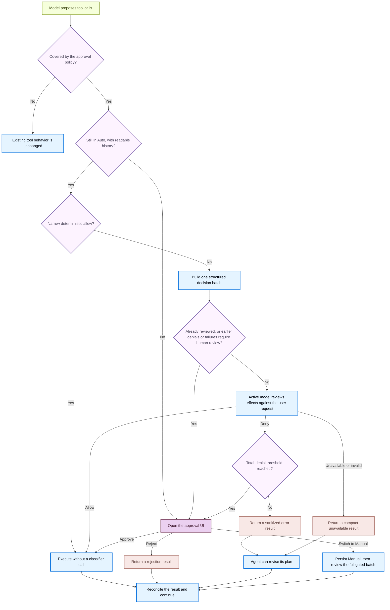

<!-- langchain-docs: machine-translated zh-CN from English source -->

<!-- langchain-docs: Approval modes | https://docs.langchain.com/oss/deepagents/code/approval-modes -->

# 审批模式

默认情况下，Deep Agents 代码在运行可能产生后果的操作之前会请求您的批准。这些称为**门控操作**，包括以下内容：

- 编辑或删除文件（`write_file`、`edit_file`、`delete`）
- 运行 shell 命令 (`execute`)
- 发出网络请求（`web_search`、`fetch_url`）
- 将工作委派给子代理 (`task`)

只读工具（例如 `ls`、`read_file`、`glob` 和 `grep`）始终运行而不提示。批准模式允许您选择每个会话需要对门控操作进行多少监督。

## 选择一种模式

|模式|它有什么作用 |
|---|---|
| **手动**（默认）|每次门控操作前均需获得批准 |
| **自动** |自动批准日常行动；要求模型审查任何不确定的事情；在多次否认或失败后，又回到你身边|
| **YOLO** |运行门控操作，根本无需审查 |

<Warning>
    Auto 是本地编码代理的授权启发式方法。它不是沙箱遏制、操作系统边界或模型生成的操作安全的保证。
</Warning>

## 启用自动

自动仅适用于交互式、非沙盒会话。

<Steps>

    <Step title="Launch with Auto" icon="terminal">
        ```bash
        dcode -y
        ```或者在`~/.deepagents/config.toml`中将其设置为默认值：

        ```toml
        [startup]
        mode = "auto"
        ```

        您还可以使用 `Shift+Tab` 循环至自动中途。
    </Step>
</Steps>

## 启用 YOLO

YOLO 运行门控操作，无需任何审查。仅当您接受代理无需询问即可采取任何操作时才使用它。

<Steps>

    <Step title="Launch with YOLO" icon="terminal">
        ```bash
        dcode --yolo
        ```

        出现提示时接受一次性风险确认。该确认信息存储在本地，因此您在以后启动时不会再次看到它。

        或者在`~/.deepagents/config.toml`中将其设置为默认值：

        ```toml
        [startup]
        mode = "yolo"
        ```
    </Step>
</Steps>

按`Shift+Tab`循环YOLO→手动→自动→YOLO。设置[⟦T24⟧](/oss/deepagents/code/config-file#startup-approval-mode)以从循环中省略YOLO。

## 自动工作原理

自动保留与手动相同的门控操作规则，但更改了审查这些操作的方式。它使用两个阶段：1. **例行操作自动运行。** 对源文件（如 `src/parser.py`）或只读 Git 命令（如`git status`）的写入将在没有提示的情况下继续进行。像`.github/workflows/ci.yml`这样的敏感目标或像`git commit`这样的变异命令会进入下一阶段。
2. **模型审查其余部分。** 对于任何不明显例行公事的事情，主动模型会检查该操作是否与您请求的结果相匹配。即使您没有指定每个实现细节，也可以继续执行获得该结果所需的合理步骤。高风险效果（例如将本地内容发送到未配置的目的地）仍然需要显式授权。如果模型拒绝呼叫，代理会收到错误结果并可以修改其计划。

重复拒绝或分类器失败后，自动停止并向您显示下一批的正常批准提示，然后在自动模式下继续。

<Accordion title="Auto decision flow" icon="flow">


</Accordion>

### 选择分类器模型

默认情况下，自动分类器使用与主代理相同的模型。您可以将其指向不同的（通常更便宜且更快）模型，以减少自动审核期间的成本和延迟。

通过以下任意来源设置分类器模型：<Tabs>
    <Tab title="TUI command">
        运行 `/auto model` 打开交互式模型选择器并为当前会话选择分类器模型。要直接指定模型，请将其作为参数传递：

        ```txt
        /auto model openai:gpt-5.6-luna
        /auto model clear
        ```

        使用`/auto model clear`返回继承主模型。
    </Tab>
    <Tab title="CLI flag">
        ```bash
        dcode -y --auto-classifier-model openai:gpt-5.6-luna
        ```

        `--auto-classifier-model` 仅在交互式 TUI 会话中接受。
    </Tab>
    <Tab title="Environment variable">
        ```bash
        export DEEPAGENTS_CODE_AUTO_CLASSIFIER_MODEL="openai:gpt-5.6-luna"
        ```

        <Warning>
            **项目`.env`**无法设置`DEEPAGENTS_CODE_AUTO_CLASSIFIER_MODEL`。只有 shell 导出、`~/.deepagents/.env`、CLI 标志和 `/auto model` 有效。
        </Warning>
    </Tab>
    <Tab title="config.toml">
        ```toml title="~/.deepagents/config.toml"
        [models]
        auto_classifier = "openai:gpt-5.6-luna"
        ```
    </Tab>
</Tabs>
<br />
<Accordion title="Precedence order">
    1. **`/auto model` TUI命令**：对当前会话立即生效。
    2. **`--auto-classifier-model` 标志**：在启动时设置分类器（仅限交互式 TUI 会话）。
    3. **`DEEPAGENTS_CODE_AUTO_CLASSIFIER_MODEL`环境变量**：启动时应用。
    4. **`config.toml`** 中的`[models].auto_classifier`：您的持久默认值。
    5. **继承**：使用主代理模型（不配置时默认）。

    任何级别的空白值都意味着“从下一个源继承”。例如，未设置的环境变量会变为 `config.toml`。
</Accordion>

当自动打开并在 `/auto model` 输出中时，TUI 会显示正在检查的模型。

### 在出现副作用之前重新验证决策计划与线程、模式、批处理和精确门控调用绑定。丢失或无效的状态、模式竞赛或重播将退回到人工审核。例如，如果您在分类器审查正在进行时切换到手动，则之前的自动决策无法静默执行；而是打开正常的审批 UI。

### 了解范围和限制

- 手动批准菜单可以为当前线程启用自动。阈值回退可以永久切换到手动或在启用自动的情况下执行一次性审核。
- 活动模型不是独立的安全机构。 [MCP read-only annotations](/oss/deepagents/code/mcp-tools#read-only-tool-annotations-in-auto-mode) 被认为是经过深思熟虑的 beta 权衡。
- 父级自动审查不涵盖在委派子代理或更广泛的显式配置 `js_eval` 扇出内执行的操作。即使 TUI 隐藏了分类器输入和输出，模型提供者和跟踪后端仍可能观察到它们。

## Auto 和 YOLO 可用的地方Auto 和 YOLO 是交互模式功能。自动仅适用于交互式、非沙盒会话；遥控器 `--sandbox` 强制其设为手动。 YOLO 也是纯交互式的，并且无论沙箱如何，都需要风险确认。无头运行使用故障关闭 MCP 路由和 `--shell-allow-list` 进行 shell 访问。

在非交互模式下（`-n`或管道标准输入），`-y`/`--auto-approve`和`--yolo`被忽略。无头运行使用故障关闭 MCP 路由和 `--shell-allow-list` 进行 shell 访问。

### 记住跨会话的最后一个模式

当没有标志或配置的模式适用时，Deep Agents代码恢复最后选择的手动或自动模式。 YOLO 必须明确选择。参见[Startup approval mode](/oss/deepagents/code/config-file#startup-approval-mode)。

有关标志和配置优先级，请参阅[Startup approval mode](/oss/deepagents/code/config-file#startup-approval-mode)。

## 另请参阅

- [CLI reference](/oss/deepagents/code/cli-reference)
- [Configuration](/oss/deepagents/code/configuration)
- [Remote sandboxes](/oss/deepagents/code/remote-sandboxes)

---

<div className="source-links">
<Callout icon="terminal-2">
    通过 MCP 向 Claude、VSCode 等发送[Connect these docs](/use-these-docs) 以获得实时答案。
</Callout>
<Callout icon="edit">
    [Edit this page on GitHub](https://github.com/langchain-ai/docs/edit/main/src/oss/deepagents/code/approval-modes.mdx) 或 [file an issue](https://github.com/langchain-ai/docs/issues/new/choose)。
</Callout>
</div>