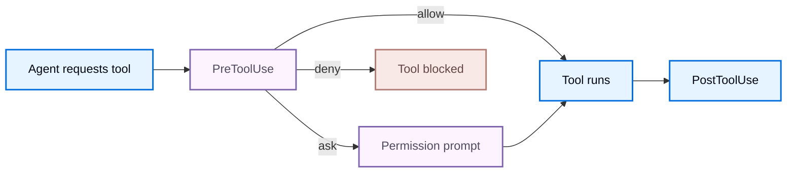

<!-- langchain-docs: machine-translated zh-CN from English source -->

<!-- langchain-docs: Hooks | https://docs.langchain.com/oss/deepagents/code/hooks -->

# 钩子

钩子让外部程序观察和控制Deep Agents代码生命周期事件。

当事件触发时，Deep Agents代码会找到匹配的处理程序，在标准输入上向每个处理程序发送一个 JSON 有效负载，并组合它们的退出代码和标准输出。使用该响应来允许、拒绝、注入上下文或继续转弯。以下部分涵盖配置、[Events](#events)、[Input payload](#input-payload) 和 [Handler output](#handler-output)。

挂钩以您的用户权限运行并执行您的配置中的任意代码。将钩子配置视为可执行代码，并且仅安装来自您信任的来源的钩子。

## 设置

为适用于每个项目的挂钩创建 `~/.deepagents/hooks.json`，或为项目范围的挂钩创建 `{project_root}/.deepagents/hooks.json`（在授予 [workspace trust](#trust-project-hooks) 之后）。处理程序嵌套在三个级别：事件名称、匹配器组，然后是为该组运行的处理程序。

```json title="~/.deepagents/hooks.json"
{
  "hooks": {
    "PreToolUse": [
      {
        "matcher": "Bash",
        "hooks": [
          {
            "type": "command",
            "command": "~/.deepagents/hooks/block-rm.sh",
            "timeout": 600
          }
        ]
      }
    ],
    "SessionStart": [
      {
        "matcher": "startup|resume",
        "hooks": [
          {
            "type": "command",
            "command": "~/.deepagents/hooks/load-context.sh"
          }
        ]
      }
    ]
  }
}
```

Deep Agents 代码按优先顺序加载钩子配置：

1. 授予工作空间信任后，从`{project_root}/.deepagents/hooks.json` 开始项目挂钩。
2. 用户从`~/.deepagents/hooks.json`挂钩。
3. 由启用的插件贡献的挂钩。每个匹配的处理程序同时运行，并且它们的结果按优先顺序组合。优先级决定哪个答案获胜，而不是执行哪些处理程序：即使较高优先级的处理程序停止事件，较低优先级的处理程序仍然会运行，并且它的副作用仍然会发生。

运行 `dcode config path` 检查单独的项目和用户挂钩位置以及工作区信任存储。

钩子配置会被快照，直到 `/reload` 或新会话。在回合中编辑`hooks.json`不会更改活动快照。启用或禁用插件也会更改快照，因此运行 `/reload` 来获取其挂钩。

### 信任项目挂钩

项目挂钩来自存储库，因此它们仅在工作区受信任后加载：

- 当不受信任的工作空间包含`.deepagents/hooks.json`时，交互式会话会提示。信任工作区会保留 `~/.deepagents/.state/hooks_trust.json` 下该项目根的决定。
- 拒绝提示会跳过该会话的项目挂钩，并继续用户和插件挂钩。
- 使用`Esc`或`Ctrl+D`取消提示会中止启动。
- Headless 和 CI 运行从不提示。通过 `--trust-project-hooks` 选择参加该跑步。

### 插件挂钩启用的插件会从 `hooks/hooks.json`、清单 `hooks` 路径或内联清单对象提供相同的配置形状。安装和启用插件是同意门：工作区信任仅管理项目挂钩，因此它既不会授予也不会保留插件的挂钩。在启用插件之前检查它，并检查它在插件管理器中声明的事件。参见[Plugins and marketplaces](/oss/deepagents/code/plugins#add-hooks)。

服务器拥有的事件在会话启动时修复，因此新启用的插件挂钩会在下次启动或`/reload`时激活。

插件处理程序可以通过这些变量引用自己的安装路径：

|变量|价值|
| ---| ---|
| `${CLAUDE_PLUGIN_ROOT}`、`${PLUGIN_ROOT}` |安装的插件目录 |
| `${CLAUDE_PLUGIN_DATA}`、`${PLUGIN_DATA}` |插件的可写数据目录 |
| `${CLAUDE_PROJECT_DIR}` |项目根目录|

在 `command` 字符串中引用这些变量，因为安装路径可以包含空格：`"command": "\"${CLAUDE_PLUGIN_ROOT}/scripts/format.sh\""`。当您可以时，首选可选的 `argv` 字段： Deep Agents 代码在启动之前解析变量并跳过 shell，因此您不需要引用。

无效的插件挂钩文档会自行跳过并报告为配置诊断。其他插件、项目挂钩和用户挂钩继续工作。

### 处理程序字段匹配器组的 `hooks` 数组中的每个条目都是一个命令处理程序：

<ResponseField name="type" type="string" required>
    处理程序类型。仅支持`command`。命令处理程序运行一个子进程，该子进程接收 stdin 上的事件 JSON。
</ResponseField>

<ResponseField name="command" type="string" required>
    要运行的 shell 命令。总是需要的。支持管道、重定向、glob 和环境变量扩展。事件负载以 JSON 形式写入标准输入，不会插入到参数中。当`argv`也被设置时，该字符串不会通过shell执行。
</ResponseField>

<ResponseField name="argv" type="list[string]" post={["optional"]}>
    直接执行参数列表，而不是通过 shell 解释 `command`。将此用于显式可执行路径和参数。
</ResponseField>

<ResponseField name="timeout" type="number" post={["optional"]}>
    每个处理程序超时（以秒为单位）。默认值为 600 秒，`UserPromptSubmit` 除外，默认为 30 秒。超时是一种非阻塞故障。
</ResponseField>

<ResponseField name="statusMessage" type="string" post={["optional"]}>
    处理程序运行时，UI 中显示瞬时消息。
</ResponseField>

配置不受支持的处理程序类型或`"async": true`会产生可见的配置错误。

### 处理程序环境处理程序在有效负载中报告为 `cwd` 的工作目录中启动，并继承会话环境，并删除了看似凭证的变量：任何包含 `KEY`、`TOKEN`、`SECRET`、`PASSWORD` 或 `APIKEY` 的名称在启动前都会被删除。需要凭证的处理程序必须从文件或秘密管理器而不是继承的环境中读取它。插件处理程序还会收到自己的[plugin path variables](#plugin-hooks)。

### 匹配器

匹配器过滤处理程序组是否针对给定事件运行。每个赛事都与一个字段匹配（参见[Events](#events)）：

- 省略、为空或 `*` 匹配该事件的所有值。
- 一个简单的名字完全匹配（`Bash`）。
- `|` 或 `,` 分隔确切的替代项 (`Edit|Write`)。
- 任何其他值都被视为未锚定的正则表达式 (`mcp__.*`)。

`UserPromptSubmit` 和 `Stop` 没有匹配器字段。对于这些事件省略`matcher`，或将其设置为`*`；加载配置时任何其他值都会被拒绝。

编译错误使该组无效，并在会话运行之前生成用户可见的配置诊断。

## 活动Deep Agents 代码发出以下事件。客户端拥有的事件在 CLI 进程中运行。服务器拥有的事件源自代理执行路径并往返于客户端，因此命令处理程序在您的配置所在的位置运行。

|活动 |业主|退出代码2效果|匹配于 |
| ---| ---| ---| ---|
| `SessionStart` |客户|诊断| `source` |
| `UserPromptSubmit` |客户|阻止提示|无 |
| `SessionEnd` |客户|诊断| `reason` |
| `PermissionRequest` |客户|否认| `tool_name` |
| `Notification` |客户|诊断| `notification_type` |
| `PreToolUse` |服务器|否认| `tool_name` |
| `PostToolUse` |服务器|反馈 | `tool_name` |
| `PreCompact` |服务器|块压缩| `trigger` |
| `Stop` |服务器|继续转 |无 |
| `SubagentStart` |服务器|诊断| `agent_type` |
| `SubagentStop` |服务器|添加上下文 | `agent_type` |

`PreToolUse` 在权限提示之前和工具执行之前运行，这使其成为允许或拒绝工具的主要位置。 `Stop` 在提交终端模型响应之前运行。



该图仅涵盖工具调用路径。当 Deep Agents 代码即将显示权限提示时，`PermissionRequest` 是一个单独的客户端拥有的事件。

## 输入负载每个处理程序都会在 stdin 上接收一个 JSON 对象。所有事件共享一个公共信封，以及特定于事件的字段。

### 常用字段

|领域|描述 |
| ---| ---|
| `session_id` |会话标识符|
| `transcript_path` |对话记录的路径（如果可用）|
| `cwd` |调用钩子时的工作目录 |
| `hook_event_name` |触发的事件的名称 |
| `prompt_id` |当前用户提示的 UUID（如果可用） |
| `permission_mode` |权限模式（`default`、`plan`、`acceptEdits`、`auto`、`dontAsk`、`bypassPermissions`），当有意义时 |
| `effort` |对象，例如 `{ "level": "medium" }`，其中级别为 `none`、`low`、`medium`、`high`、`xhigh` 或 `max`（如果可用）|
| `agent_id`、`agent_type` |子代理身份（如果可用）|

`transcript_path` 指向在 `~/.deepagents/transcripts` 下编写的对话的 JSONL 投影。子代理事件还携带 `agent_transcript_path` 来表示子代理自己的转录本。这两个文件都会在匹配的处理程序运行之前刷新，因此处理程序可以读取当前事件之前的对话。

### 特定于事件的字段|活动 |领域 |
| ---| ---|
| `SessionStart` | `source`（`startup`、`resume`、`clear`、`compact`）以及`model`（如果有）|
| `UserPromptSubmit` | `prompt` |
| `SessionEnd` | `reason`（`clear`、`resume`、`prompt_input_exit`、`other`）|
| `PermissionRequest` | `tool_name`、`tool_input`、`permission_suggestions`（目前为空）|
| `Notification` | `message`、`notification_type`，以及可用时 `title` |
| `PreToolUse` | `tool_name`、`tool_input`、`tool_use_id` |
| `PostToolUse` | `tool_name`、`tool_input`、`tool_response`、`tool_use_id`，以及可用时 `duration_ms` |
| `PreCompact` | `trigger`（`manual`、`auto`）、`custom_instructions` |
| `Stop` | `stop_hook_active`、`last_assistant_message`、`background_tasks`、`session_crons` |
| `SubagentStart` | `agent_id`、`agent_type` |
| `SubagentStop` | `stop_hook_active`、`agent_id`、`agent_type`、`agent_transcript_path`、`last_assistant_message`、`background_tasks`、`session_crons` |

示例`PreToolUse`有效负载：

```json
{
  "session_id": "abc123",
  "transcript_path": "/Users/you/.deepagents/.../transcript.jsonl",
  "cwd": "/Users/you/my-project",
  "permission_mode": "default",
  "hook_event_name": "PreToolUse",
  "tool_name": "Bash",
  "tool_input": {
    "command": "rm -rf /tmp/build"
  },
  "tool_use_id": "toolu_01ABC"
}
```

### 工具名称

挂钩脚本看到稳定的公共工具名称和参数形状，而不是内部Deep Agents代码工具名称。匹配并读取 `PreToolUse`、`PostToolUse` 和 `PermissionRequest` 中的这些名称：

|公共工具名称|值得注意的输入字段 |
| ---| ---|
| `Bash` | `command`，可选`timeout`（以毫秒为单位）|
| `Write` | `file_path`、`content` |
| `Edit` | `file_path`、`old_string`、`new_string`、`replace_all` |
| `Read` | `file_path`、`limit`、`offset` |
| `Glob` | `pattern`、`path` |
| `Grep` | `pattern`、`path`、`glob`、`output_mode`、`head_limit` |
| `LS` | `path` |
| `mcp__<server>__<tool>` |特定于工具的 JSON |

## 处理程序输出命令处理程序通过其退出代码、stdout 和 stderr 传达结果。

|退出代码 |意义|
| ---| ---|
| `0` |成功。当 stdout 包含 JSON 时，它会被解析并应用。 |
| `2` |该事件的阻塞或反馈路径。参见[Events](#events)表退出代码2效果栏。 Stdout JSON 被忽略，stderr 是主要反馈通道。 |
|其他非零 |非阻塞错误。 Deep Agents 代码记录诊断并继续。 |

JSON 输出仅在退出 `0` 时处理，并且必须是 stdout 上的唯一内容。成功的非 JSON 标准输出成为 `SessionStart` 和 `UserPromptSubmit` 的附加上下文；对于其他事件，它会生成诊断信息。 Stdout 和 stderr 各自保留最多 100,000 字节。

### 通用输出字段

任何处理程序都可以返回这些顶级字段：

```json
{
  "continue": true,
  "stopReason": "optional user-facing reason when continue is false",
  "suppressOutput": false,
  "systemMessage": "optional message shown to the user",
  "terminalSequence": "optional restricted terminal control sequence",
  "hookSpecificOutput": {
    "hookEventName": "PreToolUse"
  }
}
```

所有匹配的处理程序在其结果合并之前完成。返回 `"continue": false` 将减少的决策标记为已停止，但不会阻止其他匹配处理程序运行。按照配置顺序，第一个`stopReason`获胜。 `suppressOutput` 仅抑制该处理程序的 `systemMessage`。

特定于事件的控件位于`hookSpecificOutput`（对于工具和权限事件）或顶级`decision`和`reason`（对于`Stop`）。### 使用`PreToolUse`控制工具执行

返回权限决定以在工具运行之前允许、拒绝或强制提示：

```json
{
  "hookSpecificOutput": {
    "hookEventName": "PreToolUse",
    "permissionDecision": "deny",
    "permissionDecisionReason": "Destructive command blocked by hook"
  }
}
```

当多个钩子匹配时，决策将与优先级`deny > ask > allow`结合起来。拒绝会在权限提示之前短路执行，并将其原因提供给模型。询问强制许可提示。允许会抑制普通提示，但不会覆盖单独的拒绝或询问。任何 `additionalContext` 值都按配置顺序传递。

您还可以使用退出代码 `2` 进行阻止，并将原因写入 stderr。

### 使用 `PermissionRequest` 允许或拒绝

返回代表用户回答权限提示的决定：

```json
{
  "hookSpecificOutput": {
    "hookEventName": "PermissionRequest",
    "decision": {
      "behavior": "deny",
      "message": "Not allowed in this environment"
    }
  }
}
```

任何否认都会获胜。如果没有钩子拒绝并且至少有一个钩子允许，则允许该操作。如果没有钩子决定，则显示正常的权限提示。

### 用`Stop`继续转弯

返回一个块决策以保持代理继续工作而不是结束回合：

```json
{
  "decision": "block",
  "reason": "Tests are still failing; keep working"
}
```

一个区块会继续代理轮流并提供您的反馈。 `Stop.hookSpecificOutput.additionalContext`具有同样的延续效果。为了避免无限循环，请检查有效负载中的`stop_hook_active`，并在满足条件后停止阻塞。 Deep Agents 代码还强制执行八个连续连续的硬上限。### 注入上下文

`SessionStart`、`UserPromptSubmit`和`SubagentStart`可以为模型添加上下文：

```json
{
  "hookSpecificOutput": {
    "hookEventName": "SessionStart",
    "additionalContext": "Current sprint: ENG-1421. Prefer the staging database."
  }
}
```

`UserPromptSubmit`还支持`suppressOriginalPrompt`。 `PostToolUse` 和 `SubagentStop` 可以为模型附加 `additionalContext`，但无法撤消已运行的操作。

## 不支持的输出字段

以下兼容性字段被识别但不应用。 Deep Agents 代码发出诊断并继续在结果列中进行回退。对于工具和权限行，这意味着普通的 [PreToolUse](#control-tool-execution-with-pretooluse) 或 [PermissionRequest](#allow-or-deny-with-permissionrequest) 决策路径，无需改变工具输入或延迟。

|领域或行为 |结果 |
| ---| ---|
| `SessionStart.initialUserMessage`、`sessionTitle`、`watchPaths`、`reloadSkills` |已解析，未应用 |
| `UserPromptSubmit.sessionTitle` |已解析，未应用 |
| `PreToolUse.updatedInput` |突变被忽略； `allow` 或 `ask` 使用普通的 [PreToolUse](#control-tool-execution-with-pretooluse) 决策 |
| `PreToolUse.defer` |使用普通的[PreToolUse](#control-tool-execution-with-pretooluse)决策；从未被视为允许|
| `PostToolUse.updatedToolOutput`、`updatedMCPToolOutput` |已解析，未应用 |
| `PermissionRequest.updatedInput` |突变被忽略； `allow` 使用普通的 [PermissionRequest](#allow-or-deny-with-permissionrequest) 决策 |
| `PermissionRequest.updatedPermissions` |已解析，未应用（无权限规则存储）|
| `SubagentStop`块| [Context only](#inject-context)；无法恢复已完成的子代理 |

## 示例

<Accordion title="Block destructive Bash commands (PreToolUse)">
```bash title="~/.deepagents/hooks/block-rm.sh"
#!/usr/bin/env bash
command=$(jq -r '.tool_input.command // ""')

if printf '%s' "$command" | grep -Eq 'rm[[:space:]]+.*-[a-zA-Z]*[rf]'; then
  cat <<'JSON'
{
  "hookSpecificOutput": {
    "hookEventName": "PreToolUse",
    "permissionDecision": "deny",
    "permissionDecisionReason": "Recursive or forced rm is blocked by policy"
  }
}
JSON
fi
```

```json title="~/.deepagents/hooks.json"
{
  "hooks": {
    "PreToolUse": [
      {
        "matcher": "Bash",
        "hooks": [
          { "type": "command", "command": "~/.deepagents/hooks/block-rm.sh" }
        ]
      }
    ]
  }
}
```
</Accordion>

<Accordion title="Load project context on session start (SessionStart)">
```bash title="~/.deepagents/hooks/load-context.sh"
#!/usr/bin/env bash
context=$(git -C "$(jq -r '.cwd')" log --oneline -5 2>/dev/null)

jq -n --arg ctx "$context" '{
  hookSpecificOutput: {
    hookEventName: "SessionStart",
    additionalContext: ("Recent commits:\n" + $ctx)
  }
}'
```

```json title="~/.deepagents/hooks.json"
{
  "hooks": {
    "SessionStart": [
      {
        "matcher": "startup|resume",
        "hooks": [
          { "type": "command", "command": "~/.deepagents/hooks/load-context.sh" }
        ]
      }
    ]
  }
}
```
</Accordion>

<Accordion title="Desktop notification when the turn ends on macOS (Stop)">
```json title="~/.deepagents/hooks.json"
{
  "hooks": {
    "Stop": [
      {
        "hooks": [
          {
            "type": "command",
            "command": "osascript -e 'display notification \"Agent finished\" with title \"Deep Agents Code\"'"
          }
        ]
      }
    ]
  }
}
```
</Accordion>

<Accordion title="Python handler that reads the payload">
```python title="~/.deepagents/hooks/handler.py"
import json
import sys


def handle(payload: dict[str, object]) -> None:
    event = payload["hook_event_name"]
    if event == "PreToolUse":
        tool_name = payload["tool_name"]
        print(f"About to run {tool_name}", file=sys.stderr)


if __name__ == "__main__":
    handle(json.load(sys.stdin))
```

```json title="~/.deepagents/hooks.json"
{
  "hooks": {
    "PreToolUse": [
      {
        "matcher": "*",
        "hooks": [
          {
            "type": "command",
            "command": "python3 ~/.deepagents/hooks/handler.py"
          }
        ]
      }
    ]
  }
}
```
</Accordion>

## 钩子故障排除挂钩活动在会话中可见，而不仅仅是在日志中：

- 正在运行的处理程序显示其 `statusMessage`，或在未设置任何值时显示 `Running <event> hook`。并发处理程序共享一个状态槽，因此会显示最新的状态槽，直至其完成。
- 处理程序的 `systemMessage` 显示为信息通知。
- 配置错误、非零退出、超时和不支持的输出字段显示为 `Hook warning` 或 `Hook error` 通知，每次调用一次。
- 来自钩子的许可答案归因于该钩子，例如`PermissionRequest hook denied Bash`。
- 设置 `DEEPAGENTS_CODE_DEBUG=1` 来捕获每个诊断，包括从不显示为通知的调试级别条目。

## 旧配置

较旧的列表形 `hooks.json` 文件已弃用，但仍受支持。 Deep Agents 代码自动迁移等效事件；没有安全映射的事件将被诊断跳过。

## 安全

挂钩遵循与 Git 挂钩或 shell 别名相同的信任模型：任何可以写入 `hooks.json` 的进程都可以使用您的权限运行任意命令。- 有效负载数据以 JSON 形式流向标准输入，从未插入到命令参数中。
- 从处理程序环境中删除了看似凭证的环境变量。
- 挂钩配置保持固定，直到 `/reload` 或新会话。
- 优先选择您控制的显式 shell 可执行文件而不是 shell 包装器。
- 仅安装来自您信任的来源的挂钩。

<Warning>
    挂钩以您的用户权限运行。将钩子配置视为可执行代码。
</Warning>

## 另请参阅

- [Configuration](/oss/deepagents/code/configuration)
- [Plugins and marketplaces](/oss/deepagents/code/plugins)
- [Data locations](/oss/deepagents/code/configuration#data-locations)
- [CLI reference](/oss/deepagents/code/cli-reference)

---

<div className="source-links">
<Callout icon="terminal-2">
    通过 MCP 向 Claude、VSCode 等发送[Connect these docs](/use-these-docs) 以获得实时答案。
</Callout>
<Callout icon="edit">
    [Edit this page on GitHub](https://github.com/langchain-ai/docs/edit/main/src/oss/deepagents/code/hooks.mdx) 或 [file an issue](https://github.com/langchain-ai/docs/issues/new/choose)。
</Callout>
</div>